# //first-contentful-paint/samples/music

[→ Parent](../..)


## Raw


```yaml
p90min: 1211.2290000000003
p90max: 1602.4865
p90range: 391.2574999999997
p90mean: 1281.188553191489
median: 1233.8885999999998
p90stdev: 95.80935691310036
mad: 19.070399999999722
stdevBySn: 27.711492119999726
lfitCenter: 1271.9780349654388
lfitStdev: 78.36653281678325
mfitCenter: 1271.9780349654388
mfitStdev: 98.21788357050454
mfitConfidence: 9.821788357050455
p90skewness: 1.800116665415837
p90eccentricity: 1.0000000000000002
p90discretization: 1
outlandishness: 1.0205344104681517

```

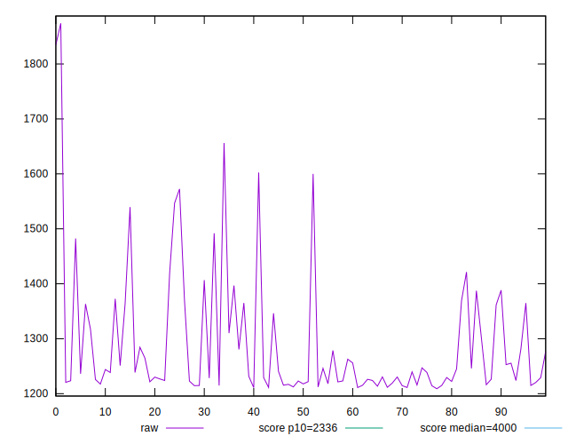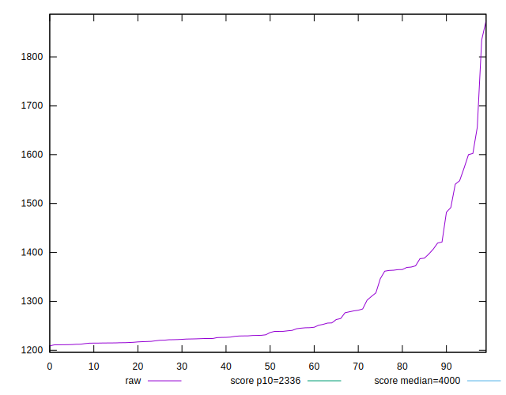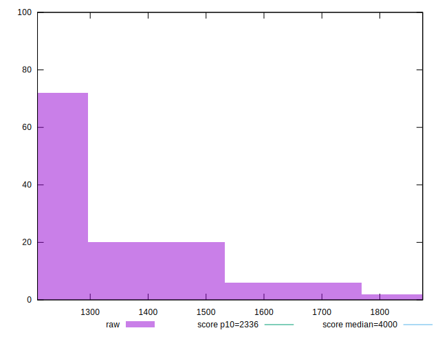
## Score


```yaml
p90min: 0.99
p90max: 1
p90range: 0.010000000000000009
p90mean: 0.9977659574468081
median: 1
p90stdev: 0.004165270627755724
mad: 0
stdevBySn: 0
lfitCenter: 0.9981542732510161
lfitStdev: 0.0039041088905017104
mfitCenter: 0.9981542732510161
mfitStdev: 0.0048930748710085455
mfitConfidence: 0.0004893074871008546
p90skewness: -1.3281045550204773
p90eccentricity: 1.000000000000003
p90discretization: 47
outlandishness: 0.9984652444015044

```

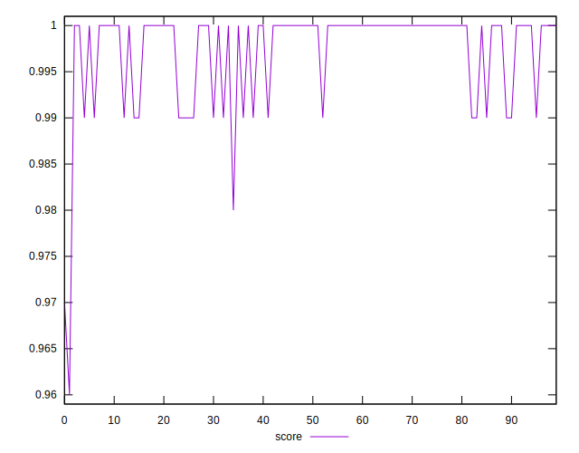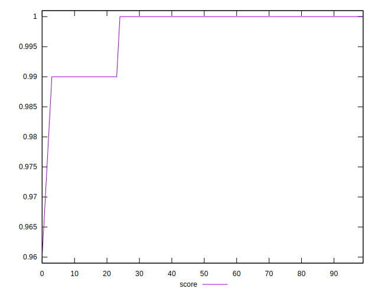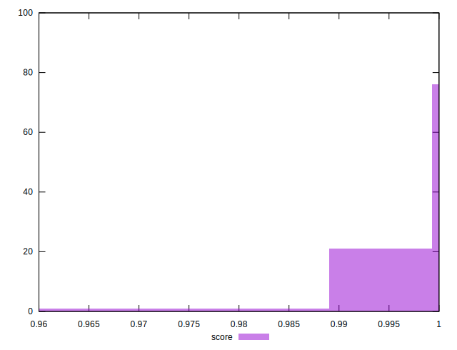
## Raw Estimate

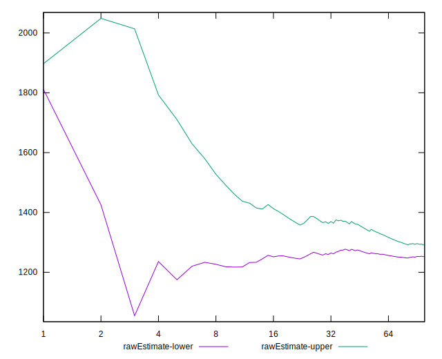
## Score Estimate

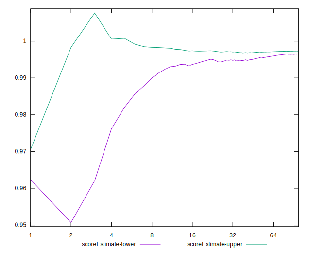
## P Score


```yaml
p90min: 0.9853548705242773
p90max: 0.9977899882256788
p90range: 0.012435117701401488
p90mean: 0.9962407390215567
median: 0.9974632646636292
p90stdev: 0.0026800538654545357
mad: 0.0002791247193267843
stdevBySn: 0.0004033021316487721
lfitCenter: 0.9963515722869793
lfitStdev: 0.002227207540697621
mfitCenter: 0.9963515722869793
mfitStdev: 0.0027913907003008316
mfitConfidence: 0.00027913907003008316
p90skewness: -2.547058771246342
p90eccentricity: 1.0000000000000007
p90discretization: 1
outlandishness: 0.9986170297541743

```

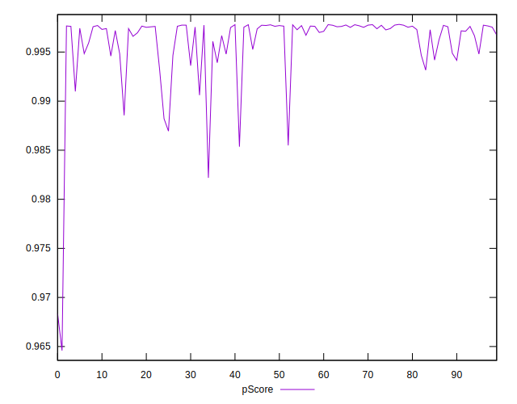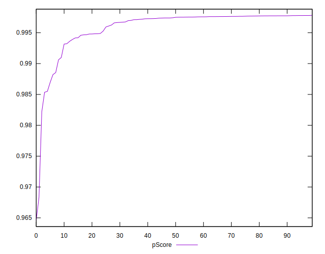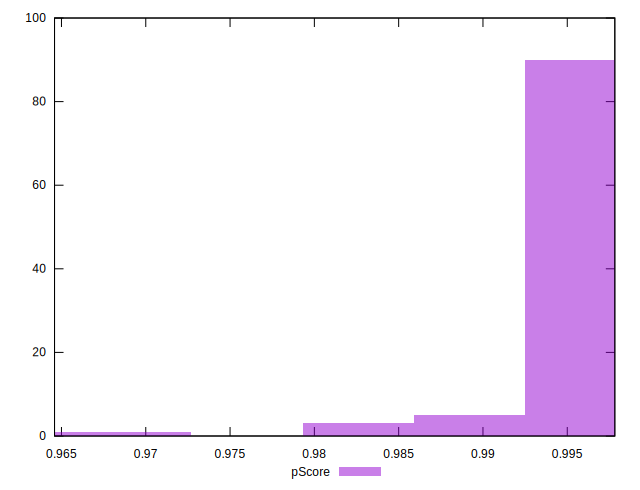
## Score Difference


```yaml
p90min: 0
p90max: 0
p90range: 0
p90mean: 0
median: 0
p90stdev: 0
mad: 0
stdevBySn: 0
lfitCenter: 0
lfitStdev: 0
mfitCenter: 0
mfitStdev: 0
mfitConfidence: 0
p90skewness: .nan
p90eccentricity: .nan
p90discretization: 94
outlandishness: .nan

```


## P Score Difference


```yaml
p90min: -0.004068975006795483
p90max: 0.004796635760380807
p90range: 0.00886561076717629
p90mean: -0.001547862749425803
median: -0.002356606210954959
p90stdev: 0.002342221474806096
mad: 0.00019636272394846221
stdevBySn: 0.0004033021316487721
lfitCenter: -0.001828055296165188
lfitStdev: 0.0014756692903711275
mfitCenter: -0.001828055296165188
mfitStdev: 0.0018494771854854887
mfitConfidence: 0.00018494771854854887
p90skewness: 1.8964205960906126
p90eccentricity: 1.0000000000000007
p90discretization: 1
outlandishness: 0.8755946950150103

```

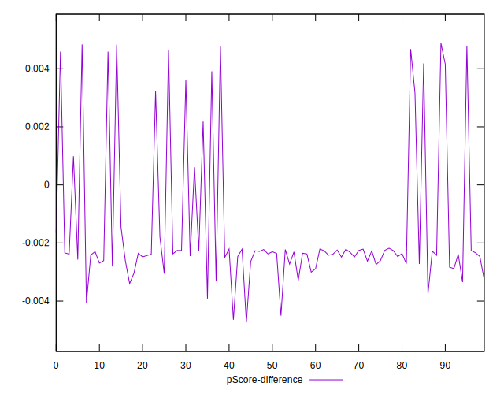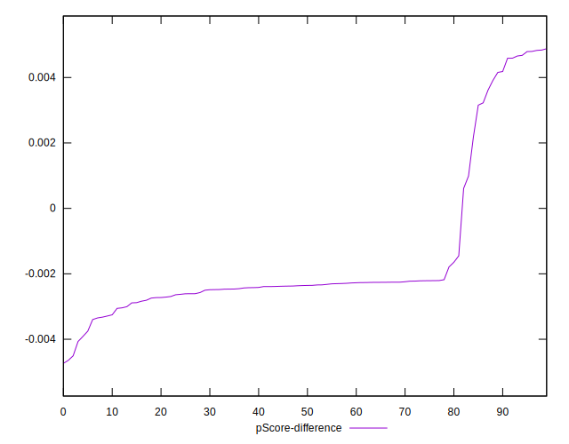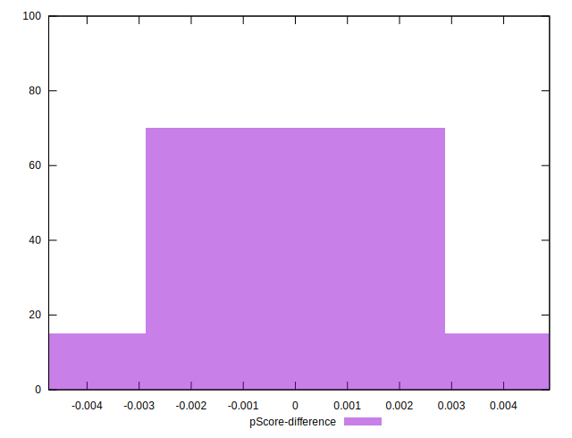