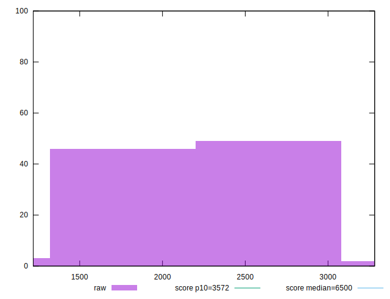

# //first-cpu-idle/samples/agenda

[→ Parent](../..)


## Raw


```yaml
p90min: 1354.3650000000002
p90max: 3057.3540000000003
p90range: 1702.989
p90mean: 2271.6708180851065
median: 2203.4345
p90stdev: 357.8150543989201
mad: 134.89850000000047
stdevBySn: 260.28554630000014
lfitCenter: 2254.1874180648165
lfitStdev: 245.33579643395151
mfitCenter: 2254.1874180648165
mfitStdev: 307.48282236963144
mfitConfidence: 30.748282236963142
p90skewness: 0.16082698636817083
p90eccentricity: 1
p90discretization: 1
outlandishness: 0.9965439785096883

```


## Score


```yaml
p90min: 0.95
p90max: 1
p90range: 0.050000000000000044
p90mean: 0.9843617021276592
median: 0.99
p90stdev: 0.01301051216862717
mad: 0
stdevBySn: 0
lfitCenter: 0.9859235293152699
lfitStdev: 0.009552632504272388
mfitCenter: 0.9859235293152699
mfitStdev: 0.011972449378231342
mfitConfidence: 0.0011972449378231341
p90skewness: -1.5989146285527873
p90eccentricity: 1.0000000000000004
p90discretization: 15.666666666666666
outlandishness: 0.9982499827810758

```


## Raw Estimate


## Score Estimate


## P Score


```yaml
p90min: 0.9467995528695023
p90max: 0.9996067347351605
p90range: 0.05280718186565814
p90mean: 0.9846481838190534
median: 0.9897130420428548
p90stdev: 0.013200418658381747
mad: 0.0035061259129863243
stdevBySn: 0.0067045828060698885
lfitCenter: 0.9859273240508692
lfitStdev: 0.00897013926754961
mfitCenter: 0.9859273240508692
mfitStdev: 0.011242402369021414
mfitConfidence: 0.0011242402369021414
p90skewness: -1.6769752075558793
p90eccentricity: 0.9999999999999994
p90discretization: 1
outlandishness: 0.9981392939179958

```


## Score Difference


```yaml
p90min: 0
p90max: 1.1102230246251565e-16
p90range: 1.1102230246251565e-16
p90mean: 7.086529944415892e-18
median: 0
p90stdev: 2.713934347484318e-17
mad: 0
stdevBySn: 0
lfitCenter: 5.186597246566366e-18
lfitStdev: 1.239351332211875e-17
mfitCenter: 5.186597246566366e-18
mfitStdev: 1.553296547324935e-17
mfitConfidence: 1.553296547324935e-18
p90skewness: 3.5685919470917966
p90eccentricity: 0.9999999999999971
p90discretization: 47
outlandishness: 1.9881000000000004

```


## P Score Difference


```yaml
p90min: -0.004375460652622509
p90max: 0.004686015231782248
p90range: 0.009061475884404757
p90mean: 0.00023741646869848284
median: 0.00023938796273487162
p90stdev: 0.002378398187934527
mad: 0.002073791819140247
stdevBySn: 0.002770273159462603
lfitCenter: 0.00028618839765773263
lfitStdev: 0.001961785410436484
mfitCenter: 0.00028618839765773263
mfitStdev: 0.0024587333917534186
mfitConfidence: 0.00024587333917534186
p90skewness: -0.22595560737462023
p90eccentricity: 0.9999999999999994
p90discretization: 1
outlandishness: 0.9523160604267725

```

