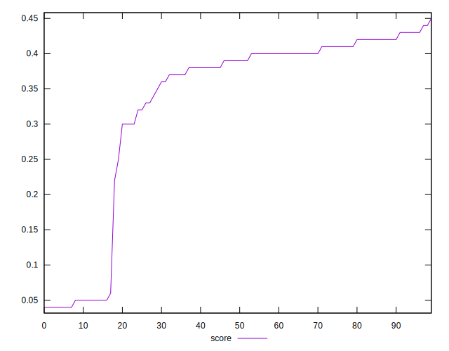

# //first-cpu-idle/samples/astro

[→ Parent](../..)


## Raw


```yaml
p90min: 7018.804000000001
p90max: 14510.726999999997
p90range: 7491.922999999996
p90mean: 8530.112021276595
median: 7413.53
p90stdev: 2470.360675740892
mad: 235.09000000000015
stdevBySn: 352.4872411999999
lfitCenter: 8180.372823275678
lfitStdev: 1656.6221462849958
mfitCenter: 8180.372823275678
mfitStdev: 2076.267958218161
mfitConfidence: 207.62679582181607
p90skewness: 1.7808144619349413
p90eccentricity: 1.0000000000000004
p90discretization: 1
outlandishness: 1.0338941570041285

```


## Score


```yaml
p90min: 0.04
p90max: 0.43
p90range: 0.39
p90mean: 0.3317021276595744
median: 0.39
p90stdev: 0.12939826610920574
mad: 0.02999999999999997
stdevBySn: 0.035778000000000004
lfitCenter: 0.34972468273526197
lfitStdev: 0.09226465553059775
mfitCenter: 0.34972468273526197
mfitStdev: 0.11563659726740137
mfitConfidence: 0.011563659726740137
p90skewness: -1.5779240020130738
p90eccentricity: 0.9999999999999996
p90discretization: 5.222222222222222
outlandishness: 0.9676930747864307

```


## Raw Estimate


## Score Estimate


## P Score


```yaml
p90min: 0.04279632753791279
p90max: 0.4347155122570632
p90range: 0.3919191847191504
p90mean: 0.33149427668686726
median: 0.3891622323301963
p90stdev: 0.12886936131569643
mad: 0.026687845260883664
stdevBySn: 0.03955820154931375
lfitCenter: 0.3493198347966995
lfitStdev: 0.09233027242510242
mfitCenter: 0.3493198347966995
mfitStdev: 0.11571883584901357
mfitConfidence: 0.011571883584901358
p90skewness: -1.5732376496178049
p90eccentricity: 0.9999999999999997
p90discretization: 1
outlandishness: 0.9669907255032213

```


## Score Difference


```yaml
p90min: 0
p90max: 5.551115123125783e-17
p90range: 5.551115123125783e-17
p90mean: 4.133809134242604e-18
median: 0
p90stdev: 1.457340475159285e-17
mad: 0
stdevBySn: 0
lfitCenter: 2.9226926675442233e-18
lfitStdev: 6.94038067323661e-18
mfitCenter: 2.9226926675442233e-18
mfitStdev: 8.69847722487149e-18
mfitConfidence: 8.69847722487149e-19
p90skewness: 3.24176359389242
p90eccentricity: 0.9999999999999976
p90discretization: 47
outlandishness: 1.8032653061224493

```


## P Score Difference


```yaml
p90min: -0.004523831636799647
p90max: 0.004865691680189722
p90range: 0.009389523316989369
p90mean: -0.0003434313735700836
median: -0.0009271169845239957
p90stdev: 0.002710664232432885
mad: 0.0021887200626704018
stdevBySn: 0.0030904978044796996
lfitCenter: -0.0004286839201062198
lfitStdev: 0.0024148230319878685
mfitCenter: -0.0004286839201062198
mfitStdev: 0.003026531848150901
mfitConfidence: 0.0003026531848150901
p90skewness: 0.2503770998556016
p90eccentricity: 0.9999999999999997
p90discretization: 1
outlandishness: 0.8836085263722953

```

