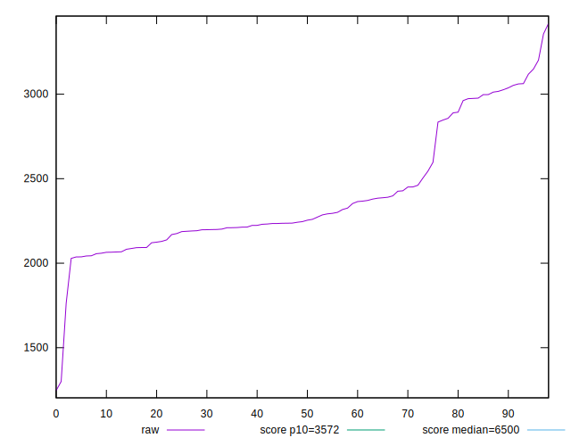

# //first-cpu-idle/samples/card

[→ Parent](../..)


## Raw


```yaml
p90min: 2028.462
p90max: 3148.8016000000002
p90range: 1120.3396000000002
p90mean: 2396.369284946237
median: 2245.8300000000004
p90stdev: 333.01437676026575
mad: 152.98900000000003
stdevBySn: 229.4824772000006
lfitCenter: 2355.1235011886115
lfitStdev: 275.22400502357647
mfitCenter: 2355.1235011886115
mfitStdev: 344.9421367717361
mfitConfidence: 34.667989153190995
p90skewness: 1.0258455558124397
p90eccentricity: 0.9999999999999993
p90discretization: 1
outlandishness: 0.9992306446236526

```


## Score


```yaml
p90min: 0.94
p90max: 0.99
p90range: 0.050000000000000044
p90mean: 0.9799999999999999
median: 0.99
p90stdev: 0.015588802156938577
mad: 0
stdevBySn: 0
lfitCenter: 0.9823373443146498
lfitStdev: 0.013227006109532471
mfitCenter: 0.9823373443146498
mfitStdev: 0.01657759376811662
mfitConfidence: 0.0016661108622962658
p90skewness: -1.3113565539098127
p90eccentricity: 0.999999999999998
p90discretization: 18.6
outlandishness: 0.9979396317412043

```


## Raw Estimate


## Score Estimate


## P Score


```yaml
p90min: 0.9396083601283549
p90max: 0.9936634867797318
p90range: 0.054055126651376906
p90mean: 0.9805449387541869
median: 0.9885445835519644
p90stdev: 0.015724451739065764
mad: 0.004271451845962337
stdevBySn: 0.005933656165255737
lfitCenter: 0.9824489445875306
lfitStdev: 0.012579031885753824
mfitCenter: 0.9824489445875306
mfitStdev: 0.01576547851202162
mfitConfidence: 0.0015844902080238263
p90skewness: -1.328772475353736
p90eccentricity: 1
p90discretization: 1
outlandishness: 0.9976478405864144

```


## Score Difference


```yaml
p90min: 0
p90max: 1.1102230246251565e-16
p90range: 1.1102230246251565e-16
p90mean: 1.5519246580781757e-17
median: 0
p90stdev: 3.849851261343493e-17
mad: 0
stdevBySn: 0
lfitCenter: 1.0338306179424712e-17
lfitStdev: 2.350117301932774e-17
mfitCenter: 1.0338306179424712e-17
mfitStdev: 2.9454352418259276e-17
mfitConfidence: 2.9602738004322194e-18
p90skewness: 2.0775818043692404
p90eccentricity: 1
p90discretization: 46.5
outlandishness: 1.3367456164658966

```


## P Score Difference


```yaml
p90min: -0.004503294817187364
p90max: 0.004273131706002076
p90range: 0.00877642652318944
p90mean: 0.0004299836218017278
median: 0.00004816085444792062
p90stdev: 0.0022075362570383207
mad: 0.0017636948976190725
stdevBySn: 0.0027834369602785713
lfitCenter: 0.00040614506446580754
lfitStdev: 0.001990811619432679
mfitCenter: 0.00040614506446580754
mfitStdev: 0.00249511234987763
mfitConfidence: 0.00025076822649472923
p90skewness: -0.11224430864857483
p90eccentricity: 0.9999999999999993
p90discretization: 1
outlandishness: 0.8704330855998179

```

