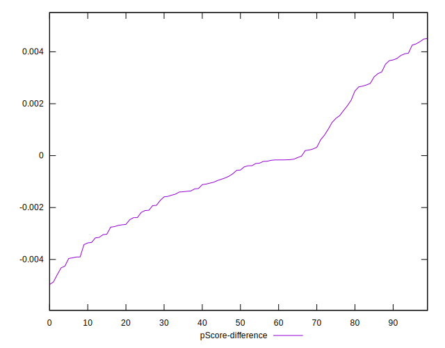

# //first-cpu-idle/samples/music

[→ Parent](../..)


## Raw


```yaml
p90min: 1215.3690000000001
p90max: 5674.996999999999
p90range: 4459.627999999999
p90mean: 3249.2010436170226
median: 3015.6153999999997
p90stdev: 1405.0828158607526
mad: 1223.9989999999998
stdevBySn: 1728.7875933
lfitCenter: 3182.536262106491
lfitStdev: 1322.071496295271
mfitCenter: 3182.536262106491
mfitStdev: 1656.9708985160346
mfitConfidence: 165.69708985160347
p90skewness: 0.32245899850207305
p90eccentricity: 1.0000000000000002
p90discretization: 1
outlandishness: 1.01349219006339

```


## Score


```yaml
p90min: 0.61
p90max: 1
p90range: 0.39
p90mean: 0.8844680851063833
median: 0.95
p90stdev: 0.13208328305387715
mad: 0.050000000000000044
stdevBySn: 0.05963000000000006
lfitCenter: 0.8995279589854912
lfitStdev: 0.12299598056247665
mfitCenter: 0.8995279589854912
mfitStdev: 0.15415260142704937
mfitConfidence: 0.015415260142704936
p90skewness: -0.7931634684413329
p90eccentricity: 1
p90discretization: 3.4814814814814814
outlandishness: 0.9863256357096309

```


## Raw Estimate


## Score Estimate


## P Score


```yaml
p90min: 0.6143036357066456
p90max: 0.9998341973383869
p90range: 0.38553056163174126
p90mean: 0.8840833103925065
median: 0.9499121297787355
p90stdev: 0.13196780373042066
mad: 0.049324156543301245
stdevBySn: 0.05954011010210577
lfitCenter: 0.8991376292449409
lfitStdev: 0.12338077980833945
mfitCenter: 0.8991376292449409
mfitStdev: 0.15463487576240284
mfitConfidence: 0.015463487576240284
p90skewness: -0.789337726699728
p90eccentricity: 1.0000000000000002
p90discretization: 1
outlandishness: 0.9863572981918832

```


## Score Difference


```yaml
p90min: 0
p90max: 1.1102230246251565e-16
p90range: 1.1102230246251565e-16
p90mean: 2.2440678157316992e-17
median: 0
p90stdev: 4.458510650077364e-17
mad: 0
stdevBySn: 0
lfitCenter: 1.5397107487514543e-17
lfitStdev: 3.3242308844122565e-17
mfitCenter: 1.5397107487514543e-17
mfitStdev: 4.1663055673270035e-17
mfitConfidence: 4.166305567327004e-18
p90skewness: 1.4834762399128532
p90eccentricity: 1.0000000000000013
p90discretization: 47
outlandishness: 1.1846603878116344

```


## P Score Difference


```yaml
p90min: -0.004324044611648148
p90max: 0.004303635706645603
p90range: 0.008627680318293751
p90mean: -0.00038057861855188605
median: -0.0005613433535248125
p90stdev: 0.002274310913409503
mad: 0.001725657400439673
stdevBySn: 0.0024925830343797742
lfitCenter: -0.00046782086269784613
lfitStdev: 0.0017923876011142993
mfitCenter: -0.00046782086269784613
mfitStdev: 0.002246424722286015
mfitConfidence: 0.0002246424722286015
p90skewness: 0.4066590158793956
p90eccentricity: 1.0000000000000002
p90discretization: 1
outlandishness: 0.9352041025029272

```

