# //first-meaningful-paint/samples/agenda

[→ Parent](../..)


## Raw


```yaml
p90min: 1212.591
p90max: 1567.984
p90range: 355.39300000000003
p90mean: 1274.1431191489369
median: 1229.9085
p90stdev: 83.01424937748382
mad: 11.380049999999983
stdevBySn: 17.90867790000008
lfitCenter: 1267.682066601042
lfitStdev: 75.67792451916579
mfitCenter: 1267.682066601042
mfitStdev: 94.84821277800611
mfitConfidence: 9.484821277800611
p90skewness: 1.6878057138706117
p90eccentricity: 1.0000000000000002
p90discretization: 1
outlandishness: 1.024909547520488

```

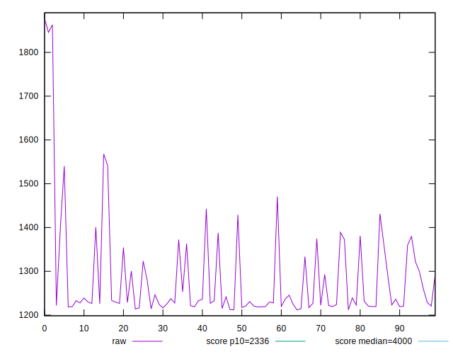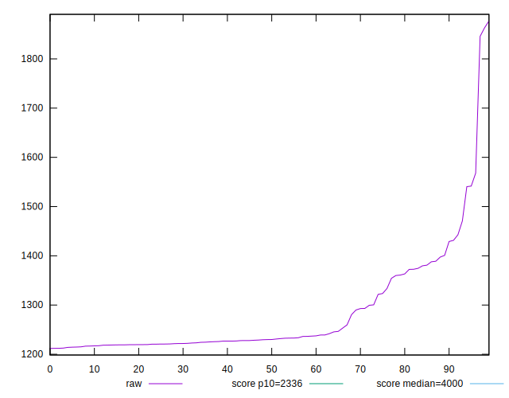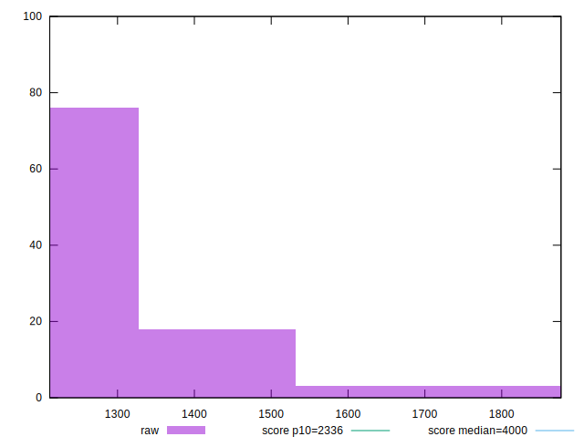
## Score


```yaml
p90min: 0.99
p90max: 1
p90range: 0.010000000000000009
p90mean: 0.9979787234042551
median: 1
p90stdev: 0.0040158693804631706
mad: 0
stdevBySn: 0
lfitCenter: 0.9982798822463801
lfitStdev: 0.0037137290663497398
mfitCenter: 0.9982798822463801
mfitStdev: 0.004654469145699147
mfitConfidence: 0.0004654469145699147
p90skewness: -1.4834762399126753
p90eccentricity: 0.9999999999999994
p90discretization: 47
outlandishness: 0.9982397689964795

```

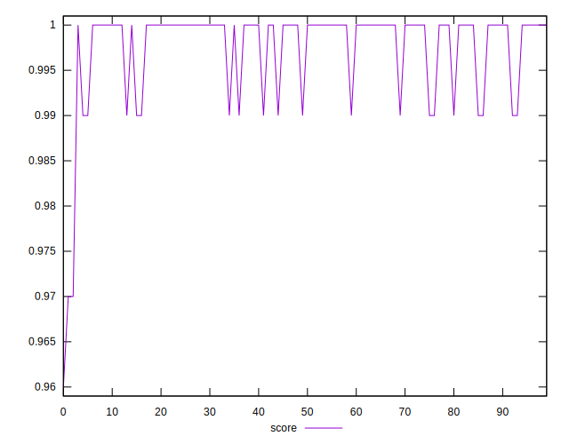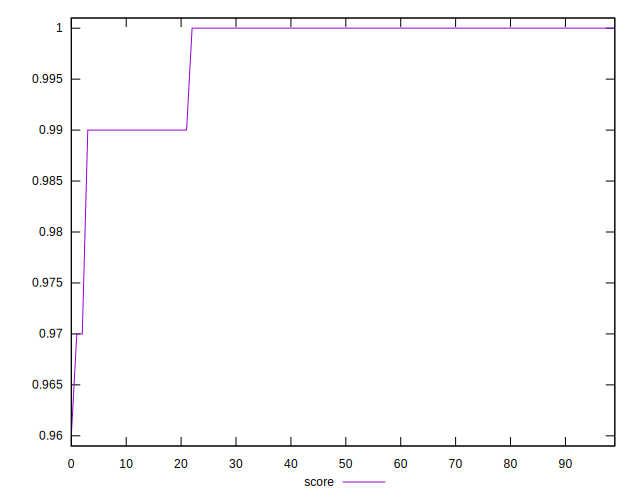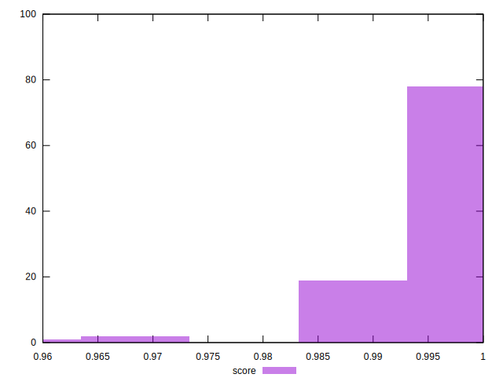
## Raw Estimate

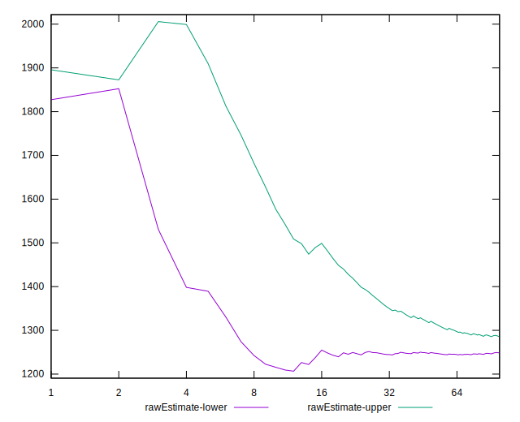
## Score Estimate

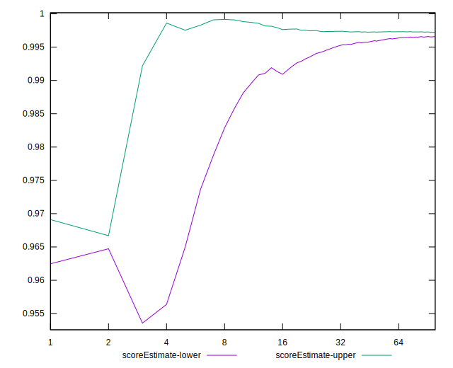
## P Score


```yaml
p90min: 0.987173312604607
p90max: 0.9977713305646174
p90range: 0.010598017960010475
p90mean: 0.9964889980151823
median: 0.9975233377369721
p90stdev: 0.002106873313350533
mad: 0.00016523169490822998
stdevBySn: 0.00025783370367707755
lfitCenter: 0.9964224488865001
lfitStdev: 0.0021607267793000017
mfitCenter: 0.9964224488865001
mfitStdev: 0.0027080694220978554
mfitConfidence: 0.0002708069422097855
p90skewness: -2.4560741115196167
p90eccentricity: 0.9999999999999996
p90discretization: 1
outlandishness: 0.9982277068903919

```

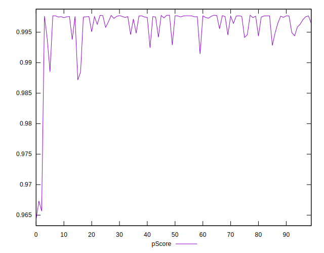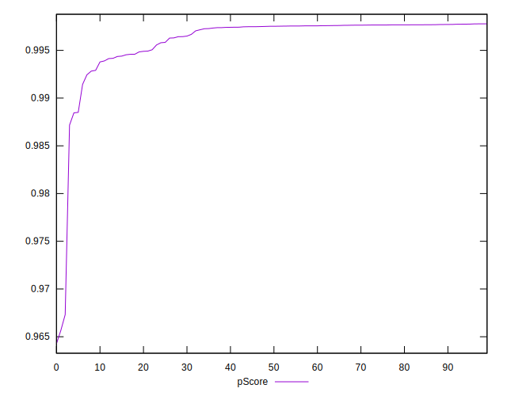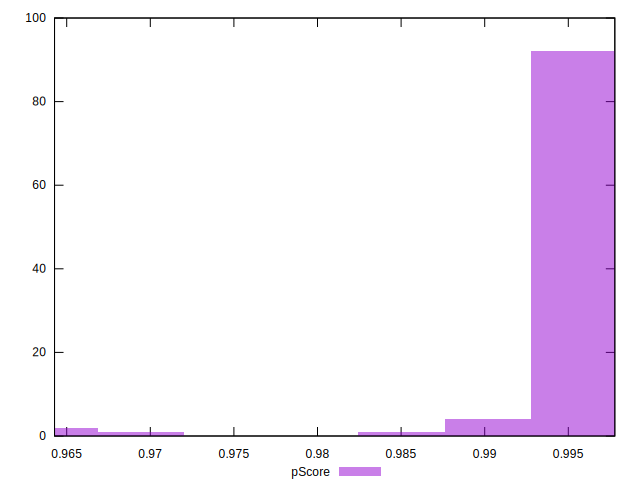
## Score Difference


```yaml
p90min: 0
p90max: 0
p90range: 0
p90mean: 0
median: 0
p90stdev: 0
mad: 0
stdevBySn: 0
lfitCenter: 0
lfitStdev: 0
mfitCenter: 0
mfitStdev: 0
mfitConfidence: 0
p90skewness: .nan
p90eccentricity: .nan
p90discretization: 94
outlandishness: .nan

```


## P Score Difference


```yaml
p90min: -0.0041997643595219625
p90max: 0.004595770425393164
p90range: 0.008795534784915127
p90mean: -0.0015999832713139428
median: -0.0023615454538160052
p90stdev: 0.002300440461477128
mad: 0.00013981484052200122
stdevBySn: 0.00025783370367707755
lfitCenter: -0.0018644664718504404
lfitStdev: 0.0014273882739955582
mfitCenter: -0.0018644664718504404
mfitStdev: 0.0017889659050371375
mfitConfidence: 0.00017889659050371375
p90skewness: 1.9113627327961153
p90eccentricity: 0.9999999999999999
p90discretization: 1
outlandishness: 0.8724079531182977

```

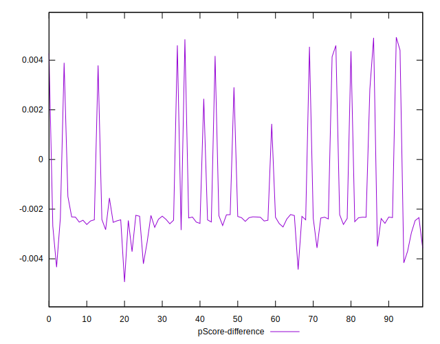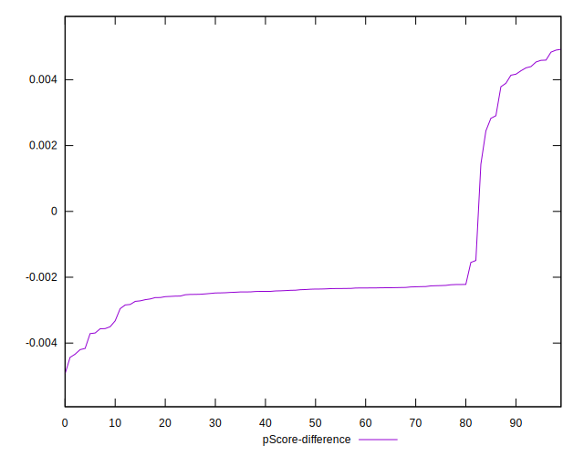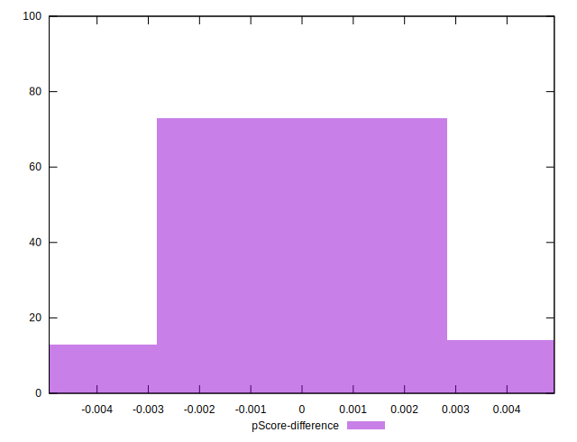