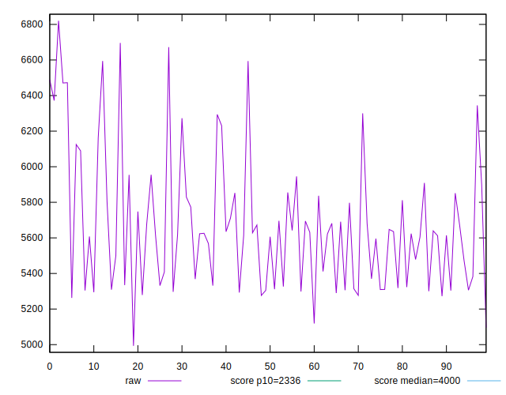

# //first-meaningful-paint/samples/astro

[→ Parent](../..)


## Raw


```yaml
p90min: 5262.377000000001
p90max: 6594.285999999998
p90range: 1331.908999999997
p90mean: 5663.790074468083
median: 5623.5830000000005
p90stdev: 349.49104462466585
mad: 287.2480000000014
stdevBySn: 378.859801300002
lfitCenter: 5645.535020591847
lfitStdev: 265.0691199720597
mfitCenter: 5645.535020591847
mfitStdev: 332.21487576104954
mfitConfidence: 33.221487576104956
p90skewness: 0.9593442750666384
p90eccentricity: 1.0000000000000002
p90discretization: 1
outlandishness: 1.0049982567452775

```


## Score


```yaml
p90min: 0.12
p90max: 0.26
p90range: 0.14
p90mean: 0.20755319148936174
median: 0.21
p90stdev: 0.03863870207868055
mad: 0.03499999999999999
stdevBySn: 0.04770400000000001
lfitCenter: 0.20918036716188812
lfitStdev: 0.030734592636941248
mfitCenter: 0.20918036716188812
mfitStdev: 0.03852009949527191
mfitConfidence: 0.003852009949527191
p90skewness: -0.6018476629976435
p90eccentricity: 0.9999999999999994
p90discretization: 6.266666666666667
outlandishness: 0.9937156961654858

```


## Raw Estimate


## Score Estimate


## P Score


```yaml
p90min: 0.11679952629340784
p90max: 0.25670073859026943
p90range: 0.1399012122968616
p90mean: 0.20729265855191872
median: 0.20847341644605738
p90stdev: 0.03868733370643116
mad: 0.034574190545327566
stdevBySn: 0.047218614511325745
lfitCenter: 0.20873717186202237
lfitStdev: 0.03039905218561163
mfitCenter: 0.20873717186202237
mfitStdev: 0.03809956190355611
mfitConfidence: 0.003809956190355611
p90skewness: -0.6098999748193402
p90eccentricity: 0.9999999999999999
p90discretization: 1
outlandishness: 0.9940475839674803

```


## Score Difference


```yaml
p90min: 0
p90max: 0
p90range: 0
p90mean: 0
median: 0
p90stdev: 0
mad: 0
stdevBySn: 0
lfitCenter: 0
lfitStdev: 0
mfitCenter: 0
mfitStdev: 0
mfitConfidence: 0
p90skewness: .nan
p90eccentricity: .nan
p90discretization: 94
outlandishness: .nan

```


## P Score Difference


```yaml
p90min: -0.0044437553963781184
p90max: 0.0045988871876244675
p90range: 0.009042642584002586
p90mean: -0.00024518522452905315
median: -0.0001429037938888017
p90stdev: 0.0023690863421700907
mad: 0.0019831447926394047
stdevBySn: 0.0027108293269794137
lfitCenter: -0.0002137975786708727
lfitStdev: 0.002036107408516331
mfitCenter: -0.0002137975786708727
mfitStdev: 0.002551882202754157
mfitConfidence: 0.0002551882202754157
p90skewness: 0.02237661289240704
p90eccentricity: 1.0000000000000002
p90discretization: 1
outlandishness: 0.8436850613108116

```

