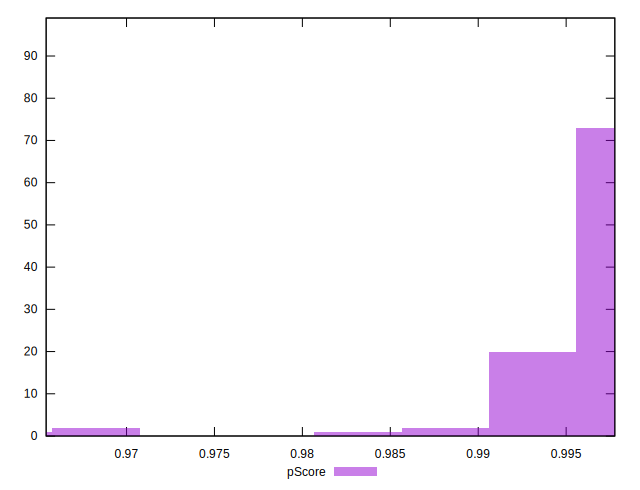

# //first-meaningful-paint/samples/card

[→ Parent](../..)


## Raw


```yaml
p90min: 1213.4879999999998
p90max: 1598.7179999999998
p90range: 385.23
p90mean: 1277.841501075269
median: 1233.723
p90stdev: 80.20215542209303
mad: 16.479000000000042
stdevBySn: 22.64031839999991
lfitCenter: 1272.386273269839
lfitStdev: 76.57956415569905
mfitCenter: 1272.386273269839
mfitStdev: 95.97825048237435
mfitConfidence: 9.646177117720693
p90skewness: 1.5436716313883394
p90eccentricity: 1.0000000000000002
p90discretization: 1
outlandishness: 1.0232624464028992

```


## Score


```yaml
p90min: 0.99
p90max: 1
p90range: 0.010000000000000009
p90mean: 0.9976344086021504
median: 1
p90stdev: 0.004249693085025706
mad: 0
stdevBySn: 0
lfitCenter: 0.9980343580660805
lfitStdev: 0.0041013725159211286
mfitCenter: 0.9980343580660805
mfitStdev: 0.005140308161773589
mfitConfidence: 0.0005166204084668025
p90skewness: -1.239811228454474
p90eccentricity: 1.0000000000000004
p90discretization: 46.5
outlandishness: 0.9984655142869487

```


## Raw Estimate


## Score Estimate


## P Score


```yaml
p90min: 0.9855617224803659
p90max: 0.9977589765166395
p90range: 0.012197254036273586
p90mean: 0.9964427788521315
median: 0.9974659681055753
p90stdev: 0.002016304023285719
mad: 0.00024070305933698855
stdevBySn: 0.0003287886306505464
lfitCenter: 0.9963797230825631
lfitStdev: 0.0020627331499053665
mfitCenter: 0.9963797230825631
mfitStdev: 0.00258525262088712
mfitConfidence: 0.00025982766459895434
p90skewness: -2.655696984927903
p90eccentricity: 0.9999999999999996
p90discretization: 1
outlandishness: 0.9983938639964759

```


## Score Difference


```yaml
p90min: 0
p90max: 0
p90range: 0
p90mean: 0
median: 0
p90stdev: 0
mad: 0
stdevBySn: 0
lfitCenter: 0
lfitStdev: 0
mfitCenter: 0
mfitStdev: 0
mfitConfidence: 0
p90skewness: .nan
p90eccentricity: .nan
p90discretization: 93
outlandishness: .nan

```


## P Score Difference


```yaml
p90min: -0.004299163907376613
p90max: 0.004668283291468844
p90range: 0.008967447198845457
p90mean: -0.00131788559746789
median: -0.002345584583379745
p90stdev: 0.0026143946459079173
mad: 0.00018844731104494805
stdevBySn: 0.0003287886306505464
lfitCenter: -0.001655794488415953
lfitStdev: 0.0018523206758618545
mfitCenter: -0.001655794488415953
mfitStdev: 0.0023215396922354964
mfitConfidence: 0.0002333235180321907
p90skewness: 1.5181759814589417
p90eccentricity: 1.0000000000000002
p90discretization: 1
outlandishness: 0.8660397488845746

```

