# //interactive/samples/agenda

[→ Parent](../..)


## Raw


```yaml
p90min: 1363.7060000000001
p90max: 3227.1669999999995
p90range: 1863.4609999999993
p90mean: 2005.852322872341
median: 1958.5795
p90stdev: 273.54042350089003
mad: 129.88149999999996
stdevBySn: 214.15548015000002
lfitCenter: 2157.341803296316
lfitStdev: 519.8517507435078
mfitCenter: 2157.341803296316
mfitStdev: 651.5375491706567
mfitConfidence: 65.15375491706567
p90skewness: 1.1180785650709395
p90eccentricity: 1
p90discretization: 1
outlandishness: 1.3845549178269505

```

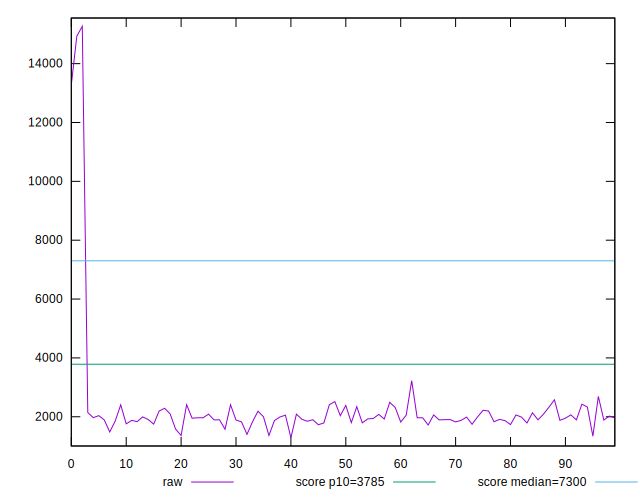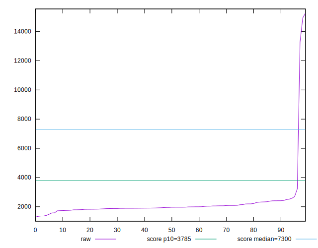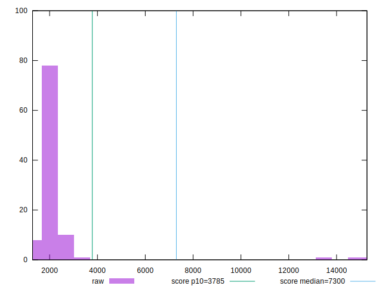
## Score


```yaml
p90min: 0.94
p90max: 1
p90range: 0.06000000000000005
p90mean: 0.9931914893617013
median: 0.99
p90stdev: 0.008777723976483522
mad: 0.010000000000000009
stdevBySn: 0.011926000000000011
lfitCenter: 0.9809241649321935
lfitStdev: 0.03276829456407043
mfitCenter: 0.9809241649321935
mfitStdev: 0.04106896687419347
mfitConfidence: 0.004106896687419348
p90skewness: -2.6489063582946484
p90eccentricity: 1.0000000000000016
p90discretization: 18.8
outlandishness: 0.9465814299155441

```

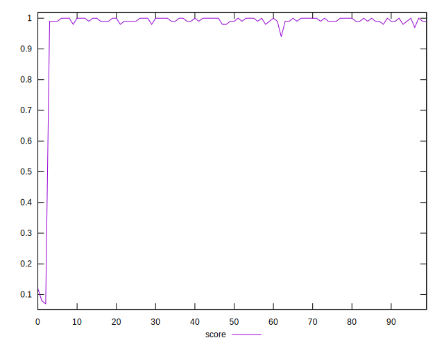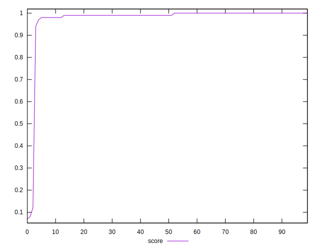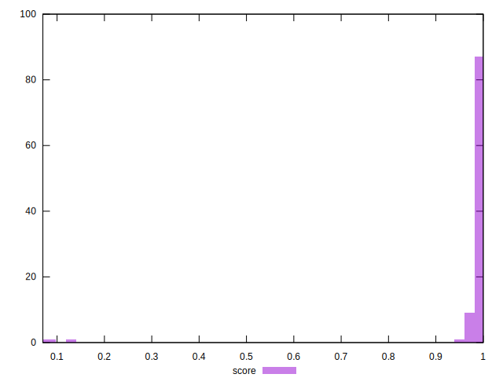
## Raw Estimate

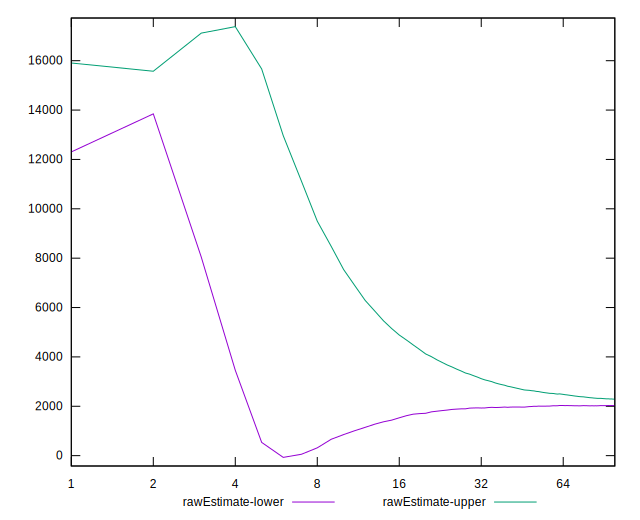
## Score Estimate

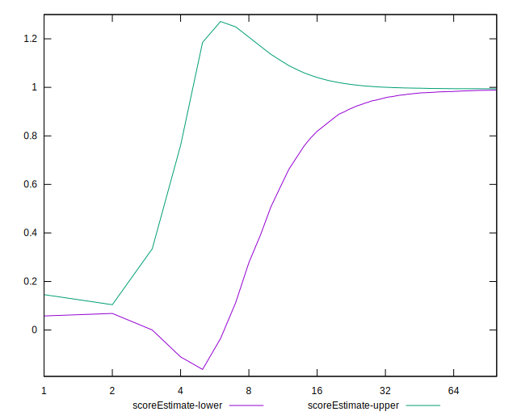
## P Score


```yaml
p90min: 0.9443795813353397
p90max: 0.999468504679603
p90range: 0.055088923344263296
p90mean: 0.992882249728684
median: 0.9948703149736766
p90stdev: 0.006869262189593083
mad: 0.001728862013880561
stdevBySn: 0.002902273825684965
lfitCenter: 0.9808654517471003
lfitStdev: 0.03248037909394023
mfitCenter: 0.9808654517471003
mfitStdev: 0.040708118344764344
mfitConfidence: 0.004070811834476435
p90skewness: -4.1820382756630865
p90eccentricity: 1.0000000000000002
p90discretization: 1
outlandishness: 0.946726605595618

```

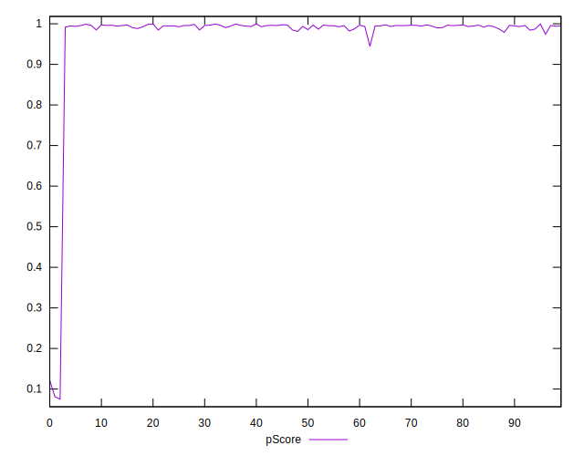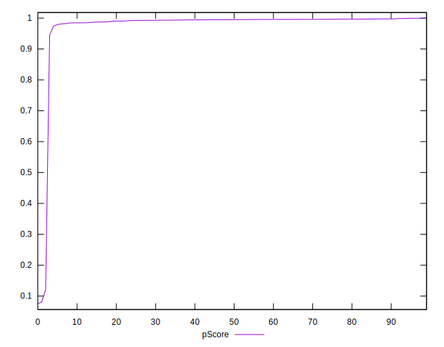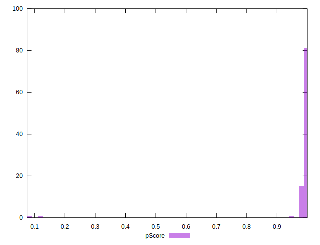
## Score Difference


```yaml
p90min: 0
p90max: 0
p90range: 0
p90mean: 0
median: 0
p90stdev: 0
mad: 0
stdevBySn: 0
lfitCenter: 5.166535369026208e-19
lfitStdev: 1.2890316797319448e-18
mfitCenter: 5.166535369026208e-19
mfitStdev: 1.6155616292812394e-18
mfitConfidence: 1.6155616292812395e-19
p90skewness: .nan
p90eccentricity: .nan
p90discretization: 94
outlandishness: .inf

```

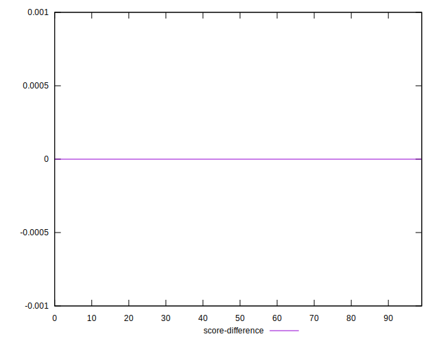
## P Score Difference


```yaml
p90min: -0.00452954559166896
p90max: 0.004834329126672587
p90range: 0.009363874718341547
p90mean: -0.00024864863331125757
median: -0.0007895921814207174
p90stdev: 0.0034403318640633686
mad: 0.003406422752060545
stdevBySn: 0.004165744787521379
lfitCenter: -0.0003901680830217146
lfitStdev: 0.0033937144344041805
mfitCenter: -0.0003901680830217146
mfitStdev: 0.004253390282930378
mfitConfidence: 0.0004253390282930378
p90skewness: 0.22624792593080642
p90eccentricity: 0.9999999999999994
p90discretization: 1
outlandishness: 0.8319283328901239

```

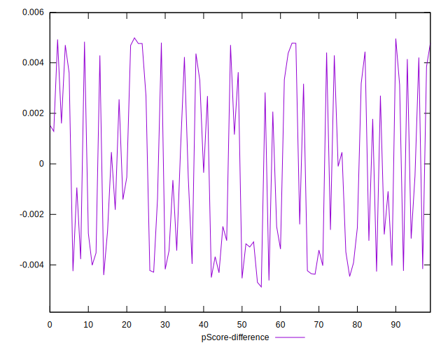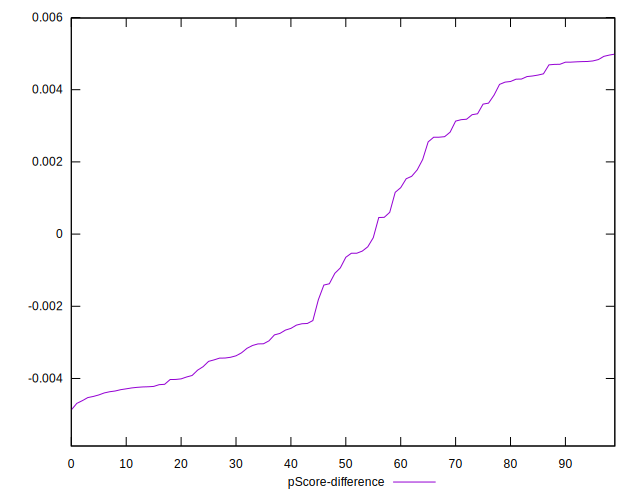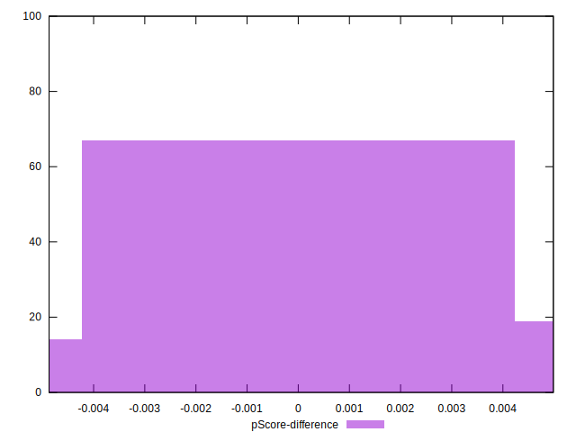