# //interactive/samples/astro

[→ Parent](../..)


## Raw


```yaml
p90min: 14717.095500000001
p90max: 15961.6475
p90range: 1244.5519999999979
p90mean: 15485.900914893622
median: 15528.188499999998
p90stdev: 279.90054545764536
mad: 220.95850000000064
stdevBySn: 301.79726895000226
lfitCenter: 15495.569078148577
lfitStdev: 237.0408722481791
mfitCenter: 15495.569078148577
mfitStdev: 297.08667660918155
mfitConfidence: 29.708667660918156
p90skewness: -0.6205774777238319
p90eccentricity: 0.9999999999999999
p90discretization: 1
outlandishness: 0.998843945675829

```

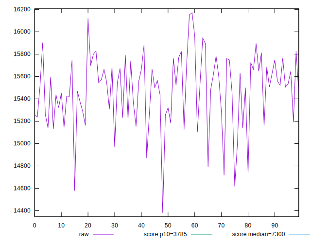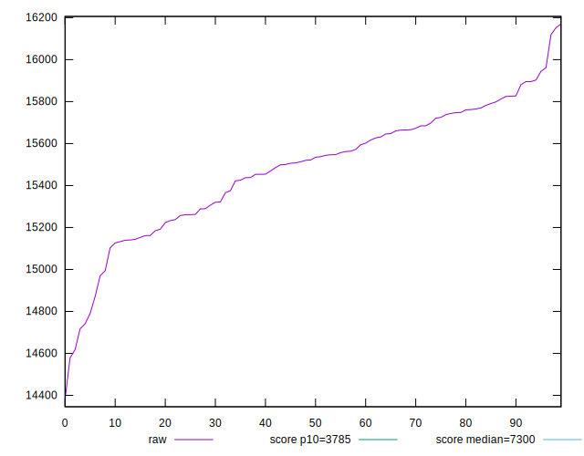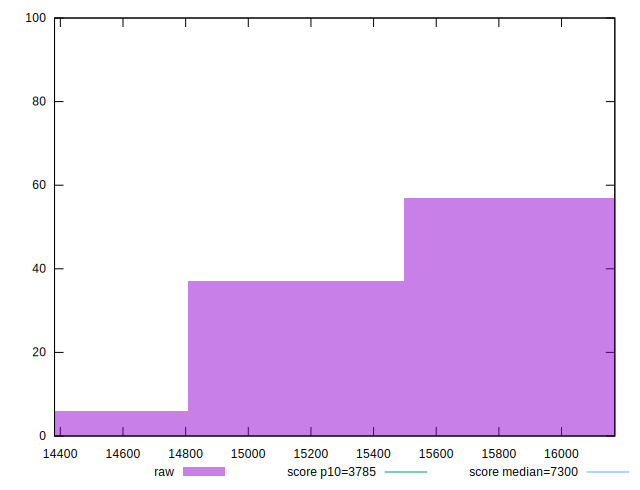
## Score


```yaml
p90min: 0.06
p90max: 0.09
p90range: 0.03
p90mean: 0.07212765957446815
median: 0.07
p90stdev: 0.005811276716488368
mad: 0
stdevBySn: 0
lfitCenter: 0.07162169848293873
lfitStdev: 0.004486681834741658
mfitCenter: 0.07162169848293873
mfitStdev: 0.005623221778776692
mfitConfidence: 0.0005623221778776692
p90skewness: 0.5871758202630203
p90eccentricity: 0.9999999999999979
p90discretization: 23.5
outlandishness: 1.004784470201268

```

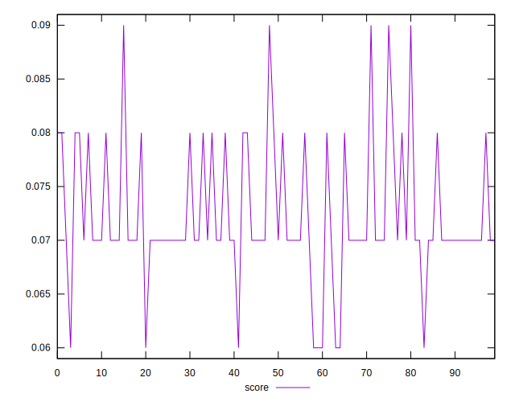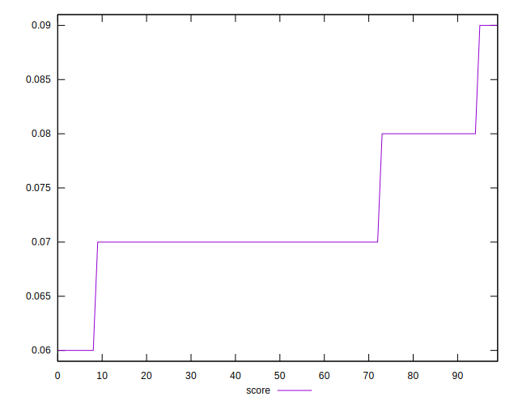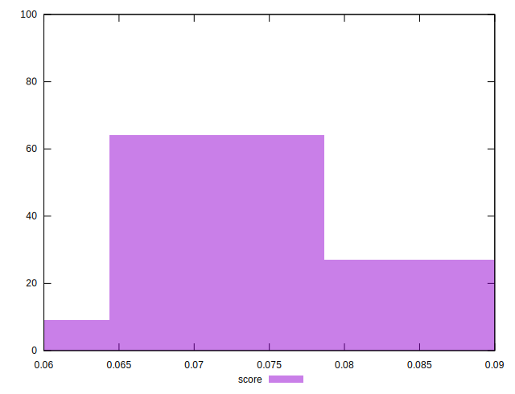
## Raw Estimate

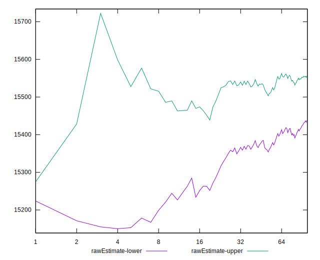
## Score Estimate

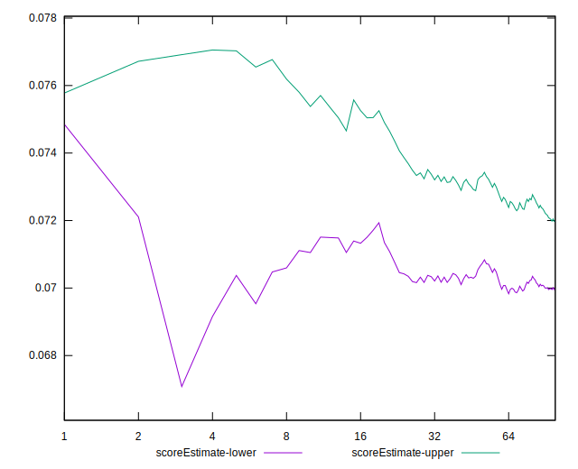
## P Score


```yaml
p90min: 0.06345641802222252
p90max: 0.08565612894600289
p90range: 0.02219971092378037
p90mean: 0.07131028497785864
median: 0.07041987683748618
p90stdev: 0.0049144943104749515
mad: 0.003729858443935974
stdevBySn: 0.005092786605362484
lfitCenter: 0.07112509629194196
lfitStdev: 0.004147150939669099
mfitCenter: 0.07112509629194196
mfitStdev: 0.005197682907498673
mfitConfidence: 0.0005197682907498673
p90skewness: 0.7857225905931386
p90eccentricity: 1.0000000000000002
p90discretization: 1
outlandishness: 1.0065921506590276

```

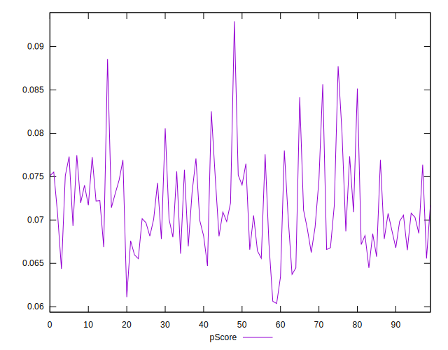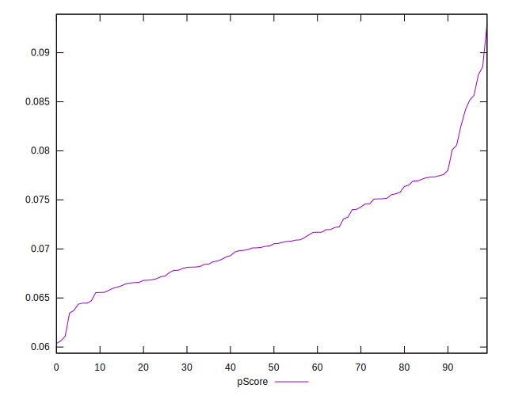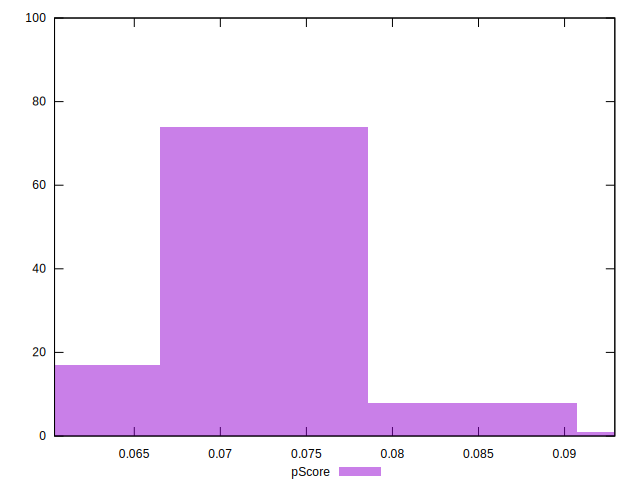
## Score Difference


```yaml
p90min: 0
p90max: 0
p90range: 0
p90mean: 0
median: 0
p90stdev: 0
mad: 0
stdevBySn: 0
lfitCenter: 0
lfitStdev: 0
mfitCenter: 0
mfitStdev: 0
mfitConfidence: 0
p90skewness: .nan
p90eccentricity: .nan
p90discretization: 94
outlandishness: .nan

```


## P Score Difference


```yaml
p90min: -0.004840165290074999
p90max: 0.004475016906657747
p90range: 0.009315182196732746
p90mean: -0.0007945235676168095
median: -0.0012702606175512832
p90stdev: 0.002636431332825644
mad: 0.002101212459815871
stdevBySn: 0.0032473079941036363
lfitCenter: -0.0008792615761636792
lfitStdev: 0.0023809645544308772
mfitCenter: -0.0008792615761636792
mfitStdev: 0.0029840965395180443
mfitConfidence: 0.0002984096539518044
p90skewness: 0.3665538415156131
p90eccentricity: 0.9999999999999994
p90discretization: 1
outlandishness: 0.9031210303697411

```

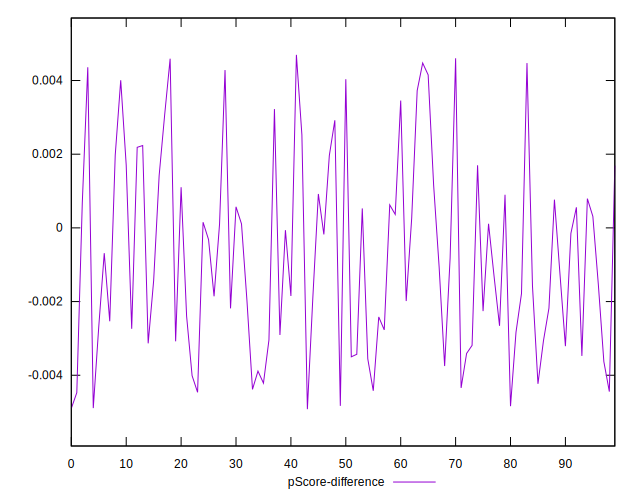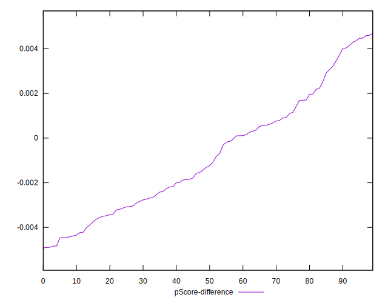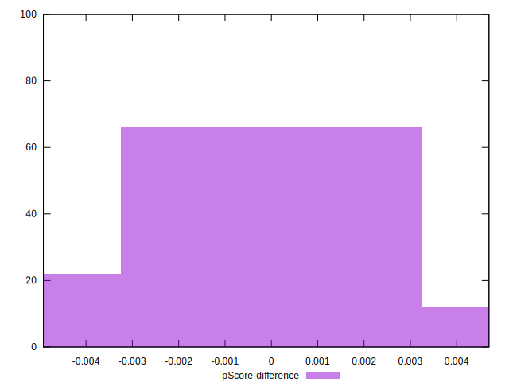