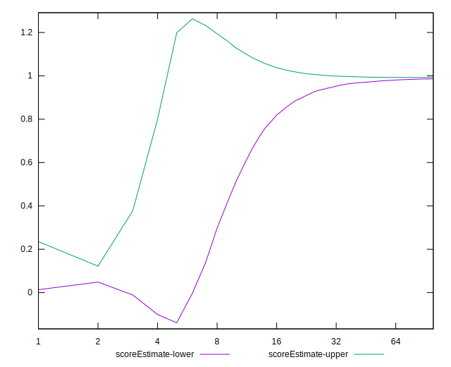
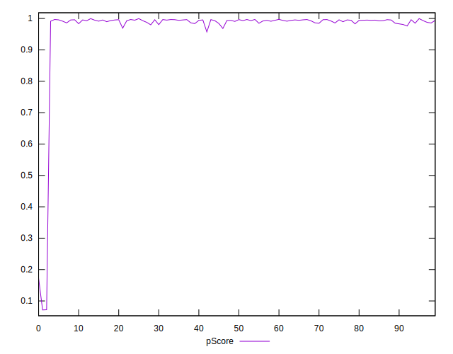

# //interactive/samples/card

[→ Parent](../..)


## Raw


```yaml
p90min: 1765.9429999999998
p90max: 3025.889
p90range: 1259.9460000000004
p90mean: 2097.956095698925
median: 2021.5955
p90stdev: 255.8087782518088
mad: 140.47949999999992
stdevBySn: 241.04145454999986
lfitCenter: 2237.7138430973346
lfitStdev: 521.8911283168806
mfitCenter: 2237.7138430973346
mfitStdev: 654.0935299172609
mfitConfidence: 65.73887322832299
p90skewness: 1.2243200491050494
p90eccentricity: 1.0000000000000002
p90discretization: 1
outlandishness: 1.3547942194812068

```


## Score


```yaml
p90min: 0.96
p90max: 1
p90range: 0.040000000000000036
p90mean: 0.991397849462365
median: 0.99
p90stdev: 0.007841356840217011
mad: 0.010000000000000009
stdevBySn: 0.011926000000000011
lfitCenter: 0.9787476922644409
lfitStdev: 0.03222408733820439
mfitCenter: 0.9787476922644409
mfitStdev: 0.04038690426369999
mfitConfidence: 0.004059036602627199
p90skewness: -1.0534094311069881
p90eccentricity: 1.0000000000000002
p90discretization: 18.6
outlandishness: 0.9469593923757611

```


## Raw Estimate


## Score Estimate


## P Score


```yaml
p90min: 0.9571283749551767
p90max: 0.9971885967377152
p90range: 0.04006022178253854
p90mean: 0.991314005887153
median: 0.9938811198398807
p90stdev: 0.006789544979559484
mad: 0.0023113810081580866
stdevBySn: 0.003479938903693318
lfitCenter: 0.9795034445385024
lfitStdev: 0.032333274286277726
mfitCenter: 0.9795034445385024
mfitStdev: 0.04052374980946834
mfitConfidence: 0.004072790097461897
p90skewness: -2.425293300571246
p90eccentricity: 1.0000000000000002
p90discretization: 1
outlandishness: 0.947054879516423

```


## Score Difference


```yaml
p90min: 0
p90max: 0
p90range: 0
p90mean: 0
median: 0
p90stdev: 0
mad: 0
stdevBySn: 0
lfitCenter: 0
lfitStdev: 0
mfitCenter: 0
mfitStdev: 0
mfitConfidence: 0
p90skewness: .nan
p90eccentricity: .nan
p90discretization: 93
outlandishness: .nan

```


## P Score Difference


```yaml
p90min: -0.004696530032572088
p90max: 0.004780243282957786
p90range: 0.009476773315529874
p90mean: -0.00003888473261046968
median: 0.0003848893956026611
p90stdev: 0.003408191563840707
mad: 0.003650533609451667
stdevBySn: 0.004353626382632059
lfitCenter: -0.000010599066747168188
lfitStdev: 0.003453648339008872
mfitCenter: -0.000010599066747168188
mfitStdev: 0.004328506292951542
mfitConfidence: 0.00043503125080037683
p90skewness: -0.03548505087990035
p90eccentricity: 0.9999999999999996
p90discretization: 1
outlandishness: 0.718249609551075

```

