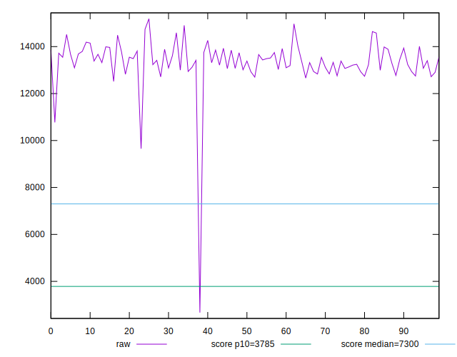

# //interactive/samples/music

[→ Parent](../..)


## Raw


```yaml
p90min: 12515.400500000002
p90max: 14737.1202
p90range: 2221.719699999998
p90mean: 13443.468755319152
median: 13384.322250000001
p90stdev: 504.9612605745811
mad: 389.3177500000029
stdevBySn: 571.1391215000014
lfitCenter: 13364.920683903483
lfitStdev: 509.4855438687683
mfitCenter: 13364.920683903483
mfitStdev: 638.5454355311354
mfitConfidence: 63.85454355311354
p90skewness: 0.5169332755514244
p90eccentricity: 0.9999999999999999
p90discretization: 1
outlandishness: 0.9814843601191098

```


## Score


```yaml
p90min: 0.09
p90max: 0.15
p90range: 0.06
p90mean: 0.11797872340425532
median: 0.12
p90stdev: 0.014408905877375597
mad: 0.010000000000000009
stdevBySn: 0.011926000000000011
lfitCenter: 0.12296796462593786
lfitStdev: 0.019639752576983253
mfitCenter: 0.12296796462593786
mfitStdev: 0.024614779582880077
mfitConfidence: 0.0024614779582880076
p90skewness: -0.11337799504753078
p90eccentricity: 1.0000000000000007
p90discretization: 13.428571428571429
outlandishness: 1.1807791212320542

```


## Raw Estimate


## Score Estimate


## P Score


```yaml
p90min: 0.08524167101181968
p90max: 0.1464408711350177
p90range: 0.061199200123198016
p90mean: 0.1176316830721011
median: 0.1184466035957416
p90stdev: 0.014048232877788912
mad: 0.01127359575098888
stdevBySn: 0.01698885803349175
lfitCenter: 0.12270221527160886
lfitStdev: 0.019061734645395623
mfitCenter: 0.12270221527160886
mfitStdev: 0.023890341536870474
mfitConfidence: 0.0023890341536870474
p90skewness: -0.25148174868295886
p90eccentricity: 0.9999999999999997
p90discretization: 1
outlandishness: 1.1818604452448622

```


## Score Difference


```yaml
p90min: 0
p90max: 0
p90range: 0
p90mean: 0
median: 0
p90stdev: 0
mad: 0
stdevBySn: 0
lfitCenter: 0
lfitStdev: 0
mfitCenter: 0
mfitStdev: 0
mfitConfidence: 0
p90skewness: .nan
p90eccentricity: .nan
p90discretization: 94
outlandishness: .nan

```


## P Score Difference


```yaml
p90min: -0.004506013143111942
p90max: 0.004172713477712253
p90range: 0.008678726620824195
p90mean: -0.0003398954545768976
median: -0.0004146434559167689
p90stdev: 0.0025969944466569255
mad: 0.002356993751747527
stdevBySn: 0.00311000968958678
lfitCenter: -0.0003784575433841831
lfitStdev: 0.002344249373760906
mfitCenter: -0.0003784575433841831
mfitStdev: 0.0029380808844839735
mfitConfidence: 0.00029380808844839737
p90skewness: 0.1202884261745684
p90eccentricity: 1.0000000000000002
p90discretization: 1
outlandishness: 0.8785744449534917

```

