# //largest-contentful-paint/samples/agenda

[→ Parent](../..)


## Raw


```yaml
p90min: 1685.6599999999999
p90max: 7411.904000000002
p90range: 5726.244000000002
p90mean: 2500.8662617021273
median: 2166.924
p90stdev: 1087.7535511414992
mad: 171.83249999999998
stdevBySn: 313.7477172499997
lfitCenter: 2427.4638551381313
lfitStdev: 702.7573606907991
mfitCenter: 2427.4638551381313
mfitStdev: 880.7757361425807
mfitConfidence: 88.07757361425807
p90skewness: 2.6297158050099685
p90eccentricity: 1.0000000000000002
p90discretization: 1
outlandishness: 1.122591840306125

```

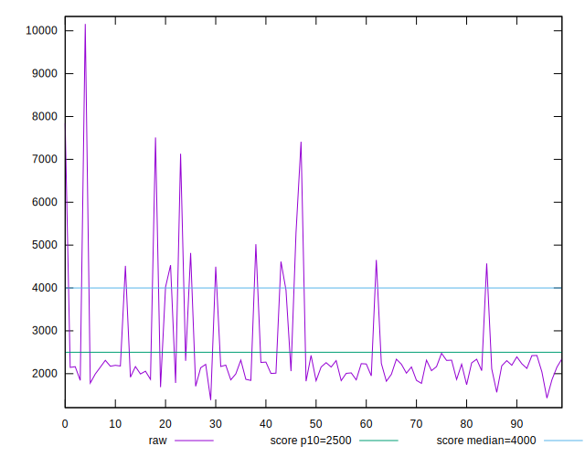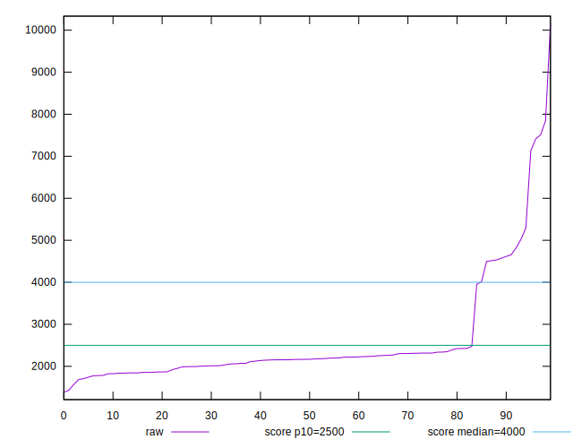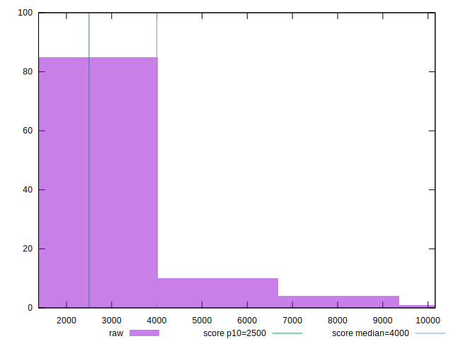
## Score


```yaml
p90min: 0.05
p90max: 0.99
p90range: 0.94
p90mean: 0.8670212765957442
median: 0.95
p90stdev: 0.2282208233885715
mad: 0.020000000000000018
stdevBySn: 0.03577800000000003
lfitCenter: 0.8921373245383908
lfitStdev: 0.14135084220932523
mfitCenter: 0.8921373245383908
mfitStdev: 0.17715700904066276
mfitConfidence: 0.017715700904066274
p90skewness: -2.2757582025144183
p90eccentricity: 1.0000000000000004
p90discretization: 4.476190476190476
outlandishness: 0.9514219154111936

```

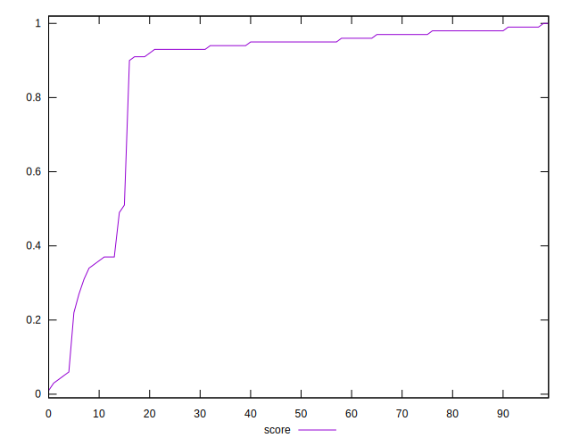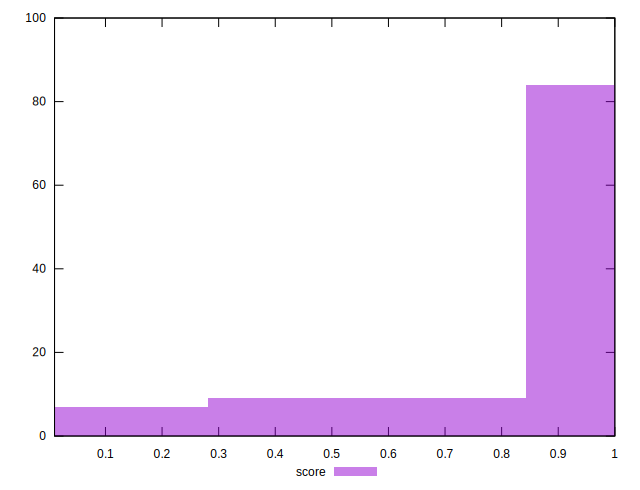
## Raw Estimate

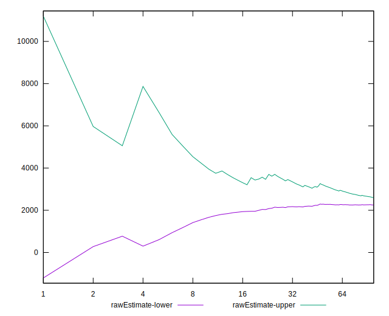
## Score Estimate

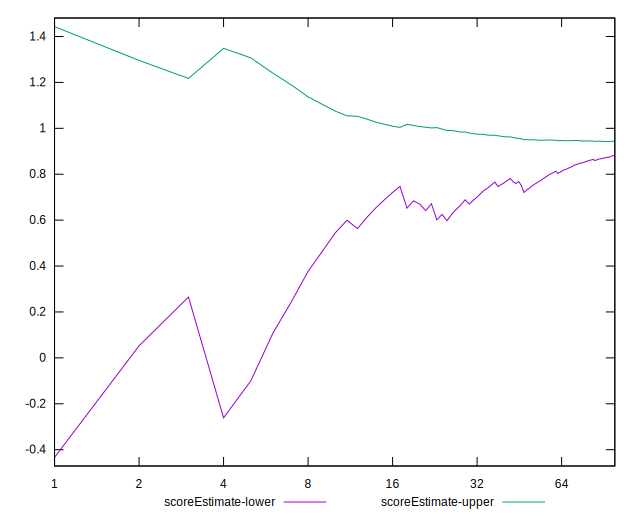
## P Score


```yaml
p90min: 0.04630380537027978
p90max: 0.9907692594147286
p90range: 0.9444654540444488
p90mean: 0.8677746759114
median: 0.9526804280849217
p90stdev: 0.2287287857510131
mad: 0.02074455572076439
stdevBySn: 0.034761648955203915
lfitCenter: 0.8930037659595315
lfitStdev: 0.14155881052482855
mfitCenter: 0.8930037659595315
mfitStdev: 0.17741765867085904
mfitConfidence: 0.017741765867085903
p90skewness: -2.281838254705954
p90eccentricity: 1.0000000000000009
p90discretization: 1
outlandishness: 0.9514051349610289

```

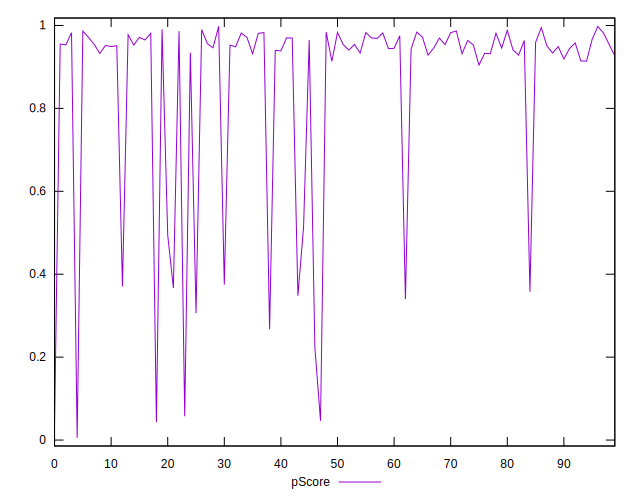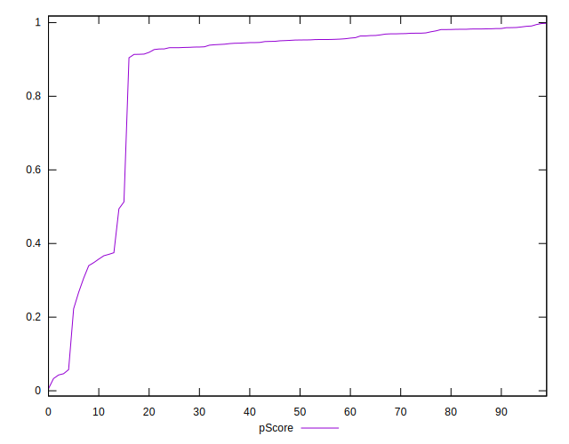
## Score Difference


```yaml
p90min: 0
p90max: 1.1102230246251565e-16
p90range: 1.1102230246251565e-16
p90mean: 2.7755575615628914e-17
median: 0
p90stdev: 4.7731898631598984e-17
mad: 0
stdevBySn: 0
lfitCenter: 1.992868137098408e-17
lfitStdev: 4.074547817580576e-17
mfitCenter: 1.992868137098408e-17
mfitStdev: 5.1066883880803206e-17
mfitConfidence: 5.106688388080321e-18
p90skewness: 1.1546113188665084
p90eccentricity: 0.9999999999999984
p90discretization: 31.333333333333332
outlandishness: 1.1236000000000002

```

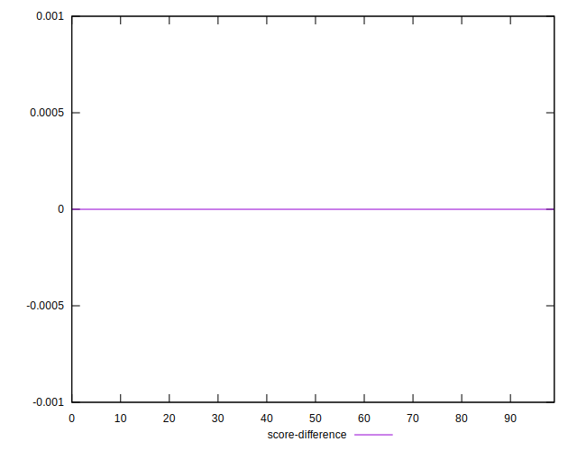
## P Score Difference


```yaml
p90min: -0.00448045672561608
p90max: 0.004760252273892651
p90range: 0.009240708999508731
p90mean: 0.0007752937230528332
median: 0.0012181679952982805
p90stdev: 0.0027154943651005654
mad: 0.0024147616288578977
stdevBySn: 0.0034091361229832812
lfitCenter: 0.0008868501791115363
lfitStdev: 0.0024479847955448876
mfitCenter: 0.0008868501791115363
mfitStdev: 0.0030680939552770485
mfitConfidence: 0.00030680939552770484
p90skewness: -0.363569923839789
p90eccentricity: 1.0000000000000004
p90discretization: 1
outlandishness: 0.8802850111703102

```

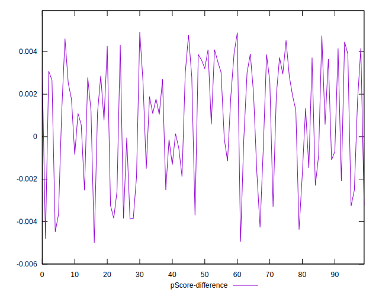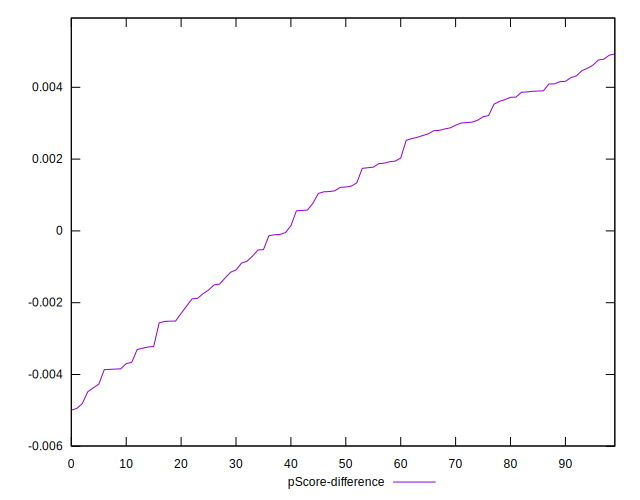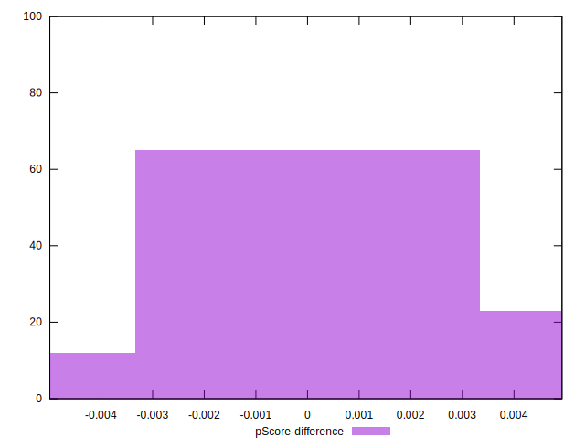