# //largest-contentful-paint/samples/astro

[→ Parent](../..)


## Raw


```yaml
p90min: 9914.688500000002
p90max: 16317.611499999999
p90range: 6402.922999999997
p90mean: 12755.260946808517
median: 12243.21975
p90stdev: 1844.683126160648
mad: 390.66949999999997
stdevBySn: 869.2300878000002
lfitCenter: 12553.960382411251
lfitStdev: 1355.5880119159644
mfitCenter: 12553.960382411251
mfitStdev: 1698.9776214192746
mfitConfidence: 169.89776214192744
p90skewness: 0.8276703550545634
p90eccentricity: 1.0000000000000002
p90discretization: 1
outlandishness: 0.9881890123768994

```

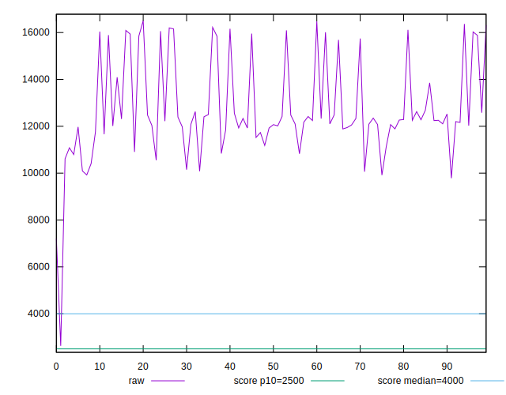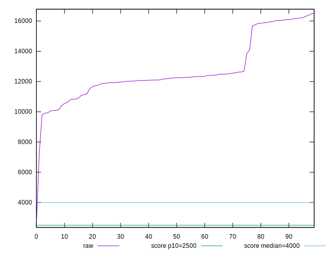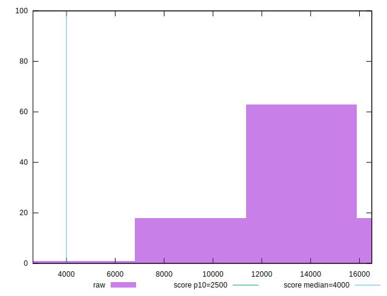
## Score


```yaml
p90min: 0
p90max: 0.01
p90range: 0.01
p90mean: 0.0006382978723404256
median: 0
p90stdev: 0.002444494743207671
mad: 0
stdevBySn: 0
lfitCenter: 0.004660363684224321
lfitStdev: 0.011136064101485748
mfitCenter: 0.004660363684224321
mfitStdev: 0.013956986586487835
mfitConfidence: 0.0013956986586487834
p90skewness: 3.5685919470918126
p90eccentricity: 1.0000000000000004
p90discretization: 47
outlandishness: 240.5601

```

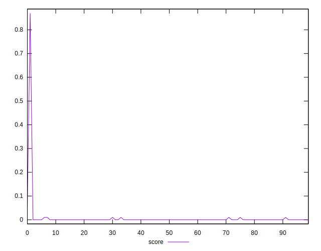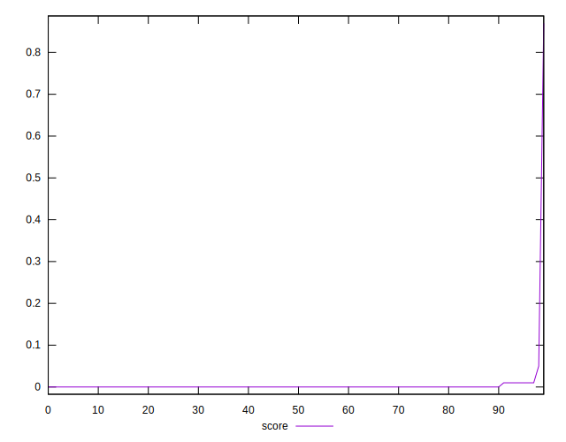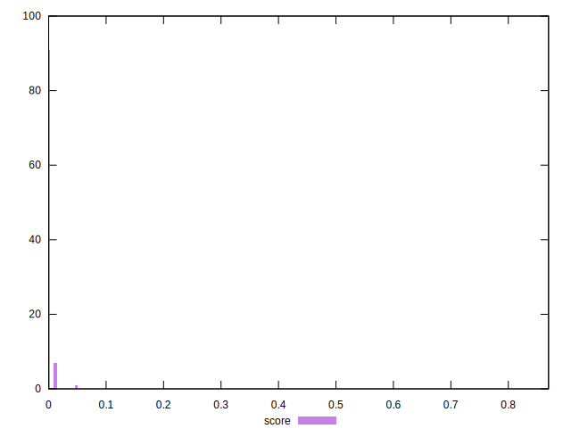
## Raw Estimate

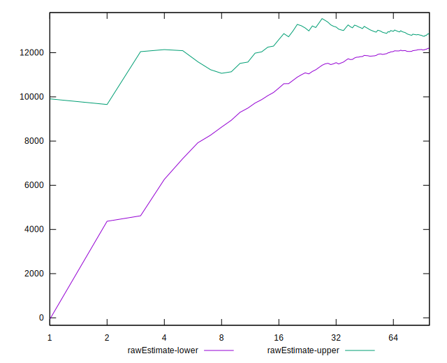
## Score Estimate

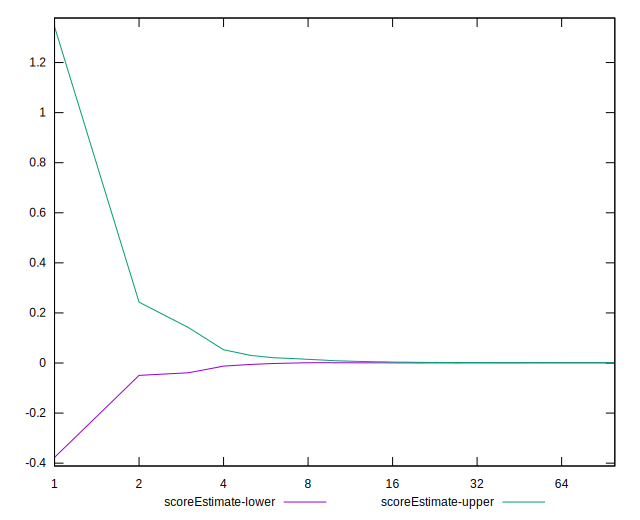
## P Score


```yaml
p90min: 0.00006316746577356147
p90max: 0.006660436282040494
p90range: 0.006597268816266932
p90mean: 0.0014945080855294094
median: 0.0011432040679355548
p90stdev: 0.0015157240288180963
mad: 0.00034626803946141704
stdevBySn: 0.000707926817172286
lfitCenter: 0.005659967631744786
lfitStdev: 0.010756330974221507
mfitCenter: 0.005659967631744786
mfitStdev: 0.01348106168920164
mfitConfidence: 0.0013481061689201638
p90skewness: 1.8830494596826286
p90eccentricity: 0.9999999999999999
p90discretization: 1
outlandishness: 51.78516684230656

```

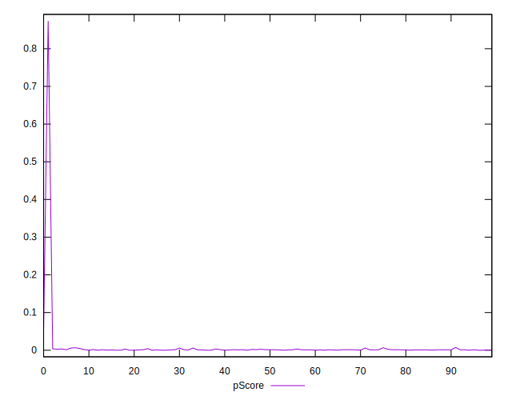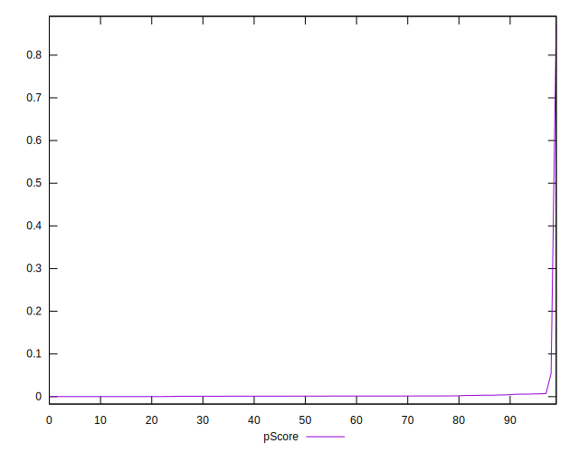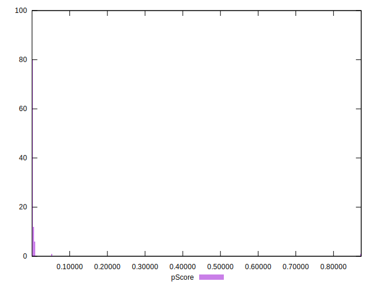
## Score Difference


```yaml
p90min: 0
p90max: 0
p90range: 0
p90mean: 0
median: 0
p90stdev: 0
mad: 0
stdevBySn: 0
lfitCenter: 0
lfitStdev: 0
mfitCenter: 0
mfitStdev: 0
mfitConfidence: 0
p90skewness: .nan
p90eccentricity: .nan
p90discretization: 94
outlandishness: .nan

```


## P Score Difference


```yaml
p90min: -0.004048582743939591
p90max: 0.003896344858538403
p90range: 0.007944927602477994
p90mean: 0.0009109137682113167
median: 0.0010804659706924735
p90stdev: 0.0012455260757938552
mad: 0.00040900613670449837
stdevBySn: 0.000707926817172286
lfitCenter: 0.0009250644185495843
lfitStdev: 0.0008335330990009349
mfitCenter: 0.0009250644185495843
mfitStdev: 0.0010446788179494723
mfitConfidence: 0.00010446788179494723
p90skewness: -1.2032828547512735
p90eccentricity: 1
p90discretization: 1
outlandishness: 0.880521120882461

```

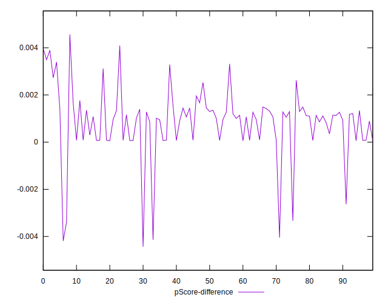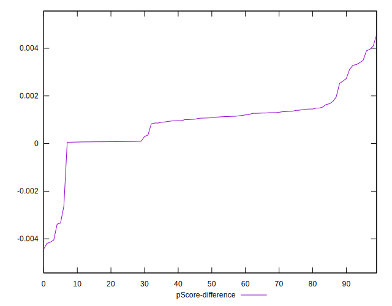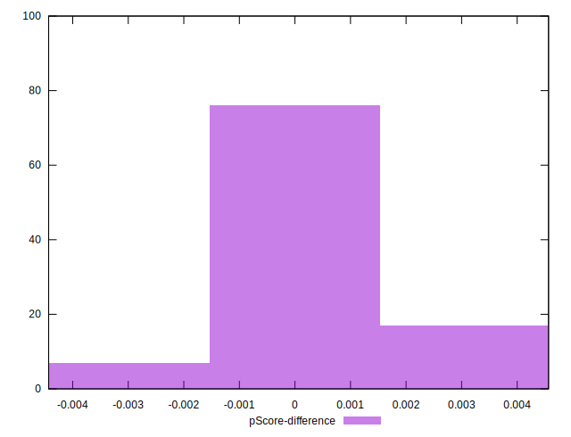