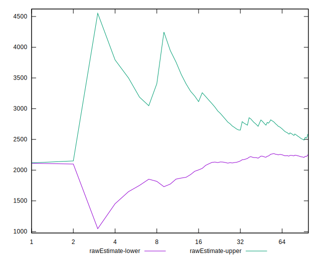

# //largest-contentful-paint/samples/card

[→ Parent](../..)


## Raw


```yaml
p90min: 1713.692
p90max: 6705.028
p90range: 4991.336
p90mean: 2495.3256881720436
median: 2167.764
p90stdev: 1012.1229694504572
mad: 201.45299999999997
stdevBySn: 379.89974850000016
lfitCenter: 2411.139242721833
lfitStdev: 663.956073351781
mfitCenter: 2411.139242721833
mfitStdev: 832.1455341256146
mfitConfidence: 83.63377295953178
p90skewness: 2.2892835079023937
p90eccentricity: 0.9999999999999992
p90discretization: 1
outlandishness: 1.0911076994643945

```


## Score


```yaml
p90min: 0.08
p90max: 0.99
p90range: 0.91
p90mean: 0.8649462365591397
median: 0.95
p90stdev: 0.22302718700138446
mad: 0.029999999999999916
stdevBySn: 0.03577800000000003
lfitCenter: 0.8906744958314635
lfitStdev: 0.14415314250029818
mfitCenter: 0.8906744958314635
mfitStdev: 0.1806691716158766
mfitConfidence: 0.018157934952551226
p90skewness: -2.1376689803255093
p90eccentricity: 0.9999999999999999
p90discretization: 4.2272727272727275
outlandishness: 0.9533839379802828

```


## Raw Estimate


## Score Estimate


## P Score


```yaml
p90min: 0.079490819952315
p90max: 0.9895907320514032
p90range: 0.9100999120990882
p90mean: 0.8652792573275624
median: 0.9525761191818126
p90stdev: 0.222954787873122
mad: 0.02487331612627719
stdevBySn: 0.03659082329498917
lfitCenter: 0.8909887801119016
lfitStdev: 0.14413316338156268
mfitCenter: 0.8909887801119016
mfitStdev: 0.18064413150388908
mfitConfidence: 0.018155418326606648
p90skewness: -2.1366990613374917
p90eccentricity: 0.9999999999999997
p90discretization: 1
outlandishness: 0.9533400907606298

```


## Score Difference


```yaml
p90min: 0
p90max: 1.1102230246251565e-16
p90range: 1.1102230246251565e-16
p90mean: 2.6263340367476823e-17
median: 0
p90stdev: 4.647348613424478e-17
mad: 0
stdevBySn: 0
lfitCenter: 1.8622137754759503e-17
lfitStdev: 3.8409520686797426e-17
mfitCenter: 1.8622137754759503e-17
mfitStdev: 4.813919533271508e-17
mfitConfidence: 4.838171170552842e-18
p90skewness: 1.2393779250780144
p90eccentricity: 1.0000000000000018
p90discretization: 31
outlandishness: 1.1395415461906822

```


## P Score Difference


```yaml
p90min: -0.004439176748416762
p90max: 0.0043325822740790665
p90range: 0.008771759022495829
p90mean: 0.00032582242205982743
median: 0.0003661542307155097
p90stdev: 0.0025934307329209083
mad: 0.0024026344475419625
stdevBySn: 0.0031417028838505844
lfitCenter: 0.0003908300898239882
lfitStdev: 0.0023356020296443456
mfitCenter: 0.0003908300898239882
mfitStdev: 0.0029272430458415506
mfitConfidence: 0.0002941989955525314
p90skewness: -0.22669028784937933
p90eccentricity: 0.9999999999999997
p90discretization: 1
outlandishness: 0.8805128291834029

```

