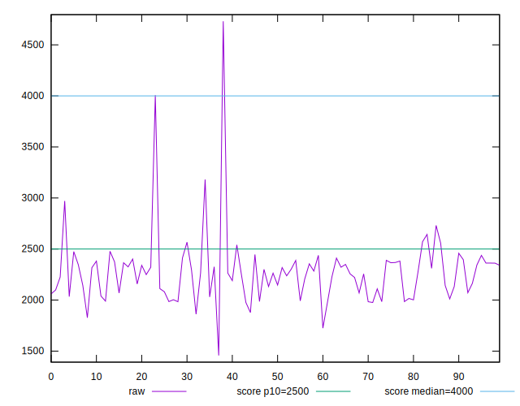
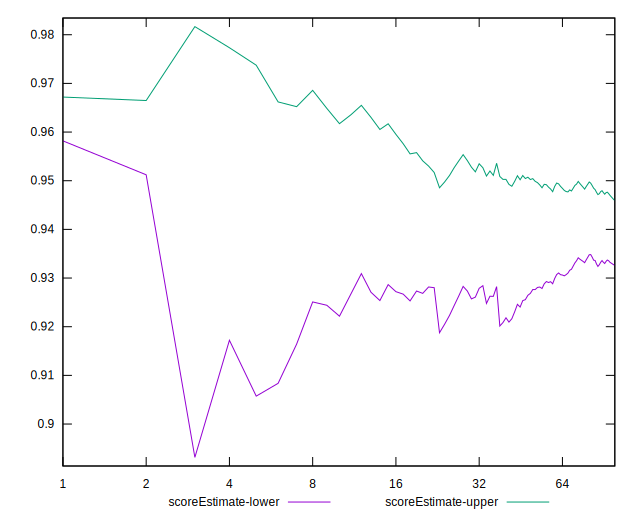

# //largest-contentful-paint/samples/music

[→ Parent](../..)


## Raw


```yaml
p90min: 1861.8270000000002
p90max: 2970.952
p90range: 1109.125
p90mean: 2248.143923404255
median: 2265.724
p90stdev: 197.2962520846683
mad: 134.69000000000005
stdevBySn: 204.0076169350002
lfitCenter: 2266.321688586938
lfitStdev: 187.11442491376587
mfitCenter: 2266.321688586938
mfitStdev: 234.51315427605954
mfitConfidence: 23.451315427605955
p90skewness: 0.4599594711382697
p90eccentricity: 0.9999999999999992
p90discretization: 1
outlandishness: 1.0308333019896092

```


## Score


```yaml
p90min: 0.79
p90max: 0.98
p90range: 0.18999999999999995
p90mean: 0.937659574468085
median: 0.94
p90stdev: 0.02997962187017201
mad: 0.020000000000000018
stdevBySn: 0.0357779999999999
lfitCenter: 0.9336084074279715
lfitStdev: 0.03015013565148275
mfitCenter: 0.9336084074279715
mfitStdev: 0.03778759129200689
mfitConfidence: 0.0037787591292006892
p90skewness: -1.5791028979855244
p90eccentricity: 0.9999999999999997
p90discretization: 7.230769230769231
outlandishness: 0.9765493754109138

```


## Raw Estimate


## Score Estimate


## P Score


```yaml
p90min: 0.7913024188598989
p90max: 0.9814742163690681
p90range: 0.19017179750916913
p90mean: 0.938023872294186
median: 0.9394108452700134
p90stdev: 0.030015331568304975
mad: 0.01986961889509037
stdevBySn: 0.030108095287537162
lfitCenter: 0.9338624188236809
lfitStdev: 0.029589800009705704
mfitCenter: 0.9338624188236809
mfitStdev: 0.03708531470981931
mfitConfidence: 0.0037085314709819307
p90skewness: -1.5404575280856456
p90eccentricity: 1.0000000000000004
p90discretization: 1
outlandishness: 0.9766260843835259

```


## Score Difference


```yaml
p90min: 0
p90max: 1.1102230246251565e-16
p90range: 1.1102230246251565e-16
p90mean: 1.7716324861039733e-17
median: 0
p90stdev: 4.0657582449828966e-17
mad: 0
stdevBySn: 0
lfitCenter: 1.1841287445510115e-17
lfitStdev: 2.6515949121427835e-17
mfitCenter: 1.1841287445510115e-17
mfitStdev: 3.323281393166429e-17
mfitConfidence: 3.3232813931664293e-18
p90skewness: 1.8591772600772096
p90eccentricity: 1.0000000000000016
p90discretization: 47
outlandishness: 1.2723839999999997

```


## P Score Difference


```yaml
p90min: -0.004420795092373586
p90max: 0.004578674597480403
p90range: 0.00899946968985399
p90mean: 0.000427147577432665
median: 0.0007461013346898304
p90stdev: 0.002574099722824231
mad: 0.002001592686497744
stdevBySn: 0.002979426760962406
lfitCenter: 0.0004985017767605533
lfitStdev: 0.0021910953709113985
mfitCenter: 0.0004985017767605533
mfitStdev: 0.002746130807333079
mfitConfidence: 0.0002746130807333079
p90skewness: -0.2531033307955968
p90eccentricity: 0.9999999999999991
p90discretization: 1
outlandishness: 0.86124548828353

```

