# //legacy-javascript/samples/astro

[→ Parent](../..)


## Raw


```yaml
p90min: 0
p90max: 150
p90range: 150
p90mean: 63.829787234042556
median: 0
p90stdev: 74.16351088482291
mad: 0
stdevBySn: 0
lfitCenter: 58.866501957223825
lfitStdev: 91.04051333468303
mfitCenter: 58.866501957223825
mfitStdev: 114.1023625456332
mfitConfidence: 11.41023625456332
p90skewness: 0.3012320380383539
p90eccentricity: 0.999999999999998
p90discretization: 47
outlandishness: 1.1183062499999998

```

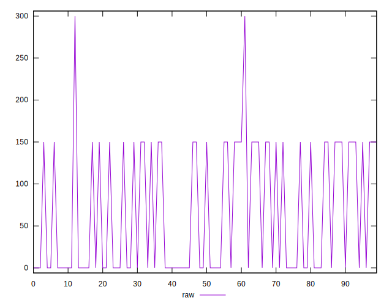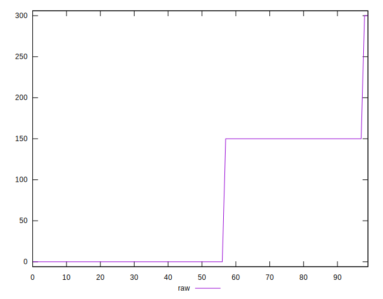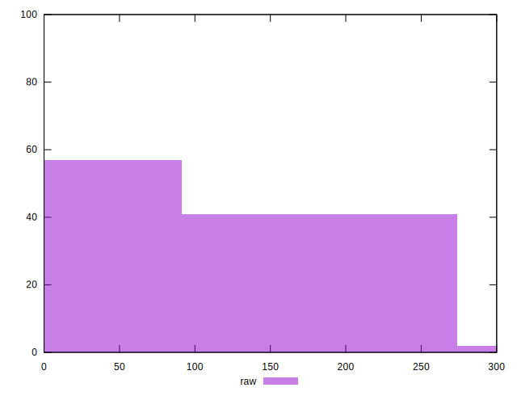
## Score


```yaml
p90min: 0.88
p90max: 1
p90range: 0.12
p90mean: 0.9489361702127657
median: 1
p90stdev: 0.05933080870785834
mad: 0
stdevBySn: 0
lfitCenter: 0.9528124875775723
lfitStdev: 0.0729782679637784
mfitCenter: 0.9528124875775723
mfitStdev: 0.091464695047838
mfitConfidence: 0.009146469504783799
p90skewness: -0.30123203803835585
p90eccentricity: 0.9999999999999974
p90discretization: 47
outlandishness: 0.9934010571095331

```

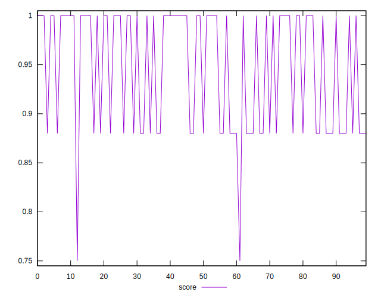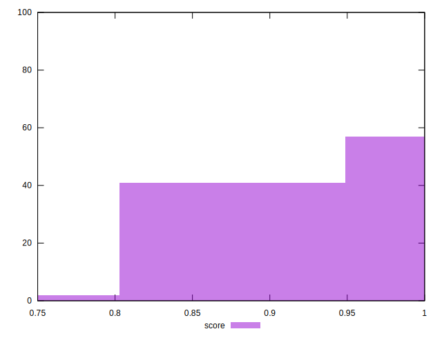
## Raw Estimate

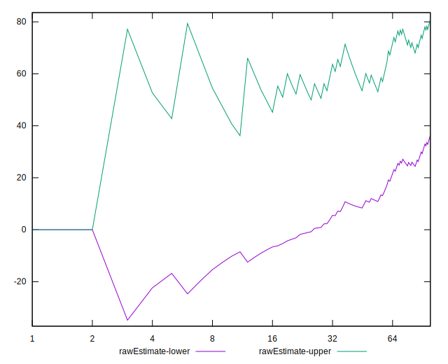
## Score Estimate

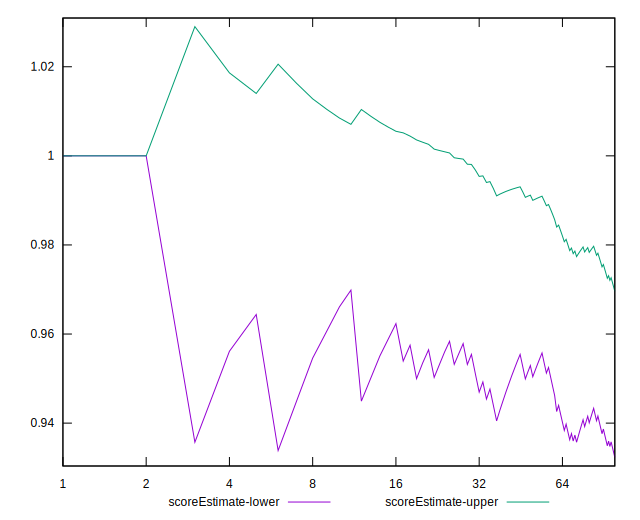
## P Score


```yaml
p90min: 0.875
p90max: 1
p90range: 0.125
p90mean: 0.9468085106382979
median: 1
p90stdev: 0.06180292573735242
mad: 0
stdevBySn: 0
lfitCenter: 0.9509445817023137
lfitStdev: 0.07586709444556917
mfitCenter: 0.9509445817023137
mfitStdev: 0.09508530212136099
mfitConfidence: 0.009508530212136098
p90skewness: -0.3012320380383535
p90eccentricity: 1
p90discretization: 47
outlandishness: 0.9935497609203383

```

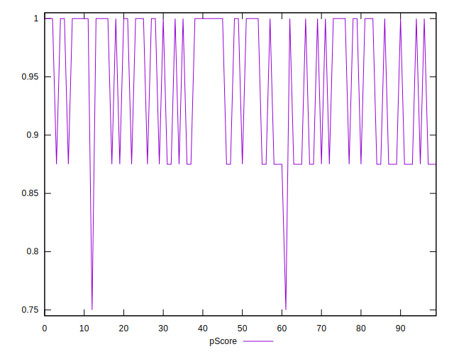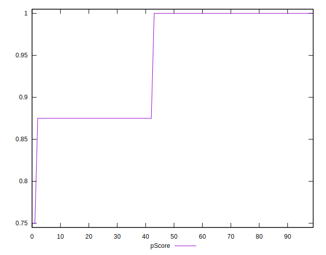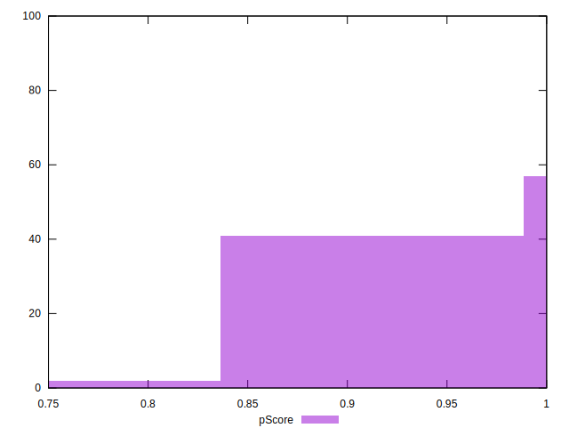
## Score Difference


```yaml
p90min: 0
p90max: 0
p90range: 0
p90mean: 0
median: 0
p90stdev: 0
mad: 0
stdevBySn: 0
lfitCenter: 0
lfitStdev: 0
mfitCenter: 0
mfitStdev: 0
mfitConfidence: 0
p90skewness: .nan
p90eccentricity: .nan
p90discretization: 94
outlandishness: .nan

```


## P Score Difference


```yaml
p90min: -0.0050000000000000044
p90max: 0
p90range: 0.0050000000000000044
p90mean: -0.0020212765957446826
median: 0
p90stdev: 0.0024537367222703843
mad: 0
stdevBySn: 0
lfitCenter: -0.0017658150003361734
lfitStdev: 0.002863056974692495
mfitCenter: -0.0017658150003361734
mfitStdev: 0.00358830978593256
mfitConfidence: 0.000358830978593256
p90skewness: -0.3901994862858543
p90eccentricity: 1.0000000000000004
p90discretization: 47
outlandishness: 1.0286229916897511

```

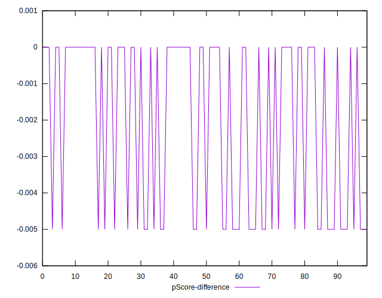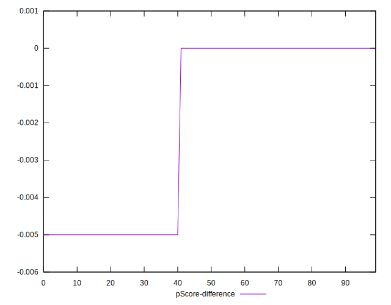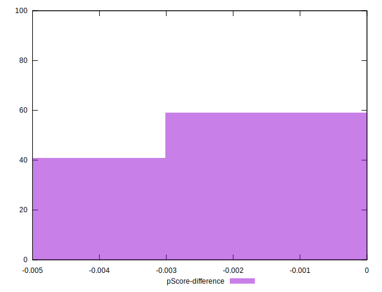