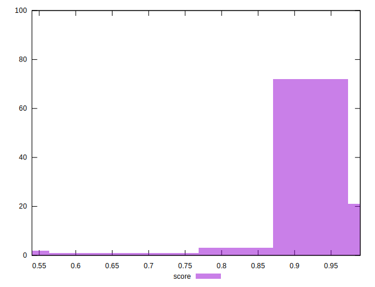

# //mainthread-work-breakdown/samples/agenda

[→ Parent](../..)


## Raw


```yaml
p90min: 1201.1760000000006
p90max: 3087.379999999969
p90range: 1886.2039999999686
p90mean: 1673.1203404255314
median: 1626.4939999999992
p90stdev: 298.94094343391595
mad: 197.22799999999847
stdevBySn: 285.1256154000003
lfitCenter: 1680.4475078701043
lfitStdev: 254.0061886815313
mfitCenter: 1680.4475078701043
mfitStdev: 318.34954756052844
mfitConfidence: 31.834954756052845
p90skewness: 1.30781495601537
p90eccentricity: 0.9999999999999992
p90discretization: 1
outlandishness: 1.053694900670391

```


## Score


```yaml
p90min: 0.69
p90max: 0.99
p90range: 0.30000000000000004
p90mean: 0.9424468085106383
median: 0.95
p90stdev: 0.041633818348068036
mad: 0.020000000000000018
stdevBySn: 0.0357779999999999
lfitCenter: 0.9413137395311499
lfitStdev: 0.03501886945267817
mfitCenter: 0.9413137395311499
mfitStdev: 0.04388964420201109
mfitConfidence: 0.004388964420201109
p90skewness: -2.7893933742677026
p90eccentricity: 0.9999999999999999
p90discretization: 6.266666666666667
outlandishness: 0.9787929521413997

```


## Raw Estimate


## Score Estimate


## P Score


```yaml
p90min: 0.6860654946995337
p90max: 0.9878292808906437
p90range: 0.30176378619111
p90mean: 0.9428277899758208
median: 0.9539382402486606
p90stdev: 0.04187315001779398
mad: 0.02199236775807112
stdevBySn: 0.031390215043460123
lfitCenter: 0.9417505566226386
lfitStdev: 0.03520756839926019
mfitCenter: 0.9417505566226386
mfitStdev: 0.044126143259696854
mfitConfidence: 0.004412614325969686
p90skewness: -2.8734972577783466
p90eccentricity: 0.9999999999999992
p90discretization: 1
outlandishness: 0.9788558346080002

```


## Score Difference


```yaml
p90min: 0
p90max: 1.1102230246251565e-16
p90range: 1.1102230246251565e-16
p90mean: 2.362176648138631e-17
median: 0
p90stdev: 4.543737504845804e-17
mad: 0
stdevBySn: 0
lfitCenter: 1.635256425389315e-17
lfitStdev: 3.4952379347472356e-17
mfitCenter: 1.635256425389315e-17
mfitStdev: 4.3806311213081194e-17
mfitConfidence: 4.3806311213081194e-18
p90skewness: 1.4036631612571016
p90eccentricity: 1.0000000000000018
p90discretization: 47
outlandishness: 1.168561

```


## P Score Difference


```yaml
p90min: -0.003953200659204459
p90max: 0.004579112491959081
p90range: 0.00853231315116354
p90mean: 0.00042216737159261295
median: 0.00020440491088208335
p90stdev: 0.0025988288618647385
mad: 0.002515674994294226
stdevBySn: 0.0030930845751758014
lfitCenter: 0.0004083305799634546
lfitStdev: 0.002411275908949723
mfitCenter: 0.0004083305799634546
mfitStdev: 0.003022086188695922
mfitConfidence: 0.0003022086188695922
p90skewness: -0.01589429604899909
p90eccentricity: 1.0000000000000007
p90discretization: 1
outlandishness: 0.9289002238927613

```

