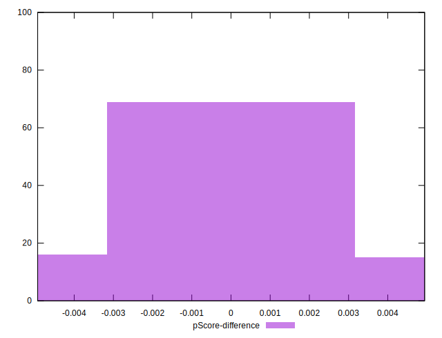

# //mainthread-work-breakdown/samples/astro

[→ Parent](../..)


## Raw


```yaml
p90min: 4245.324
p90max: 7000.279999999993
p90range: 2754.9559999999938
p90mean: 5613.115999999994
median: 5586.701999999998
p90stdev: 653.5291578439084
mad: 589.0579999999959
stdevBySn: 793.7730931999956
lfitCenter: 5613.040020848354
lfitStdev: 560.9638959100511
mfitCenter: 5613.040020848354
mfitStdev: 703.0639819751005
mfitConfidence: 70.30639819751005
p90skewness: -0.01186461757594079
p90eccentricity: 1.0000000000000002
p90discretization: 1
outlandishness: 0.9997126365990361

```


## Score


```yaml
p90min: 0.15
p90max: 0.46
p90range: 0.31000000000000005
p90mean: 0.2719148936170213
median: 0.27
p90stdev: 0.07324218926833406
mad: 0.060000000000000026
stdevBySn: 0.08348200000000001
lfitCenter: 0.27049808845501955
lfitStdev: 0.06194926159594361
mfitCenter: 0.27049808845501955
mfitStdev: 0.07764188543257888
mfitConfidence: 0.007764188543257888
p90skewness: 0.45343355055707657
p90eccentricity: 0.9999999999999997
p90discretization: 3.357142857142857
outlandishness: 1.0250532596290662

```


## Raw Estimate


## Score Estimate


## P Score


```yaml
p90min: 0.1474270702833428
p90max: 0.4556442629685858
p90range: 0.308217192685243
p90mean: 0.2719915155243811
median: 0.2658749457049914
p90stdev: 0.07302759162125566
mad: 0.06011073591309052
stdevBySn: 0.08424733998003085
lfitCenter: 0.2705900994856776
lfitStdev: 0.06217301646711748
mfitCenter: 0.2705900994856776
mfitStdev: 0.07792232057619648
mfitConfidence: 0.007792232057619648
p90skewness: 0.4505775085315138
p90eccentricity: 1.000000000000001
p90discretization: 1
outlandishness: 1.0252005896299843

```


## Score Difference


```yaml
p90min: 0
p90max: 5.551115123125783e-17
p90range: 5.551115123125783e-17
p90mean: 4.133809134242604e-18
median: 0
p90stdev: 1.4573404751592846e-17
mad: 0
stdevBySn: 0
lfitCenter: 3.1810194359955335e-18
lfitStdev: 7.553817087899258e-18
mfitCenter: 3.1810194359955335e-18
mfitStdev: 9.467305756485948e-18
mfitConfidence: 9.467305756485948e-19
p90skewness: 3.241763593892421
p90eccentricity: 0.9999999999999979
p90discretization: 47
outlandishness: 2.181951020408164

```


## P Score Difference


```yaml
p90min: -0.004556265301802642
p90max: 0.004695242401417943
p90range: 0.009251507703220585
p90mean: 0.0001037065028912298
median: 0.000011707893174020545
p90stdev: 0.0025749186614704017
mad: 0.002354704909641639
stdevBySn: 0.003038588468035696
lfitCenter: 0.00010660665299387683
lfitStdev: 0.002305266700445717
mfitCenter: 0.00010660665299387683
mfitStdev: 0.0028892233488585326
mfitConfidence: 0.00028892233488585326
p90skewness: -0.04365236169493081
p90eccentricity: 0.9999999999999999
p90discretization: 1
outlandishness: 0.881441330730329

```

