# //mainthread-work-breakdown/samples/card

[→ Parent](../..)


## Raw


```yaml
p90min: 1102.224000000001
p90max: 2365.3
p90range: 1263.075999999999
p90mean: 1737.7119139784945
median: 1734.4280000000006
p90stdev: 319.52475024493674
mad: 243.12400000000048
stdevBySn: 355.27553999999935
lfitCenter: 1759.6521144160427
lfitStdev: 282.67103646604033
mfitCenter: 1759.6521144160427
mfitStdev: 354.27560656900084
mfitConfidence: 35.60603816257408
p90skewness: -0.14571201790452046
p90eccentricity: 0.9999999999999997
p90discretization: 1
outlandishness: 1.0441960141316764

```

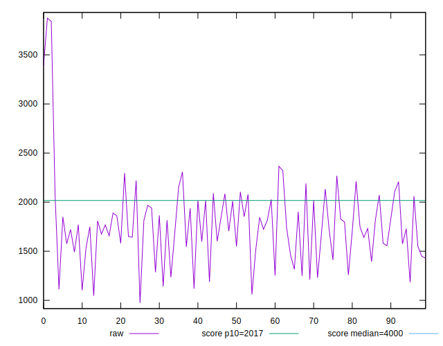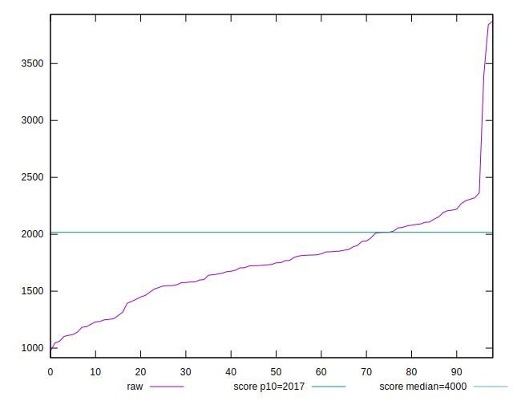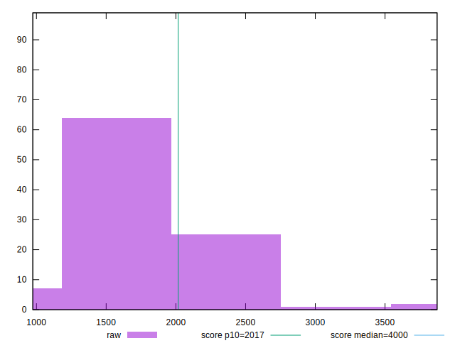
## Score


```yaml
p90min: 0.84
p90max: 0.99
p90range: 0.15000000000000002
p90mean: 0.9338709677419355
median: 0.94
p90stdev: 0.03940504465452064
mad: 0.030000000000000027
stdevBySn: 0.04770399999999991
lfitCenter: 0.9310568736808633
lfitStdev: 0.03806130294171807
mfitCenter: 0.9310568736808633
mfitStdev: 0.04770276910950385
mfitConfidence: 0.004794308684763038
p90skewness: -0.4643608794586531
p90eccentricity: 0.9999999999999996
p90discretization: 5.8125
outlandishness: 0.9794855885497323

```

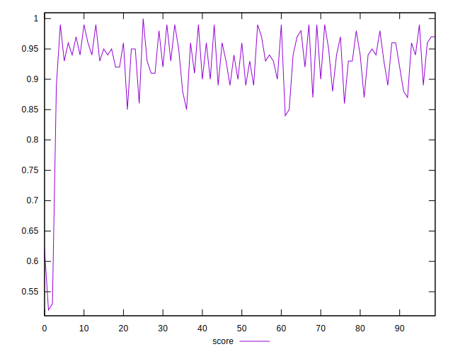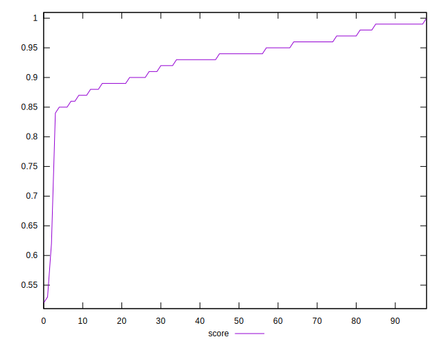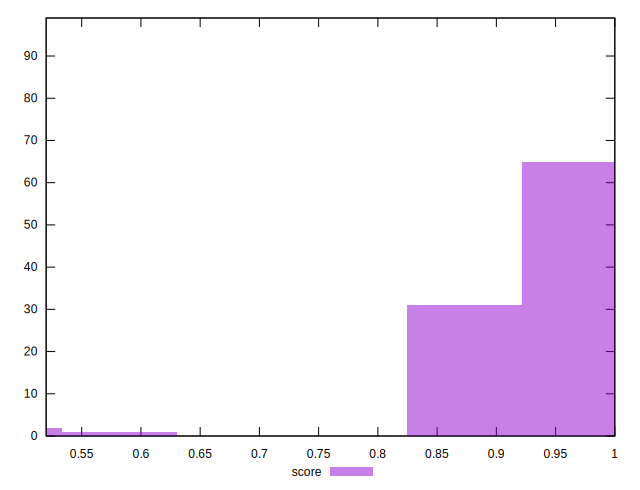
## Raw Estimate

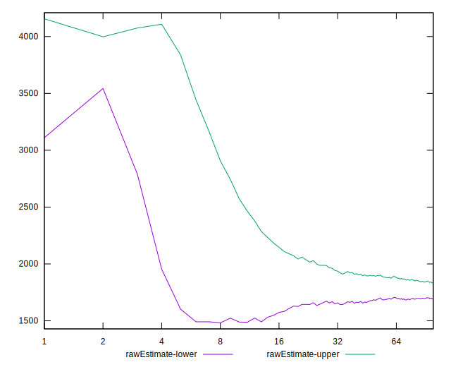
## Score Estimate

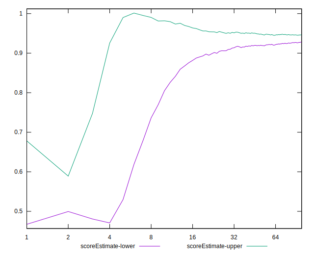
## P Score


```yaml
p90min: 0.8372933873343569
p90max: 0.9920806586698148
p90range: 0.1547872713354579
p90mean: 0.9336980969107516
median: 0.9410983218426432
p90stdev: 0.0396293349535807
mad: 0.029085123425130477
stdevBySn: 0.04144681023434409
lfitCenter: 0.9310734531915892
lfitStdev: 0.03846115868760572
mfitCenter: 0.9310734531915892
mfitStdev: 0.048203913969215945
mfitConfidence: 0.004844675638256381
p90skewness: -0.5054559581164987
p90eccentricity: 1.0000000000000013
p90discretization: 1
outlandishness: 0.9796894202847147

```

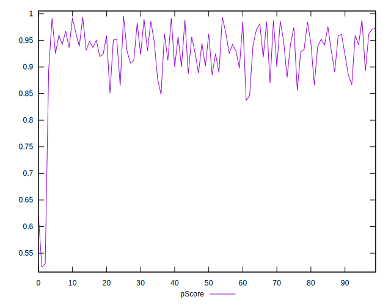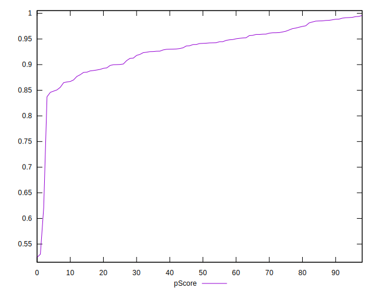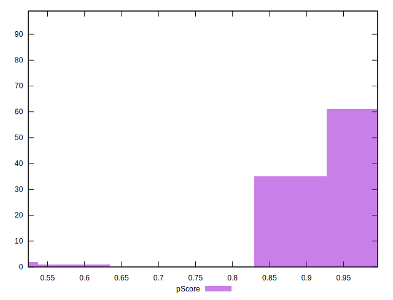
## Score Difference


```yaml
p90min: 0
p90max: 1.1102230246251565e-16
p90range: 1.1102230246251565e-16
p90mean: 1.910061117634678e-17
median: 0
p90stdev: 4.1901795712466756e-17
mad: 0
stdevBySn: 0
lfitCenter: 1.2855990842641254e-17
lfitStdev: 2.8493626872780807e-17
mfitCenter: 1.2855990842641254e-17
mfitStdev: 3.571146541898343e-17
mfitConfidence: 3.589137318440001e-18
p90skewness: 1.7378987910094743
p90eccentricity: 1
p90discretization: 46.5
outlandishness: 1.244407856978879

```

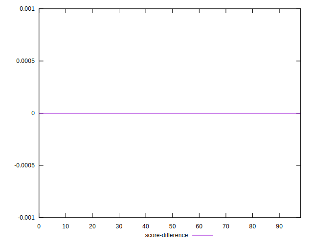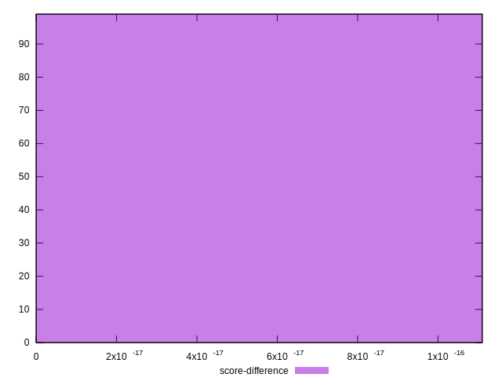
## P Score Difference


```yaml
p90min: -0.004706666605621024
p90max: 0.004707146576114929
p90range: 0.009413813181735953
p90mean: -0.00007646131578799331
median: 0.0001834452677736964
p90stdev: 0.0025644533571657336
mad: 0.002178554373479913
stdevBySn: 0.0029136371255513794
lfitCenter: -0.00003491188381572612
lfitStdev: 0.002197694875299579
mfitCenter: -0.00003491188381572612
mfitStdev: 0.002754402059490384
mfitConfidence: 0.00027682782282156896
p90skewness: -0.08342111792116795
p90eccentricity: 0.9999999999999993
p90discretization: 1
outlandishness: 0.9606920186592223

```

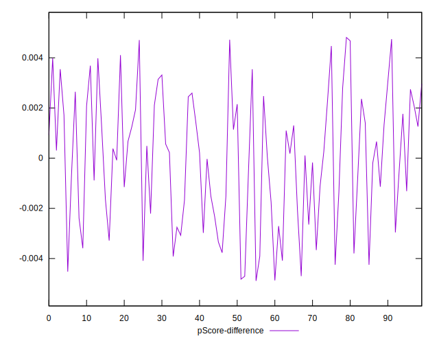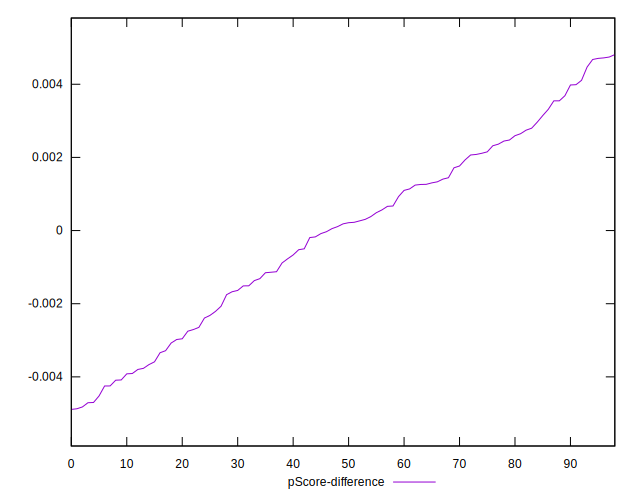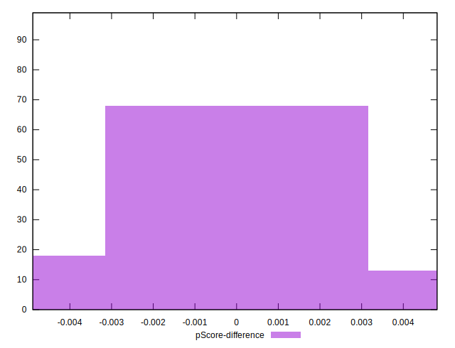