# //mainthread-work-breakdown/samples/music

[→ Parent](../..)


## Raw


```yaml
p90min: 2855.419999999994
p90max: 5347.6279999999815
p90range: 2492.2079999999874
p90mean: 4207.616297872329
median: 4336.097999999989
p90stdev: 489.3298089547128
mad: 309.3420000000008
stdevBySn: 516.6689053999966
lfitCenter: 4225.35367332708
lfitStdev: 423.5897736528074
mfitCenter: 4225.35367332708
mfitStdev: 530.8910522755415
mfitConfidence: 53.08910522755415
p90skewness: -0.3614411941436883
p90eccentricity: 0.9999999999999996
p90discretization: 1
outlandishness: 0.9929163632068186

```

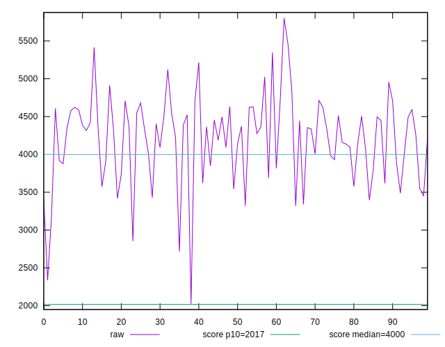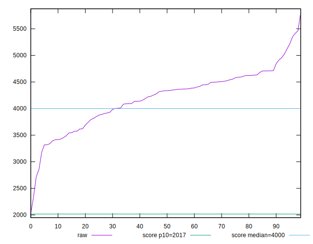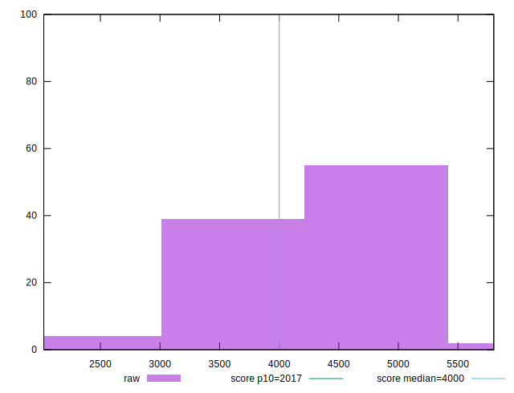
## Score


```yaml
p90min: 0.29
p90max: 0.74
p90range: 0.45
p90mean: 0.46723404255319145
median: 0.44
p90stdev: 0.08877900191785275
mad: 0.05499999999999999
stdevBySn: 0.08348200000000001
lfitCenter: 0.46335338876937127
lfitStdev: 0.07641459528653578
mfitCenter: 0.46335338876937127
mfitStdev: 0.09577149266622703
mfitConfidence: 0.009577149266622703
p90skewness: 0.6649631057949391
p90eccentricity: 1.0000000000000004
p90discretization: 2.6857142857142855
outlandishness: 1.0222351780518306

```

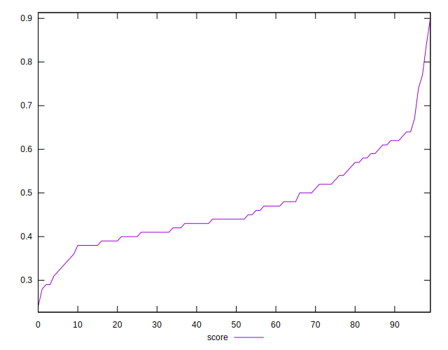
## Raw Estimate

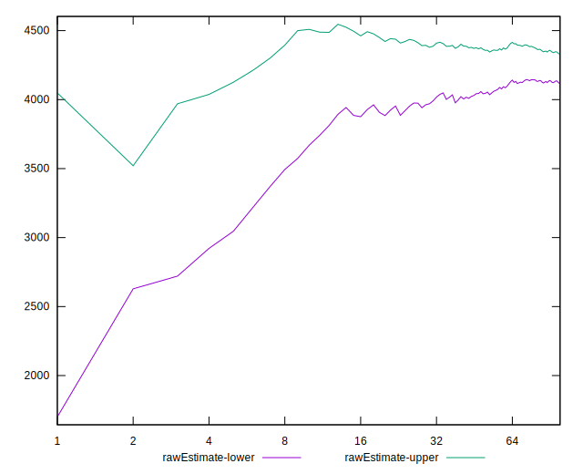
## Score Estimate

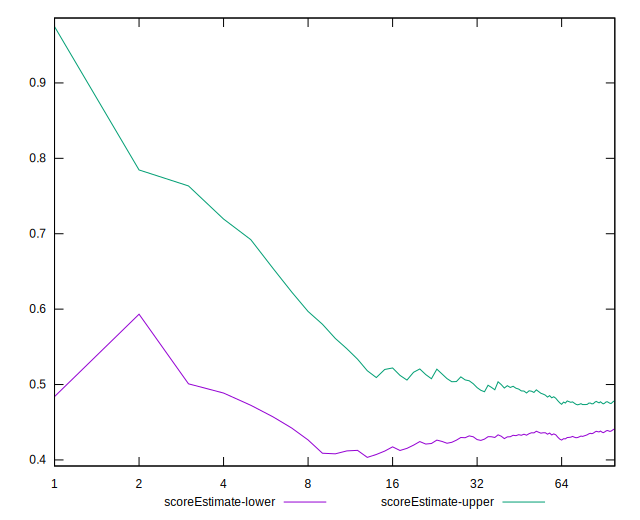
## P Score


```yaml
p90min: 0.29340059910780275
p90max: 0.7359532909093456
p90range: 0.44255269180154283
p90mean: 0.4678688323596799
median: 0.43998262447767833
p90stdev: 0.08808967572155352
mad: 0.05191124910892206
stdevBySn: 0.08611390437715458
lfitCenter: 0.46399369256722056
lfitStdev: 0.07644514315213831
mfitCenter: 0.46399369256722056
mfitStdev: 0.09580977873809002
mfitConfidence: 0.009580977873809002
p90skewness: 0.653819602759591
p90eccentricity: 1
p90discretization: 1
outlandishness: 1.0218760443370674

```

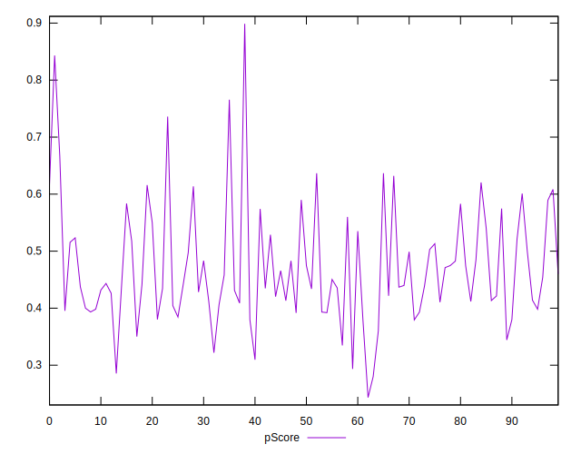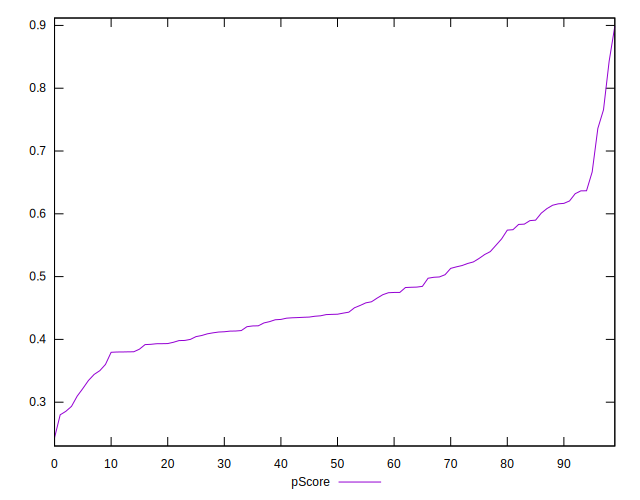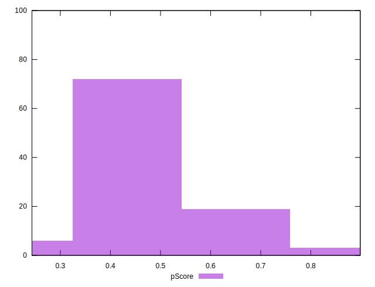
## Score Difference


```yaml
p90min: 0
p90max: 5.551115123125783e-17
p90range: 5.551115123125783e-17
p90mean: 7.677074106450551e-18
median: 0
p90stdev: 1.9163135309776876e-17
mad: 0
stdevBySn: 0
lfitCenter: 5.6294231752098526e-18
lfitStdev: 1.2812959202212236e-17
mfitCenter: 5.6294231752098526e-18
mfitStdev: 1.6058662925138237e-17
mfitConfidence: 1.6058662925138238e-18
p90skewness: 2.095534074628638
p90eccentricity: 0.9999999999999979
p90discretization: 47
outlandishness: 1.6940023668639053

```

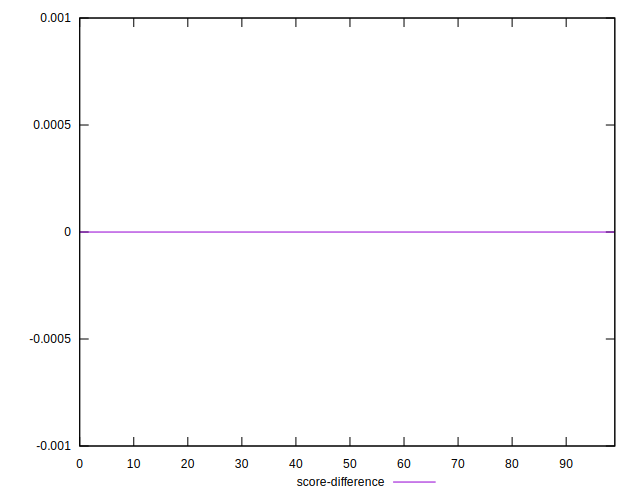
## P Score Difference


```yaml
p90min: -0.004538985292545594
p90max: 0.004691775433442458
p90range: 0.009230760725988052
p90mean: 0.0005943027135577978
median: 0.00033700768624586597
p90stdev: 0.0026759476071121545
mad: 0.0027083543558581724
stdevBySn: 0.003310673072199374
lfitCenter: 0.0006365703989369263
lfitStdev: 0.0023085091090797377
mfitCenter: 0.0006365703989369263
mfitStdev: 0.002893287105442594
mfitConfidence: 0.0002893287105442594
p90skewness: -0.2868817663120935
p90eccentricity: 1.0000000000000002
p90discretization: 1
outlandishness: 0.8837945246563871

```

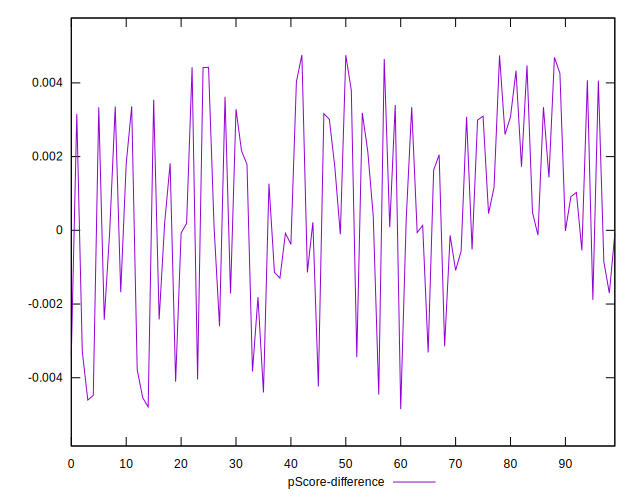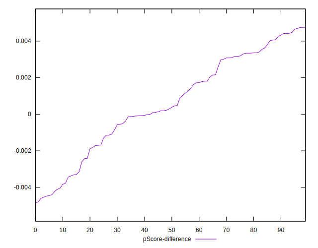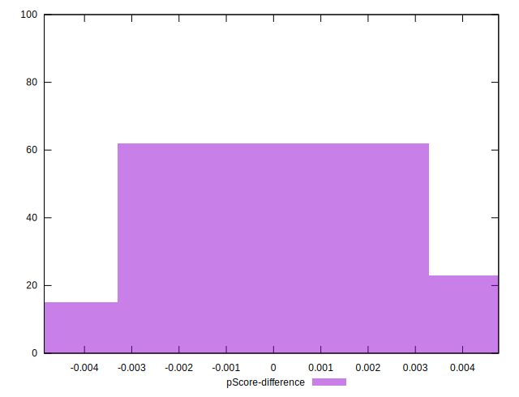