# //max-potential-fid/samples/agenda

[→ Parent](../..)


## Raw


```yaml
p90min: 63
p90max: 532
p90range: 469
p90mean: 207.04255319148936
median: 183.5
p90stdev: 98.85105009113212
mad: 63.5
stdevBySn: 97.19690000000001
lfitCenter: 213.93898925858795
lfitStdev: 101.6534601543002
mfitCenter: 213.93898925858795
mfitStdev: 127.40371884662137
mfitConfidence: 12.740371884662137
p90skewness: 0.9248220967041937
p90eccentricity: 0.9999999999999996
p90discretization: 1.0930232558139534
outlandishness: 1.3230673201030443

```

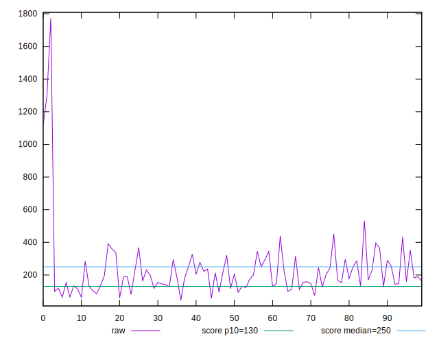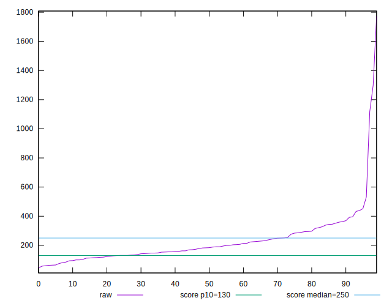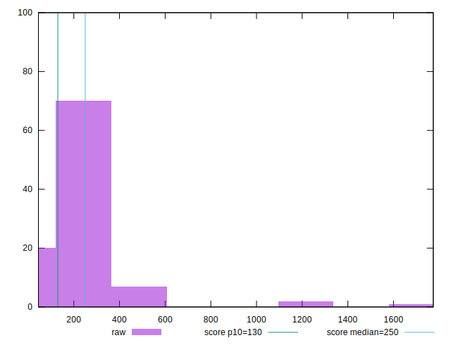
## Score


```yaml
p90min: 0.07
p90max: 1
p90range: 0.9299999999999999
p90mean: 0.663191489361702
median: 0.73
p90stdev: 0.2643225494359779
mad: 0.20000000000000007
stdevBySn: 0.29815
lfitCenter: 0.678140097843747
lfitStdev: 0.23588335097135849
mfitCenter: 0.678140097843747
mfitStdev: 0.295635938827239
mfitConfidence: 0.0295635938827239
p90skewness: -0.5762379628726926
p90eccentricity: 1.0000000000000004
p90discretization: 1.5666666666666667
outlandishness: 0.9706895888083692

```

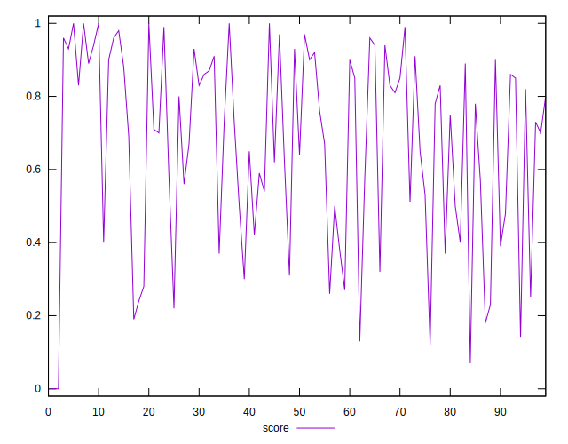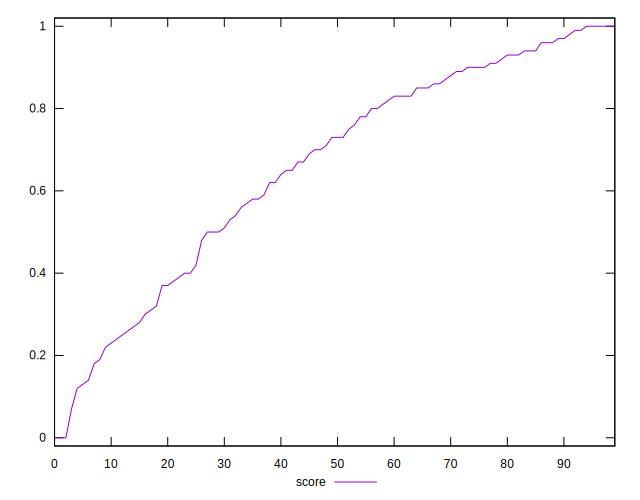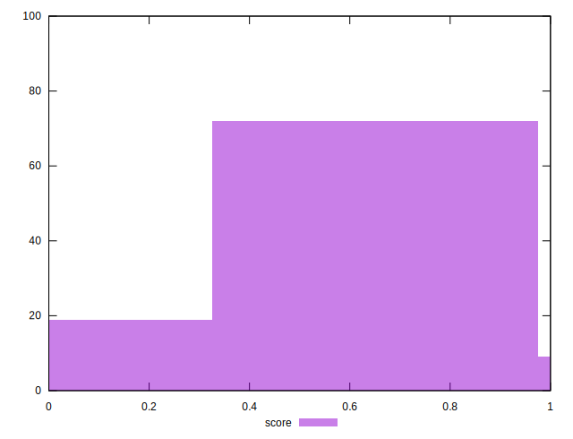
## Raw Estimate

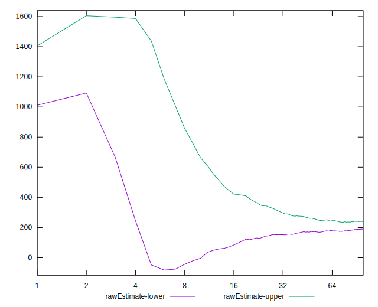
## Score Estimate

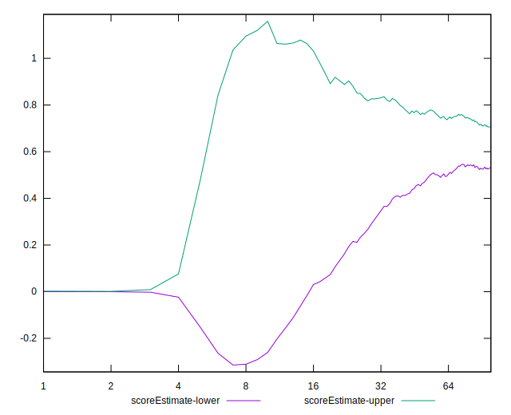
## P Score


```yaml
p90min: 0.0694378350189514
p90max: 0.9965456190098279
p90range: 0.9271077839908765
p90mean: 0.6631943781546128
median: 0.7277602834047836
p90stdev: 0.2638250089040059
mad: 0.2005110043370355
stdevBySn: 0.2953996100059217
lfitCenter: 0.6781632567200699
lfitStdev: 0.23534553897410926
mfitCenter: 0.6781632567200699
mfitStdev: 0.29496189144719037
mfitConfidence: 0.029496189144719038
p90skewness: -0.5764994896557923
p90eccentricity: 0.9999999999999997
p90discretization: 1.0930232558139534
outlandishness: 0.9706148082786537

```

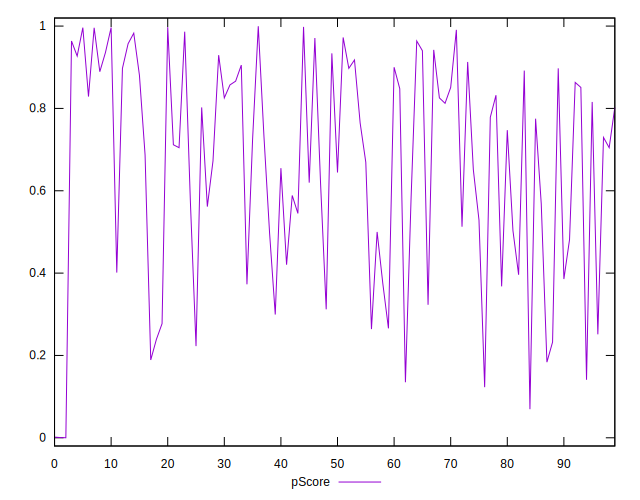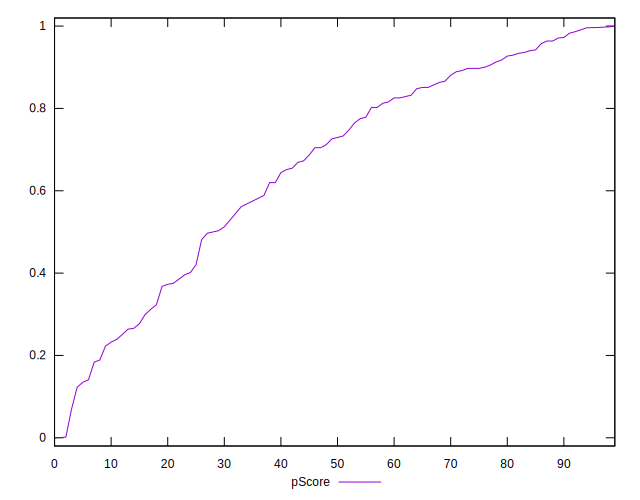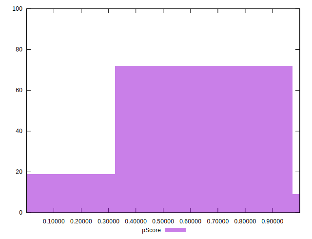
## Score Difference


```yaml
p90min: 0
p90max: 1.1102230246251565e-16
p90range: 1.1102230246251565e-16
p90mean: 1.0629794916623839e-17
median: 0
p90stdev: 3.2667288935239785e-17
mad: 0
stdevBySn: 0
lfitCenter: 7.219430790829529e-18
lfitStdev: 1.6919675537718318e-17
mfitCenter: 7.219430790829529e-18
mfitStdev: 2.1205668571551652e-17
mfitConfidence: 2.120566857155165e-18
p90skewness: 2.7477857990363197
p90eccentricity: 1.000000000000002
p90discretization: 47
outlandishness: 1.570844444444444

```

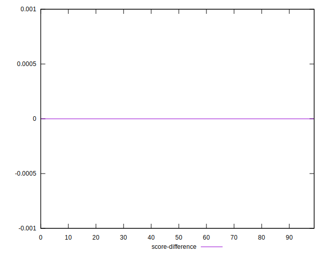
## P Score Difference


```yaml
p90min: -0.004650187464433186
p90max: 0.004708516728663348
p90range: 0.009358704193096534
p90mean: -0.00002490313130783446
median: 0.00003073851684418094
p90stdev: 0.002676409262060752
mad: 0.0025792236763131082
stdevBySn: 0.0031493832460936
lfitCenter: 0.00001796740680509825
lfitStdev: 0.002418977543029412
mfitCenter: 0.00001796740680509825
mfitStdev: 0.00303173875557814
mfitConfidence: 0.000303173875557814
p90skewness: -0.09014351894930782
p90eccentricity: 1
p90discretization: 1.0930232558139534
outlandishness: 0.8035173643419425

```

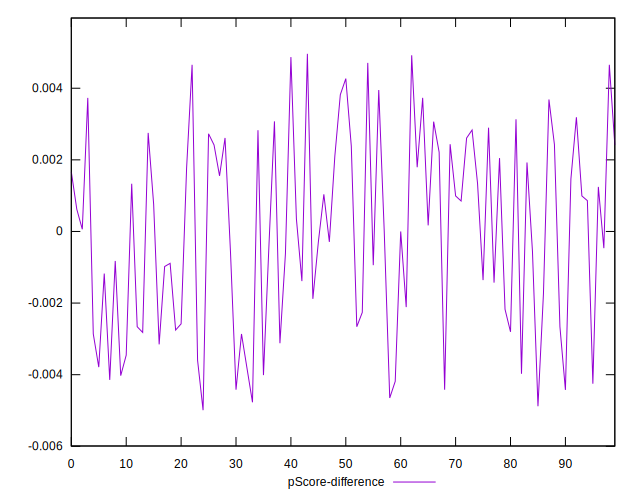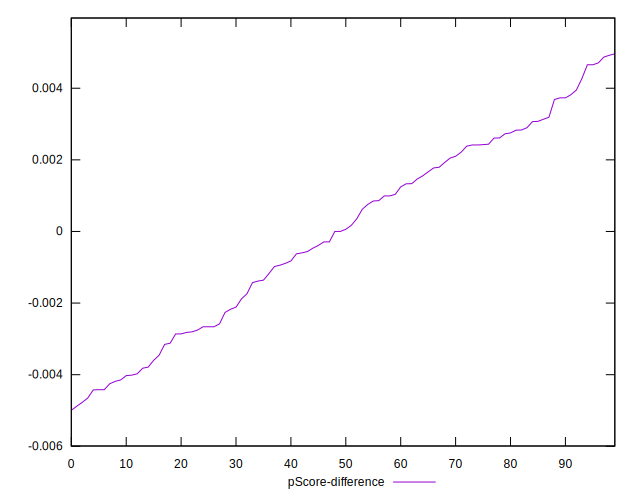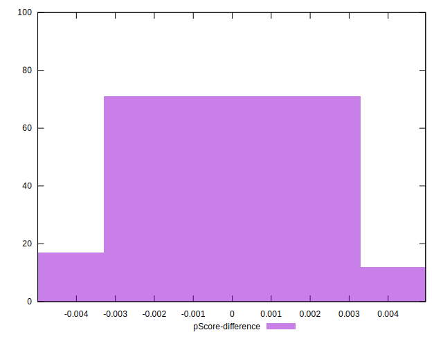