# //max-potential-fid/samples/astro

[→ Parent](../..)


## Raw


```yaml
p90min: 610.0000000000009
p90max: 1222.000000000001
p90range: 612
p90mean: 838.968085106383
median: 794.9999999999991
p90stdev: 161.53284707317957
mad: 105
stdevBySn: 155.63429999999892
lfitCenter: 825.7108348176636
lfitStdev: 132.67050374069532
mfitCenter: 825.7108348176636
mfitStdev: 166.27781811029823
mfitConfidence: 16.627781811029823
p90skewness: 0.8278169200963708
p90eccentricity: 0.9999999999999996
p90discretization: 1.032967032967033
outlandishness: 1.0056145437399173

```

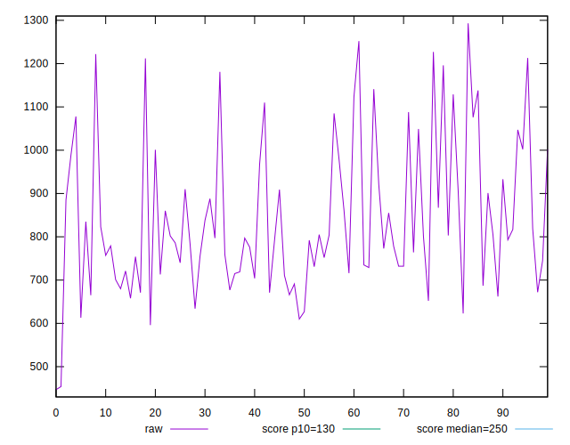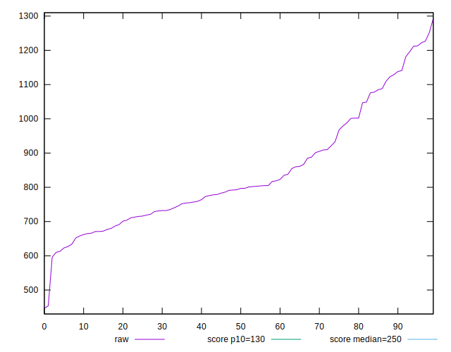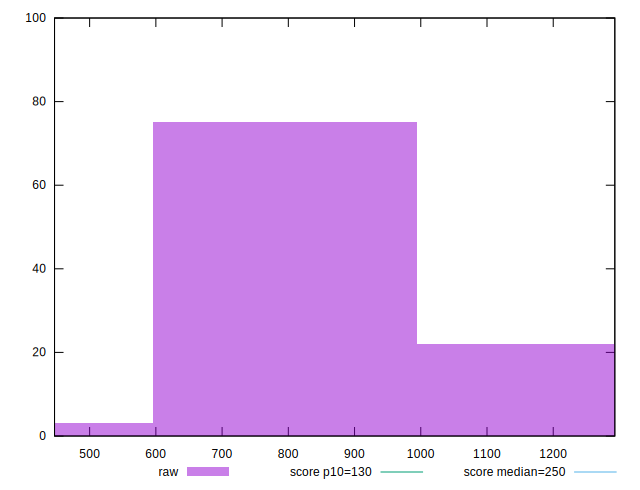
## Score


```yaml
p90min: 0
p90max: 0.04
p90range: 0.04
p90mean: 0.013191489361702138
median: 0.01
p90stdev: 0.010838540959106404
mad: 0.01
stdevBySn: 0.011926
lfitCenter: 0.013512274315011723
lfitStdev: 0.010441980797405652
mfitCenter: 0.013512274315011723
mfitStdev: 0.013087082168134262
mfitConfidence: 0.0013087082168134262
p90skewness: 0.6451739072935928
p90eccentricity: 1.000000000000001
p90discretization: 18.8
outlandishness: 1.3452258324661808

```

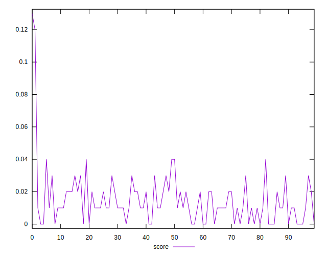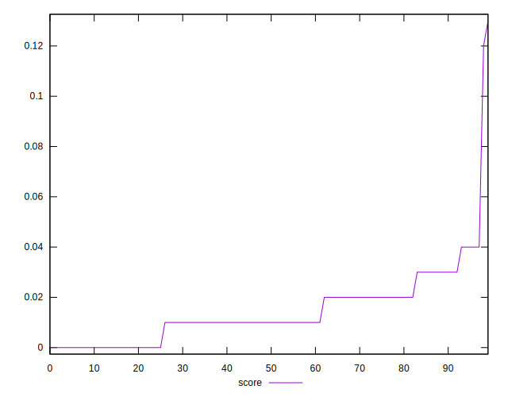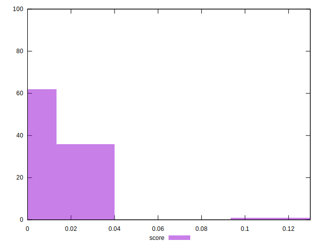
## Raw Estimate

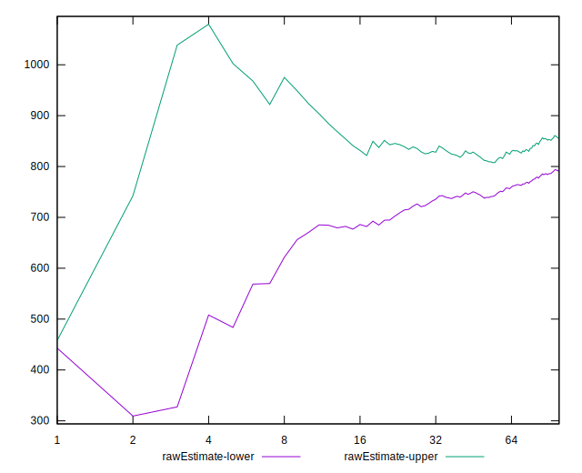
## Score Estimate

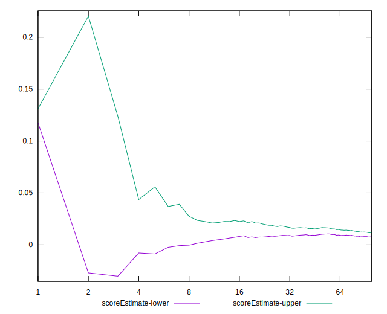
## P Score


```yaml
p90min: 0.0009363125957330687
p90max: 0.040221643685576736
p90range: 0.03928533108984367
p90mean: 0.013323223867560761
median: 0.011689028555455089
p90stdev: 0.009788836512951734
mad: 0.007793135650388888
stdevBySn: 0.010980801749279238
lfitCenter: 0.013750221554195072
lfitStdev: 0.00919395261978301
mfitCenter: 0.013750221554195072
mfitStdev: 0.011522910807777769
mfitConfidence: 0.001152291080777777
p90skewness: 0.7640290625537395
p90eccentricity: 0.9999999999999996
p90discretization: 1.032967032967033
outlandishness: 1.349244459634678

```

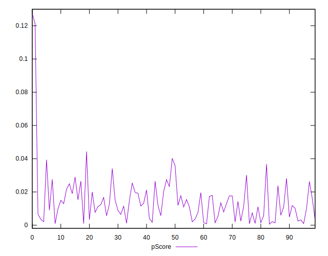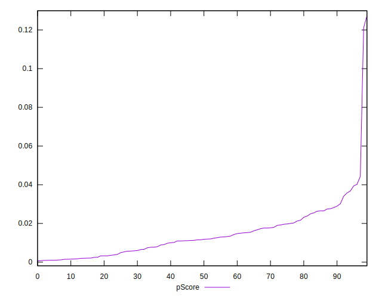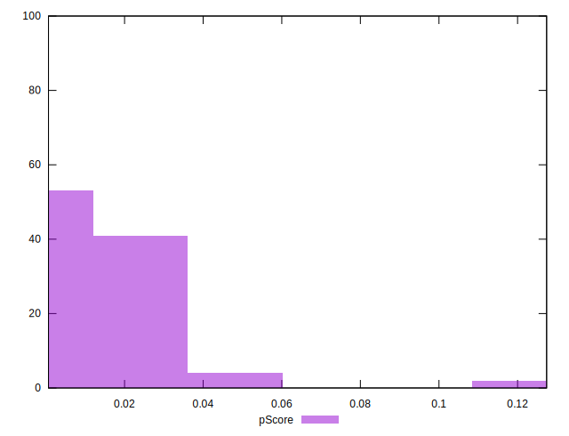
## Score Difference


```yaml
p90min: 0
p90max: 0
p90range: 0
p90mean: 0
median: 0
p90stdev: 0
mad: 0
stdevBySn: 0
lfitCenter: 0
lfitStdev: 0
mfitCenter: 0
mfitStdev: 0
mfitConfidence: 0
p90skewness: .nan
p90eccentricity: .nan
p90discretization: 94
outlandishness: .nan

```


## P Score Difference


```yaml
p90min: -0.00455188164558859
p90max: 0.004762069299912528
p90range: 0.009313950945501118
p90mean: 0.00018145523476684782
median: 0.0009484568330090414
p90stdev: 0.0025419439427039597
mad: 0.0020389032743817204
stdevBySn: 0.0027529121176103335
lfitCenter: 0.00029561306217122294
lfitStdev: 0.0022283123216584725
mfitCenter: 0.00029561306217122294
mfitStdev: 0.002792775337899097
mfitConfidence: 0.0002792775337899097
p90skewness: -0.27531626909241386
p90eccentricity: 1
p90discretization: 1.032967032967033
outlandishness: 0.9392248347624582

```

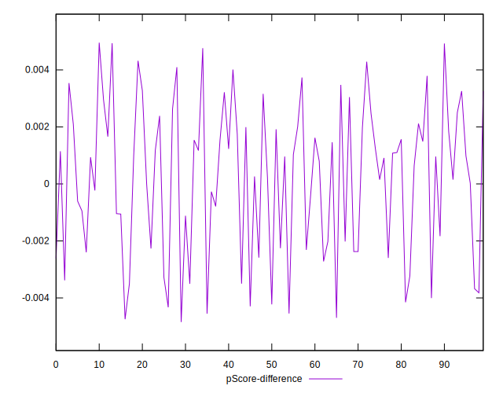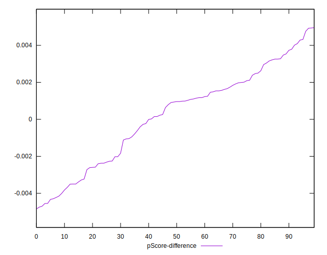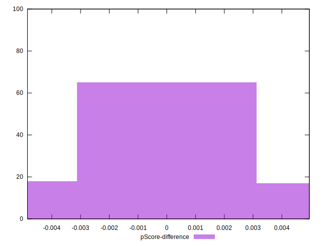