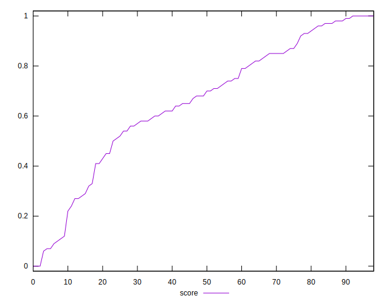

# //max-potential-fid/samples/card

[→ Parent](../..)


## Raw


```yaml
p90min: 57
p90max: 561
p90range: 504
p90mean: 211.4731182795699
median: 196
p90stdev: 110.14112075730019
mad: 51
stdevBySn: 95.40800000000002
lfitCenter: 217.98651145064844
lfitStdev: 96.59463270426426
mfitCenter: 217.98651145064844
mfitStdev: 121.06341887887172
mfitConfidence: 12.167331401783208
p90skewness: 1.3136187169158768
p90eccentricity: 1.0000000000000004
p90discretization: 1.2077922077922079
outlandishness: 1.3063765370897313

```


## Score


```yaml
p90min: 0.06
p90max: 1
p90range: 0.94
p90mean: 0.6574193548387097
median: 0.68
p90stdev: 0.26083366440244105
mad: 0.17999999999999994
stdevBySn: 0.29815
lfitCenter: 0.6675217722344005
lfitStdev: 0.209712812140866
mfitCenter: 0.6675217722344005
mfitStdev: 0.26283603249681387
mfitConfidence: 0.026416015187199708
p90skewness: -0.6799523810533636
p90eccentricity: 1.0000000000000002
p90discretization: 1.6607142857142858
outlandishness: 0.97118630648623

```


## Raw Estimate


## Score Estimate


## P Score


```yaml
p90min: 0.05659558896458483
p90max: 0.9981183248482491
p90range: 0.9415227358836643
p90mean: 0.6574695836524357
median: 0.6832850906273125
p90stdev: 0.2611636564927615
mad: 0.1738519844806954
stdevBySn: 0.3018687701541439
lfitCenter: 0.6676238412689182
lfitStdev: 0.21023039203045005
mfitCenter: 0.6676238412689182
mfitStdev: 0.26348472269027245
mfitConfidence: 0.026481211004681076
p90skewness: -0.6831989257348721
p90eccentricity: 1
p90discretization: 1.2077922077922079
outlandishness: 0.9711533220246322

```


## Score Difference


```yaml
p90min: 0
p90max: 1.1102230246251565e-16
p90range: 1.1102230246251565e-16
p90mean: 7.162729191130042e-18
median: 0
p90stdev: 2.603170067481254e-17
mad: 0
stdevBySn: 0
lfitCenter: 5.254034573435622e-18
lfitStdev: 1.2468614024514898e-17
mfitCenter: 5.254034573435622e-18
mfitStdev: 1.562709024537948e-17
mfitConfidence: 1.5705816639074739e-18
p90skewness: 3.5329526142826695
p90eccentricity: 1.0000000000000002
p90discretization: 31
outlandishness: 1.9855371900826448

```


## P Score Difference


```yaml
p90min: -0.00467818972752318
p90max: 0.00435784590535615
p90range: 0.00903603563287933
p90mean: 0.00004399719201810579
median: 0.00014602702643162768
p90stdev: 0.002481775326535344
mad: 0.0021737092658712376
stdevBySn: 0.0029778867299189316
lfitCenter: 0.00005332066451990761
lfitStdev: 0.002232888121739035
mfitCenter: 0.00005332066451990761
mfitStdev: 0.002798510252835366
mfitConfidence: 0.0002812608630490162
p90skewness: -0.04892800286809175
p90eccentricity: 1
p90discretization: 1.2077922077922079
outlandishness: 0.7656025159382799

```

