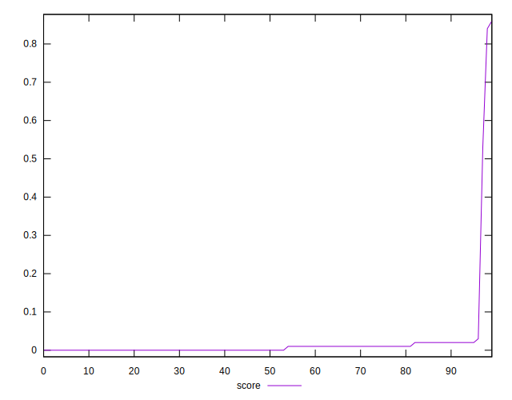
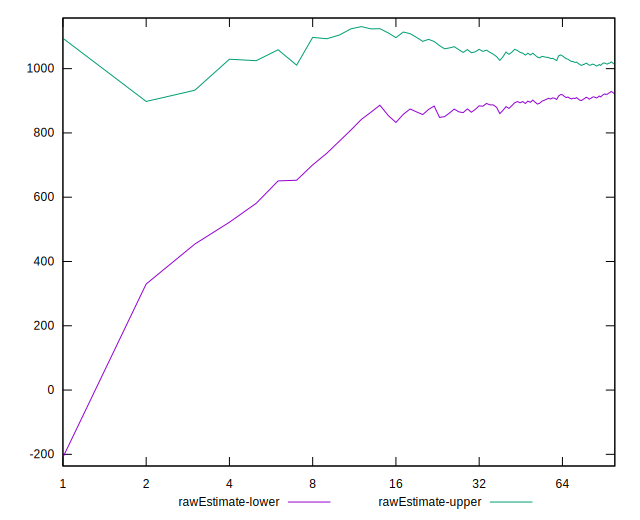

# //max-potential-fid/samples/music

[→ Parent](../..)


## Raw


```yaml
p90min: 635.0000000000009
p90max: 1399
p90range: 763.9999999999991
p90mean: 970.9574468085107
median: 979.4999999999995
p90stdev: 190.033195022613
mad: 153.99999999999955
stdevBySn: 252.53305000000003
lfitCenter: 968.2997637574468
lfitStdev: 185.40441937072688
mfitCenter: 968.2997637574468
mfitStdev: 232.36998015192435
mfitConfidence: 23.236998015192434
p90skewness: 0.26609877749441985
p90eccentricity: 1
p90discretization: 1.0561797752808988
outlandishness: 1.0045833047515986

```


## Score


```yaml
p90min: 0
p90max: 0.03
p90range: 0.03
p90mean: 0.006276595744680855
median: 0
p90stdev: 0.007716250130122802
mad: 0
stdevBySn: 0
lfitCenter: 0.01575272844194406
lfitStdev: 0.027151287301428625
mfitCenter: 0.01575272844194406
mfitStdev: 0.034029092255436835
mfitConfidence: 0.0034029092255436835
p90skewness: 0.8884712168030953
p90eccentricity: 1.0000000000000002
p90discretization: 23.5
outlandishness: 20.185982878483113

```


## Raw Estimate


## Score Estimate


## P Score


```yaml
p90min: 0.00036934376038949557
p90max: 0.03386216728243974
p90range: 0.03349282352205024
p90mean: 0.007134526973692056
median: 0.0037228928787500226
p90stdev: 0.007114579641988017
mad: 0.002871143691659944
stdevBySn: 0.004065829326097299
lfitCenter: 0.016630598998351277
lfitStdev: 0.026851672585576462
mfitCenter: 0.016630598998351277
mfitStdev: 0.0336535808959337
mfitConfidence: 0.0033653580895933698
p90skewness: 1.332730821751095
p90eccentricity: 0.9999999999999999
p90discretization: 1.0681818181818181
outlandishness: 16.536198486689617

```


## Score Difference


```yaml
p90min: 0
p90max: 0
p90range: 0
p90mean: 0
median: 0
p90stdev: 0
mad: 0
stdevBySn: 0
lfitCenter: 0
lfitStdev: 0
mfitCenter: 0
mfitStdev: 0
mfitConfidence: 0
p90skewness: .nan
p90eccentricity: .nan
p90discretization: 94
outlandishness: .nan

```


## P Score Difference


```yaml
p90min: -0.004030939765162316
p90max: 0.004288090828959043
p90range: 0.00831903059412136
p90mean: 0.0008630934838512958
median: 0.0011436322682769062
p90stdev: 0.0021855905310256924
mad: 0.0015278243381563385
stdevBySn: 0.0023913621048382698
lfitCenter: 0.0009711660726654908
lfitStdev: 0.0017280374382111
mfitCenter: 0.0009711660726654908
mfitStdev: 0.0021657737532997253
mfitConfidence: 0.00021657737532997253
p90skewness: -0.6371338349811283
p90eccentricity: 1.0000000000000002
p90discretization: 1.0681818181818181
outlandishness: 0.8858881018328719

```

