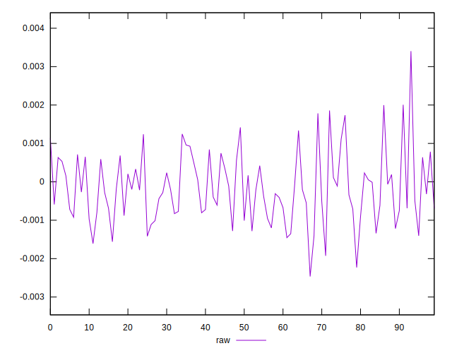
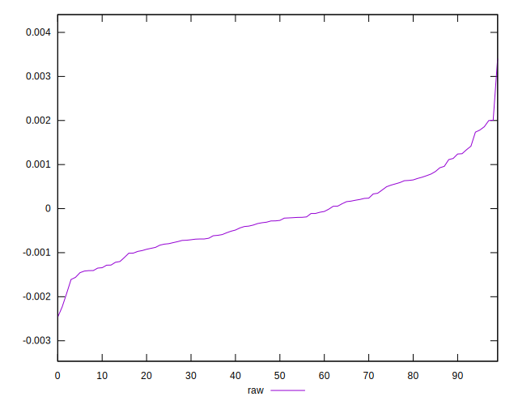
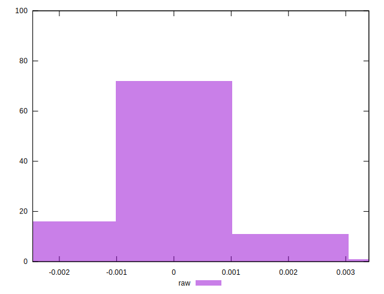

# //meta/pScore-difference/samples/agenda

[→ Parent](../..)


## Raw


```yaml
p90min: -0.0016086369548382108
p90max: 0.0018579503629046923
p90range: 0.0034665873177429033
p90mean: -0.0001739456626444691
median: -0.00027300274881171814
p90stdev: 0.0008276590649410728
mad: 0.0006142618869797833
stdevBySn: 0.0009252734464667798
lfitCenter: -0.00019740109746729806
lfitStdev: 0.0006992840481233966
mfitCenter: -0.00019740109746729806
mfitStdev: 0.0008764225843941593
mfitConfidence: 0.00008764225843941593
p90skewness: 0.4300429591374645
p90eccentricity: 1.000000000000001
p90discretization: 1
outlandishness: 0.8007744577061561

```

