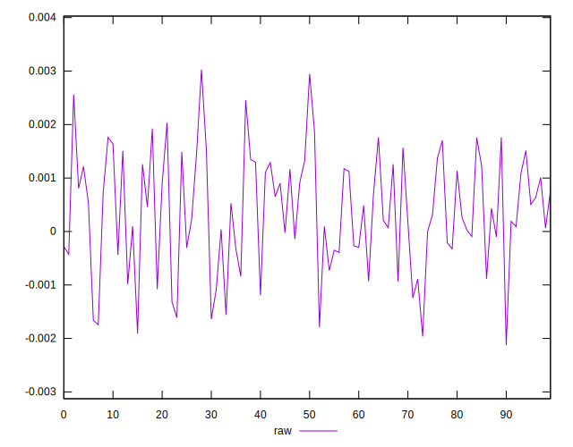
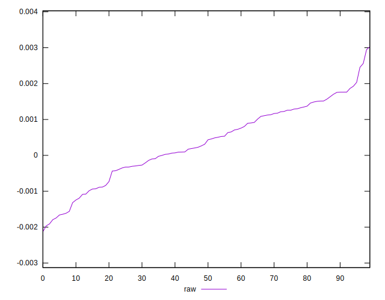
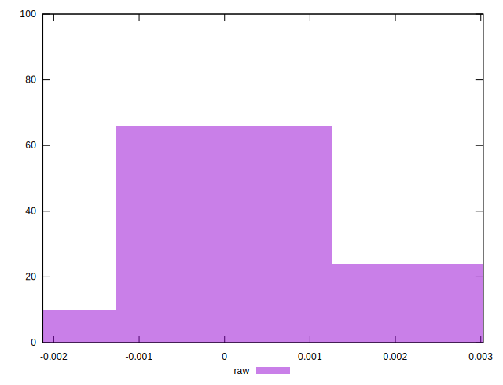

# //meta/pScore-difference/samples/astro

[→ Parent](../..)


## Raw


```yaml
p90min: -0.0017912770317077028
p90max: 0.0024544795300470348
p90range: 0.004245756561754738
p90mean: 0.00034875364325982685
median: 0.0003732694019580137
p90stdev: 0.0010270006300505884
mad: 0.0008058640631174105
stdevBySn: 0.0012628511042950467
lfitCenter: 0.000373485117639315
lfitStdev: 0.0009043367498881207
mfitCenter: 0.000373485117639315
mfitStdev: 0.0011334180346692267
mfitConfidence: 0.00011334180346692267
p90skewness: -0.26260717470562256
p90eccentricity: 1
p90discretization: 1
outlandishness: 1.0255036276035239

```

