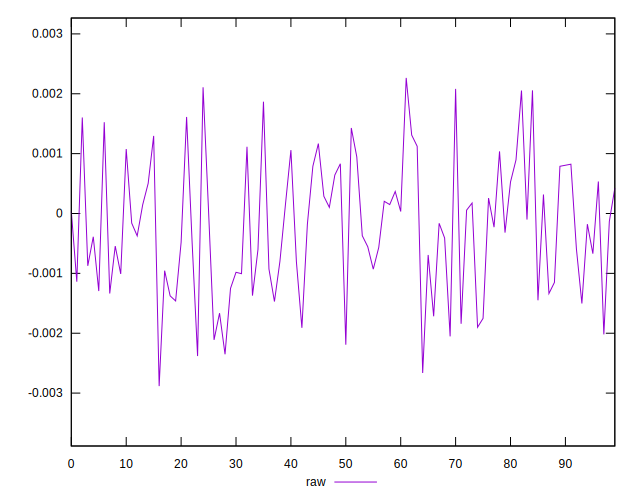
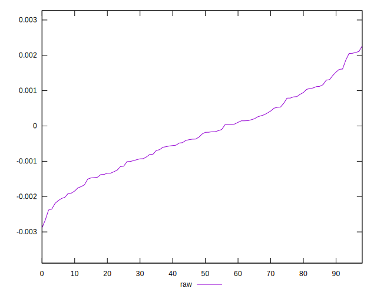
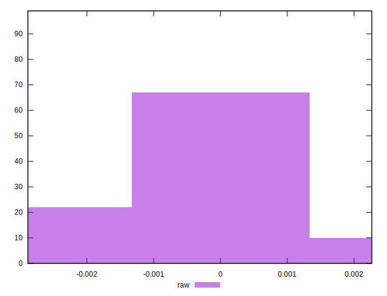

# //meta/pScore-difference/samples/card

[→ Parent](../..)


## Raw


```yaml
p90min: -0.002351895032488227
p90max: 0.0020574423420301304
p90range: 0.0044093373745183575
p90mean: -0.0002447919568456402
median: -0.00022843731280246525
p90stdev: 0.0010815006935446687
mad: 0.0009107769586015903
stdevBySn: 0.0012775098723425019
lfitCenter: -0.00025360201157271584
lfitStdev: 0.000917717633367696
mfitCenter: -0.00025360201157271584
mfitStdev: 0.0011501884851208251
mfitConfidence: 0.00011559829222221369
p90skewness: 0.10920332754038212
p90eccentricity: 0.9999999999999997
p90discretization: 1
outlandishness: 1.0004443377204084

```

