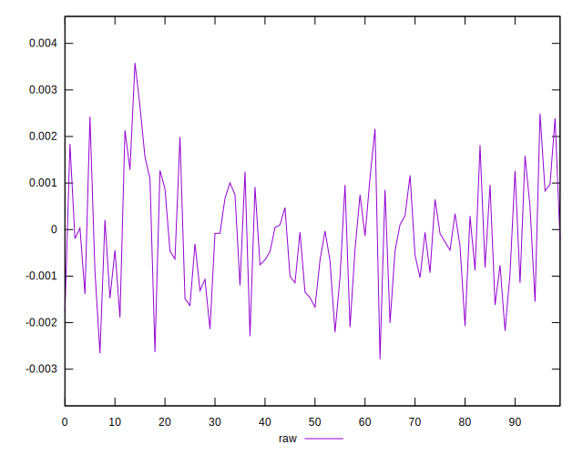
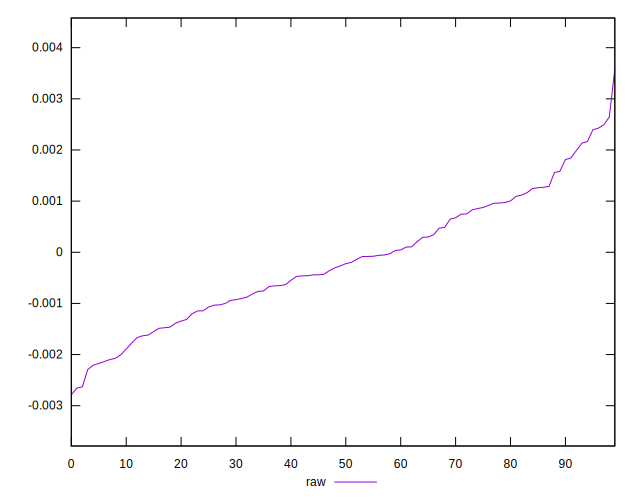
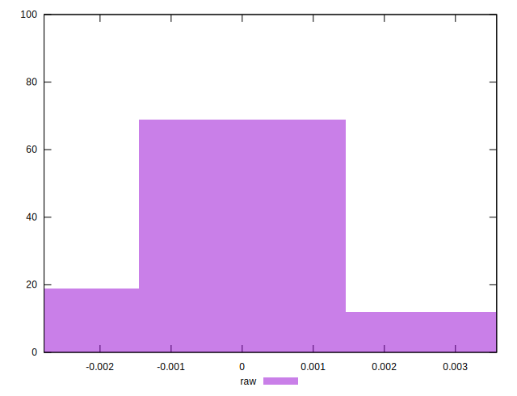

# //meta/pScore-difference/samples/music

[→ Parent](../..)


## Raw


```yaml
p90min: -0.0022910027691323024
p90max: 0.002426369251136341
p90range: 0.004717372020268644
p90mean: -0.0001706041193418269
median: -0.0002450244544344166
p90stdev: 0.0011851457182558906
mad: 0.0009921635103562066
stdevBySn: 0.0014404469671461205
lfitCenter: -0.00018744328764576626
lfitStdev: 0.0010061637870838124
mfitCenter: -0.00018744328764576626
mfitStdev: 0.0012610393000759563
mfitConfidence: 0.00012610393000759564
p90skewness: 0.21271782614576243
p90eccentricity: 1.0000000000000002
p90discretization: 1
outlandishness: 0.8143097893433291

```

