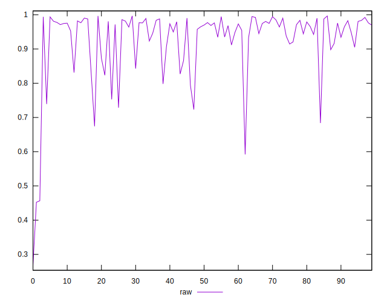
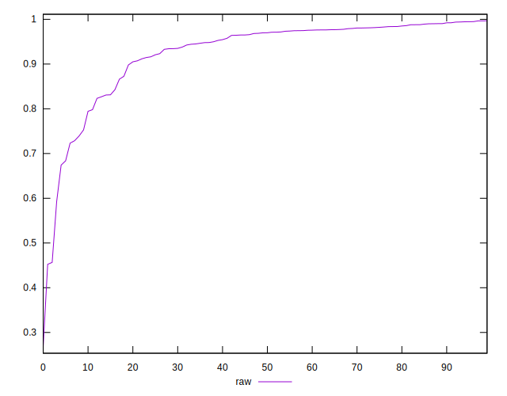
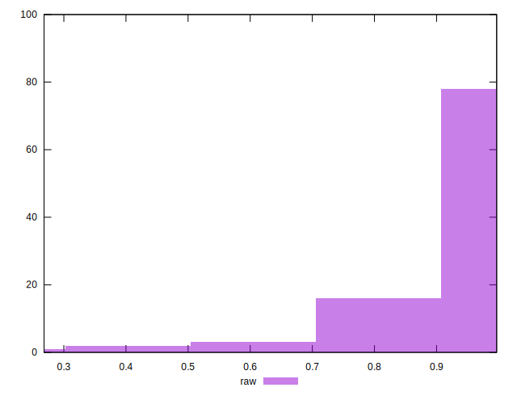

# //meta/pScore/samples/agenda

[→ Parent](../..)


## Raw


```yaml
p90min: 0.592149691590068
p90max: 0.9948365432048197
p90range: 0.4026868516147517
p90mean: 0.9333554709564326
median: 0.9698981153586268
p90stdev: 0.0819318119844005
mad: 0.02031265667556259
stdevBySn: 0.02785301131534195
lfitCenter: 0.9390300908071503
lfitStdev: 0.06385938181827398
mfitCenter: 0.9390300908071503
mfitStdev: 0.08003586611360669
mfitConfidence: 0.008003586611360669
p90skewness: -2.1045909985909077
p90eccentricity: 0.9999999999999996
p90discretization: 1
outlandishness: 0.9695269265150677

```

