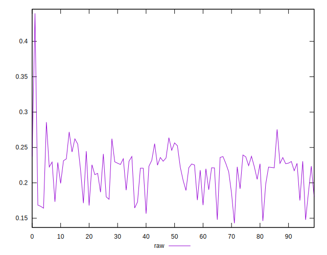
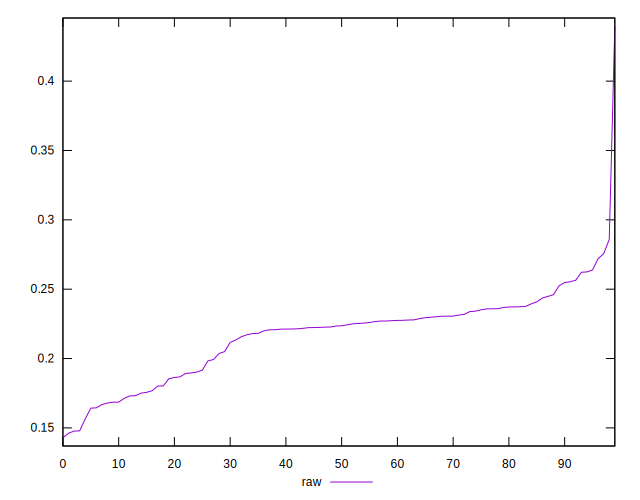
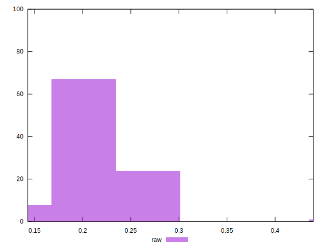

# //meta/pScore/samples/astro

[→ Parent](../..)


## Raw


```yaml
p90min: 0.14785398329303784
p90max: 0.2719560283861567
p90range: 0.12410204509311884
p90mean: 0.21666205670145358
median: 0.22352500444467344
p90stdev: 0.027236258001088087
mad: 0.013436053707015519
stdevBySn: 0.021326031961409926
lfitCenter: 0.21939141643632964
lfitStdev: 0.02203611462875915
mfitCenter: 0.21939141643632964
mfitStdev: 0.02761817402351933
mfitConfidence: 0.002761817402351933
p90skewness: -0.5937276777528283
p90eccentricity: 0.9999999999999999
p90discretization: 1
outlandishness: 1.012754150969034

```

