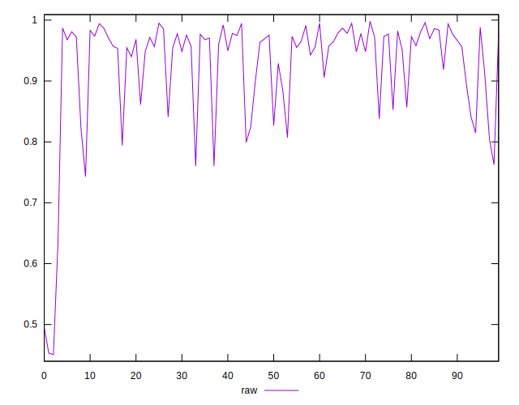
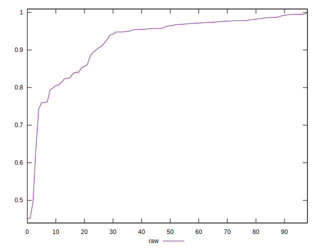
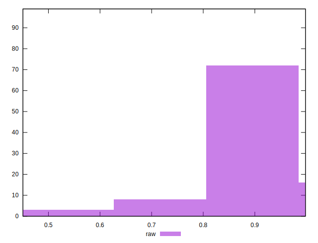

# //meta/pScore/samples/card

[→ Parent](../..)


## Raw


```yaml
p90min: 0.6351256776808313
p90max: 0.995033356583275
p90range: 0.3599076789024437
p90mean: 0.9315931263382063
median: 0.9636024676480567
p90stdev: 0.07272372768266419
mad: 0.018669095039140937
stdevBySn: 0.03039237865574307
lfitCenter: 0.9366244196178642
lfitStdev: 0.06230372237979041
mfitCenter: 0.9366244196178642
mfitStdev: 0.07808613614454504
mfitConfidence: 0.007847951967274695
p90skewness: -1.675751767476901
p90eccentricity: 1.0000000000000002
p90discretization: 1
outlandishness: 0.9741048130902982

```

