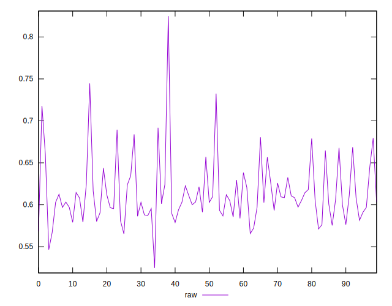
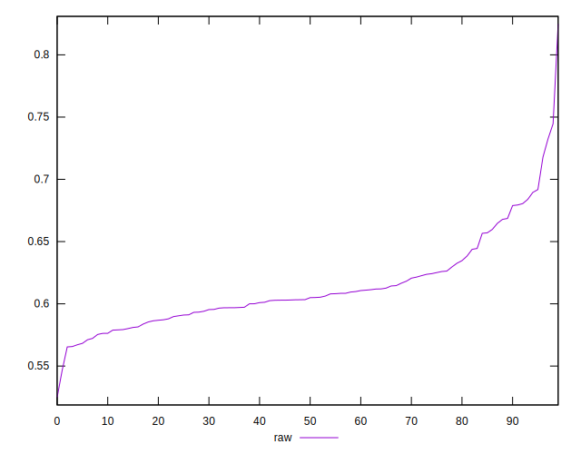
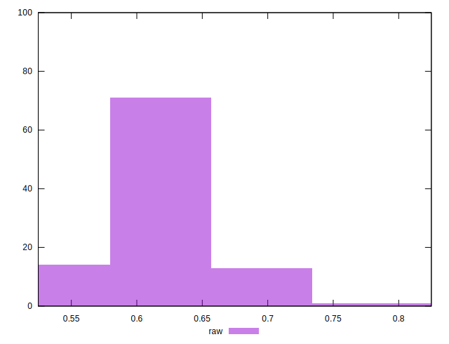

# //meta/pScore/samples/music

[→ Parent](../..)


## Raw


```yaml
p90min: 0.5656648695576494
p90max: 0.7178428642906718
p90range: 0.1521779947330224
p90mean: 0.6119938603281891
median: 0.6041571645327907
p90stdev: 0.031395552641981614
mad: 0.01713645750631182
stdevBySn: 0.024781868308596165
lfitCenter: 0.6105974766222282
lfitStdev: 0.02451270202174586
mfitCenter: 0.6105974766222282
mfitStdev: 0.03072211601857023
mfitConfidence: 0.003072211601857023
p90skewness: 1.178254659589777
p90eccentricity: 1.0000000000000002
p90discretization: 1
outlandishness: 1.0087353820324423

```

