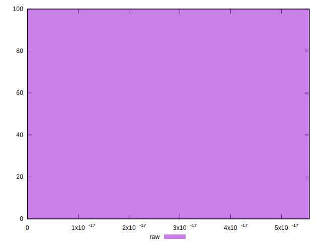

# //meta/score-difference/samples/agenda

[→ Parent](../..)


## Raw


```yaml
p90min: 0
p90max: 2.7755575615628914e-17
p90range: 2.7755575615628914e-17
p90mean: 8.149509436078278e-18
median: 0
p90stdev: 1.239819304864408e-17
mad: 0
stdevBySn: 0
lfitCenter: 6.420420270098985e-18
lfitStdev: 1.2277387080083527e-17
mfitCenter: 6.420420270098985e-18
mfitStdev: 1.5387422812246832e-17
mfitConfidence: 1.5387422812246832e-18
p90skewness: 0.9029573559007781
p90eccentricity: 0.999999999999998
p90discretization: 23.5
outlandishness: 1.2327435622768321

```

