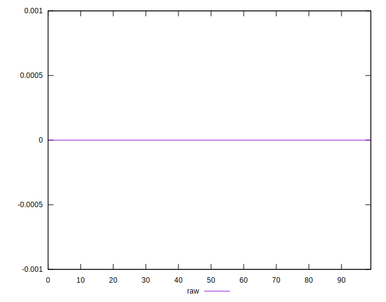

# //meta/score-difference/samples/astro

[→ Parent](../..)


## Raw


```yaml
p90min: 0
p90max: 1.959217102279688e-17
p90range: 1.959217102279688e-17
p90mean: 1.7160518590889468e-18
median: 0
p90stdev: 4.947797828088415e-18
mad: 0
stdevBySn: 0
lfitCenter: 1.1973043845422256e-18
lfitStdev: 2.7251481642606278e-18
mfitCenter: 1.1973043845422256e-18
mfitStdev: 3.4154667239840157e-18
mfitConfidence: 3.415466723984016e-19
p90skewness: 3.033251970457152
p90eccentricity: 0.9999999999999996
p90discretization: 23.5
outlandishness: 1.6448322116409055

```

