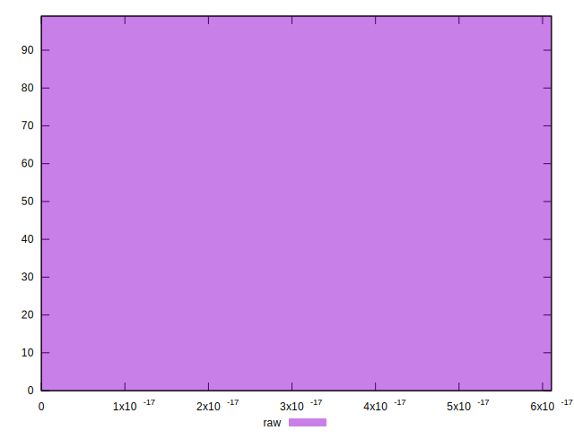

# //meta/score-difference/samples/card

[→ Parent](../..)


## Raw


```yaml
p90min: 0
p90max: 3.3306690738754695e-17
p90range: 3.3306690738754695e-17
p90mean: 1.3459961938331883e-17
median: 5.551115123125783e-18
p90stdev: 1.3590978485891502e-17
mad: 5.551115123125783e-18
stdevBySn: 6.6202598958398095e-18
lfitCenter: 1.2180506684066158e-17
lfitStdev: 1.4005428259908196e-17
mfitCenter: 1.2180506684066158e-17
mfitStdev: 1.7553201254963747e-17
mfitConfidence: 1.7641631040094023e-18
p90skewness: 0.5816780770295159
p90eccentricity: 1.0000000000000009
p90discretization: 18.6
outlandishness: 1.0933264592266

```

