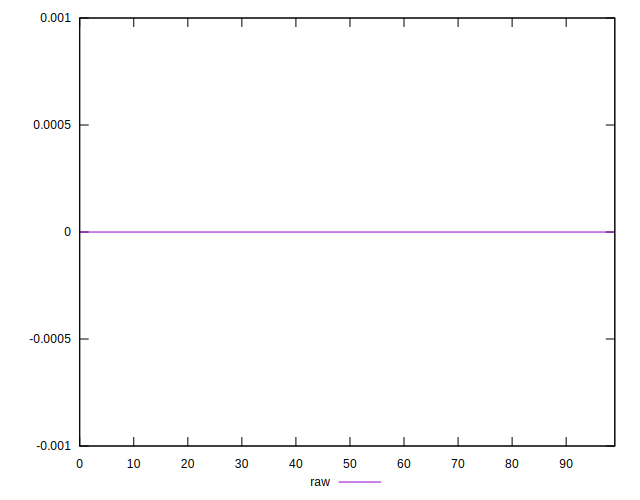
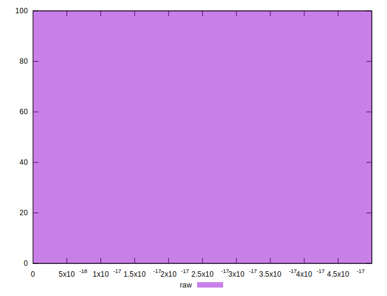

# //meta/score-difference/samples/music

[→ Parent](../..)


## Raw


```yaml
p90min: 0
p90max: 3.3306690738754695e-17
p90range: 3.3306690738754695e-17
p90mean: 1.0777430957132506e-17
median: 5.551115123125783e-18
p90stdev: 1.1218668335916024e-17
mad: 5.551115123125783e-18
stdevBySn: 6.6202598958398095e-18
lfitCenter: 1.0026526858288343e-17
lfitStdev: 1.1237889596656627e-17
mfitCenter: 1.0026526858288343e-17
mfitStdev: 1.4084605919253064e-17
mfitConfidence: 1.4084605919253064e-18
p90skewness: 0.6283406378929668
p90eccentricity: 1.0000000000000007
p90discretization: 13.428571428571429
outlandishness: 1.1532994588102832

```

