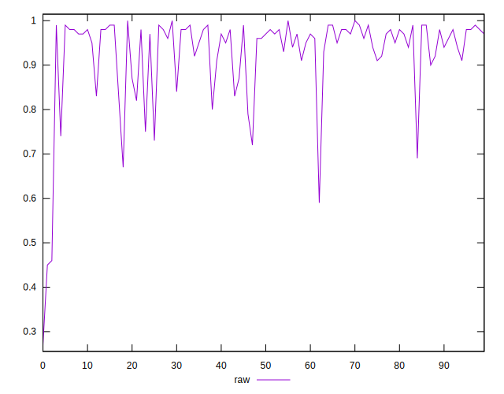

# //meta/score/samples/agenda

[→ Parent](../..)


## Raw


```yaml
p90min: 0.59
p90max: 1
p90range: 0.41000000000000003
p90mean: 0.9332978723404253
median: 0.97
p90stdev: 0.08213103564883167
mad: 0.020000000000000018
stdevBySn: 0.023852000000000022
lfitCenter: 0.9391250267105516
lfitStdev: 0.06389557588609267
mfitCenter: 0.9391250267105516
mfitStdev: 0.08008122865053645
mfitConfidence: 0.008008122865053644
p90skewness: -2.110235482199618
p90eccentricity: 1.0000000000000002
p90discretization: 3.9166666666666665
outlandishness: 0.9698062545844387

```

