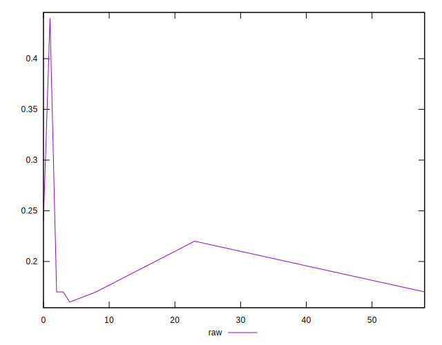
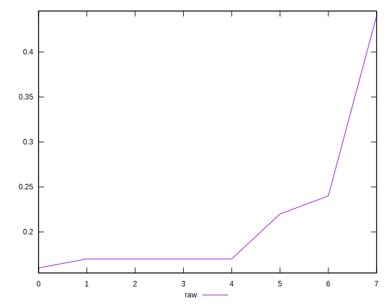
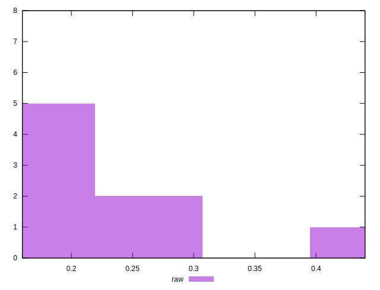

# //meta/score/samples/astro

[→ Parent](../..)


## Raw


```yaml
p90min: 0.17
p90max: 0.24
p90range: 0.06999999999999998
p90mean: 0.19000000000000003
median: 0.17
p90stdev: 0.02886751345948128
mad: 0.0050000000000000044
stdevBySn: 0.008944500000000008
lfitCenter: 0.19971439910728148
lfitStdev: 0.054143180512823234
mfitCenter: 0.19971439910728148
mfitStdev: 0.06785841364422848
mfitConfidence: 0.023991572224197847
p90skewness: 0.8313843876330586
p90eccentricity: 1.0000000000000002
p90discretization: 2
outlandishness: 1.3104224376731295

```

