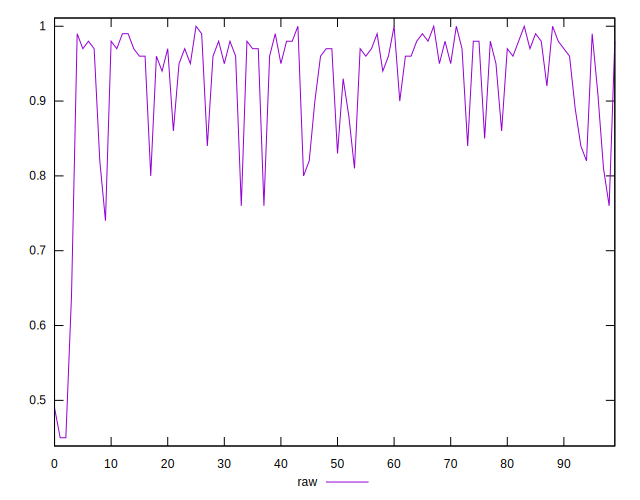
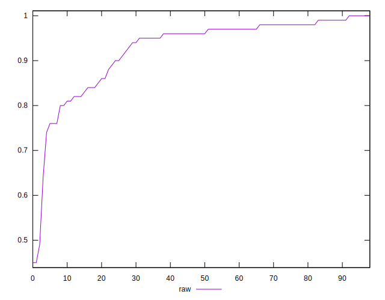
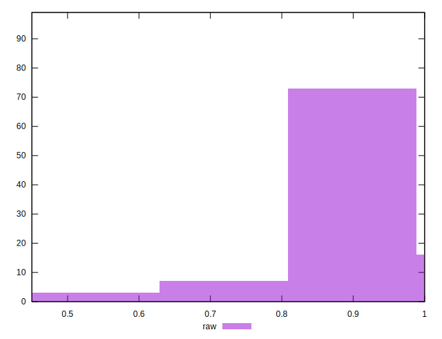

# //meta/score/samples/card

[→ Parent](../..)


## Raw


```yaml
p90min: 0.64
p90max: 1
p90range: 0.36
p90mean: 0.9324731182795699
median: 0.96
p90stdev: 0.07298042032279195
mad: 0.020000000000000018
stdevBySn: 0.03577800000000003
lfitCenter: 0.9374681861734235
lfitStdev: 0.062894917595401
mfitCenter: 0.9374681861734235
mfitStdev: 0.07882708946692865
mfitConfidence: 0.007922420578108443
p90skewness: -1.6413361402432805
p90eccentricity: 1.0000000000000007
p90discretization: 4.043478260869565
outlandishness: 0.9740675214285198

```

