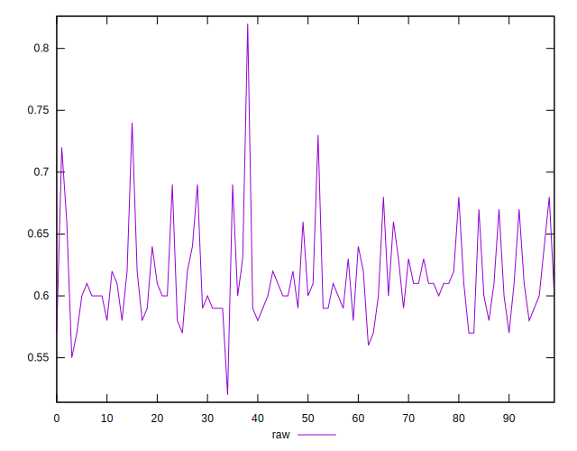
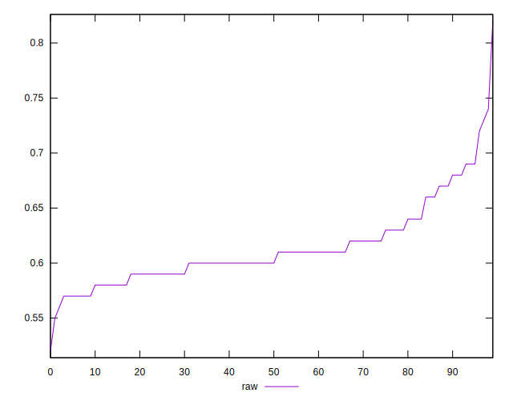
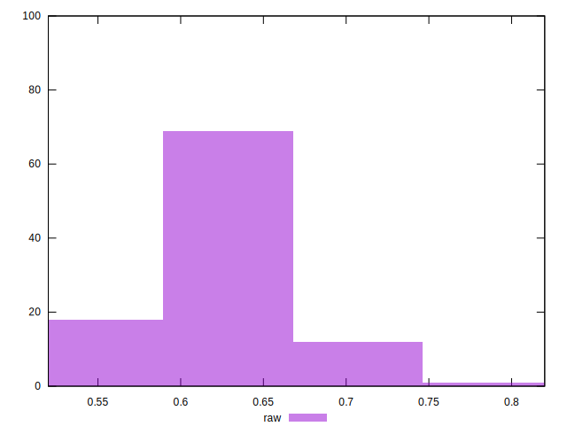

# //meta/score/samples/music

[→ Parent](../..)


## Raw


```yaml
p90min: 0.57
p90max: 0.72
p90range: 0.15000000000000002
p90mean: 0.6122340425531917
median: 0.6
p90stdev: 0.03192925208921927
mad: 0.020000000000000018
stdevBySn: 0.023852000000000022
lfitCenter: 0.610577370674209
lfitStdev: 0.024672576806870572
mfitCenter: 0.610577370674209
mfitStdev: 0.030922489347168933
mfitConfidence: 0.0030922489347168934
p90skewness: 1.1908204751455052
p90eccentricity: 0.9999999999999999
p90discretization: 7.230769230769231
outlandishness: 1.0080718270110007

```

