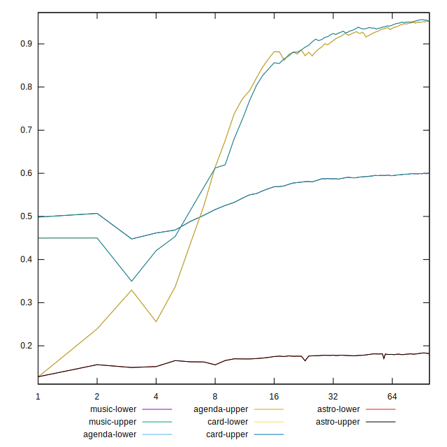
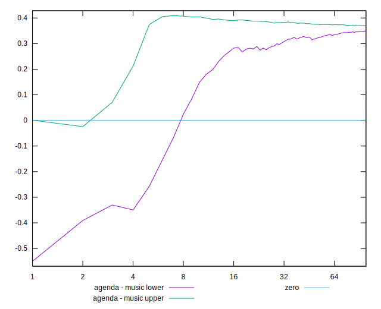
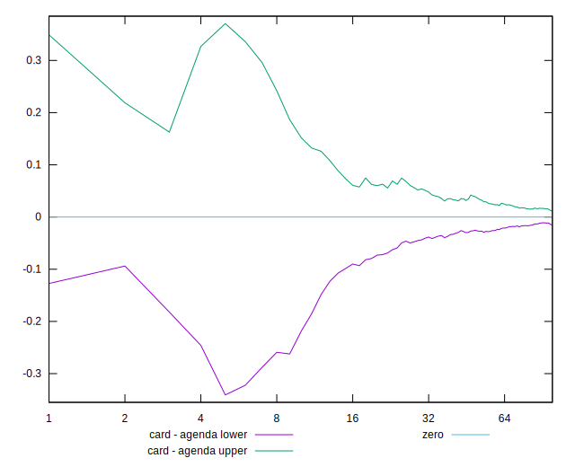
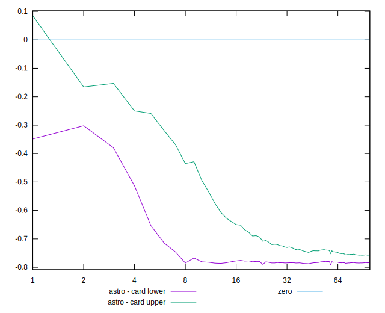
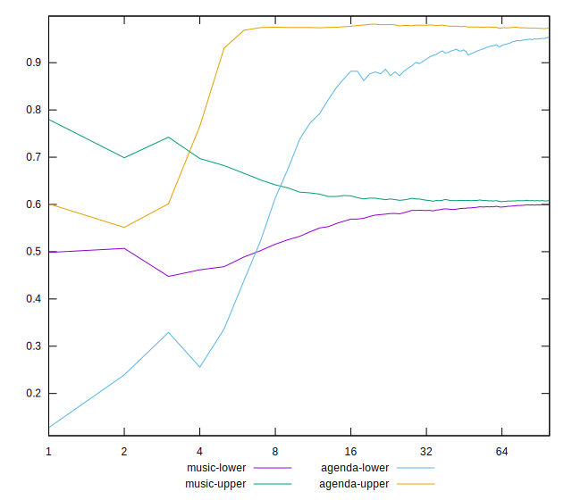
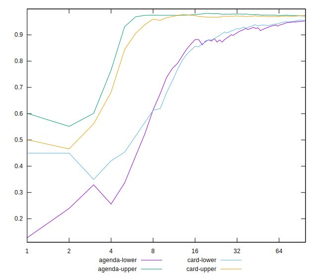
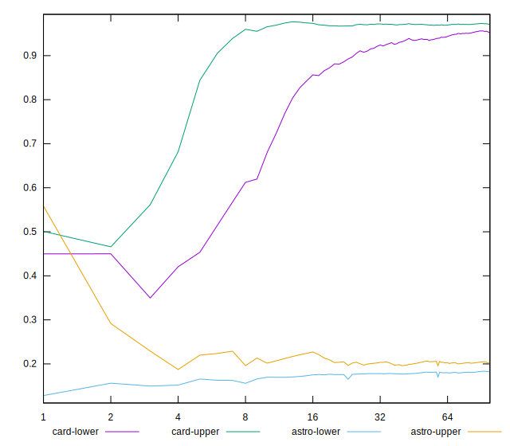

# //meta/scoreEstimate

[→ Parent](../..)

[0=music](samples/music)  
[1=agenda](samples/agenda)  
[2=card](samples/card)  
[3=astro](samples/astro)  

## Comparison

## Score Differentials

## Absolute value comparisons

