# //render-blocking-resources/samples/astro

[→ Parent](../..)


## Raw


```yaml
p90min: 546
p90max: 1788
p90range: 1242
p90mean: 948.5
median: 768
p90stdev: 377.82036568110544
mad: 94.5
stdevBySn: 170.24365
lfitCenter: 899.6432226963423
lfitStdev: 300.44252640874936
mfitCenter: 899.6432226963423
mfitStdev: 376.54886617777055
mfitConfidence: 37.65488661777705
p90skewness: 1.210934428893372
p90eccentricity: 0.9999999999999999
p90discretization: 1.0930232558139534
outlandishness: 1.0285188803785017

```

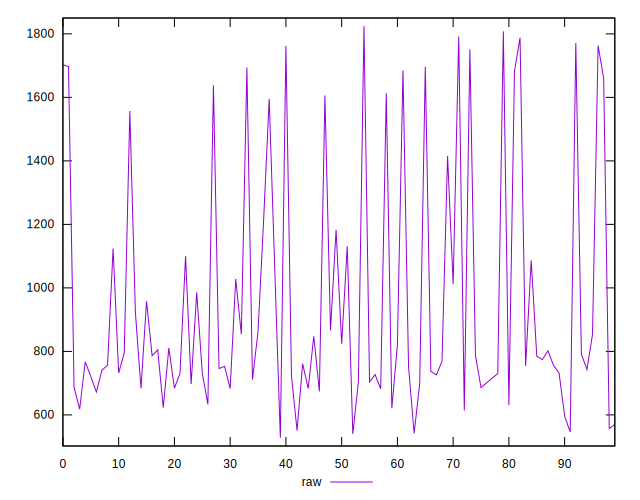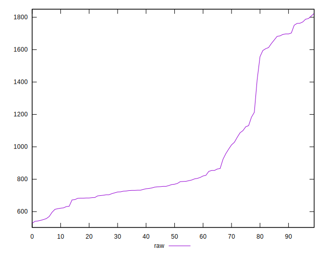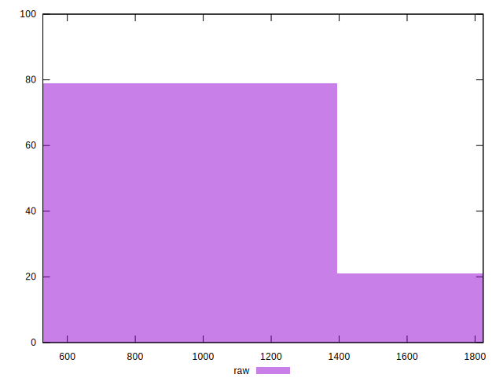
## Score


```yaml
p90min: 0.38
p90max: 0.61
p90range: 0.22999999999999998
p90mean: 0.4908510638297874
median: 0.5
p90stdev: 0.058920421891645855
mad: 0.03999999999999998
stdevBySn: 0.05963000000000006
lfitCenter: 0.4935405312423942
lfitStdev: 0.04299647263465436
mfitCenter: 0.4935405312423942
mfitStdev: 0.053888087061935826
mfitConfidence: 0.005388808706193583
p90skewness: -0.32626231102971975
p90eccentricity: 1.000000000000001
p90discretization: 4.476190476190476
outlandishness: 1.0018300519385697

```

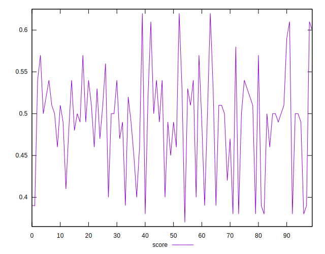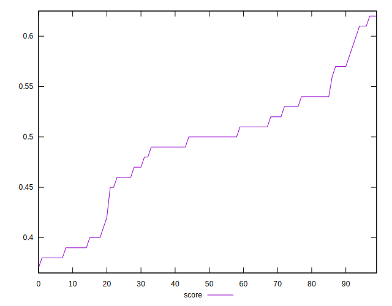
## Raw Estimate

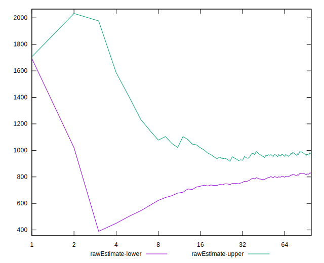
## Score Estimate

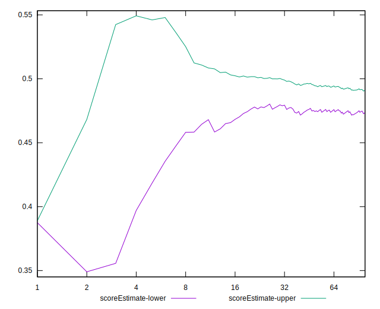
## P Score


```yaml
p90min: 0.37788235294117645
p90max: 0.6133333333333333
p90range: 0.23545098039215684
p90mean: 0.48994270616047836
median: 0.49788235294117644
p90stdev: 0.058855648043297515
mad: 0.03567647058823531
stdevBySn: 0.051897586928104616
lfitCenter: 0.49260059169609144
lfitStdev: 0.04259016011853233
mfitCenter: 0.49260059169609144
mfitStdev: 0.05337884984079944
mfitConfidence: 0.0053378849840799445
p90skewness: -0.31062218777834755
p90eccentricity: 0.9999999999999994
p90discretization: 1.0930232558139534
outlandishness: 1.0017351406944266

```

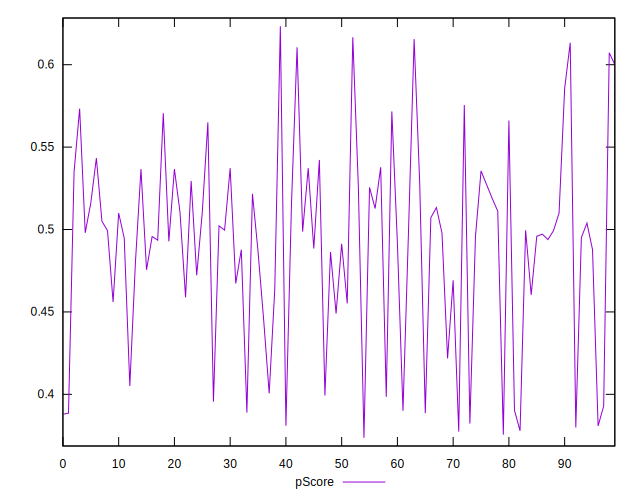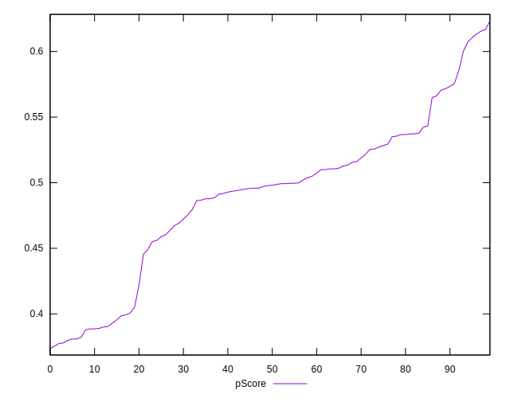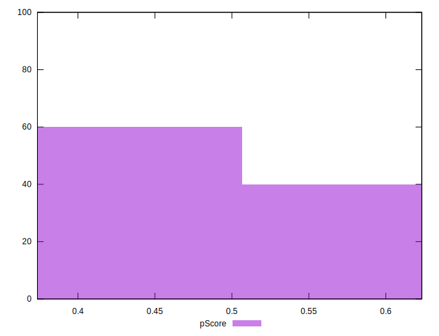
## Score Difference


```yaml
p90min: 0
p90max: 1.1102230246251565e-16
p90range: 1.1102230246251565e-16
p90mean: 3.543264972207946e-18
median: 0
p90stdev: 1.5801884812776703e-17
mad: 0
stdevBySn: 0
lfitCenter: 3.348419206016278e-18
lfitStdev: 8.049580981041194e-18
mfitCenter: 3.348419206016278e-18
mfitStdev: 1.0088653653156534e-17
mfitConfidence: 1.0088653653156533e-18
p90skewness: 4.850394434305286
p90eccentricity: 1.0000000000000002
p90discretization: 31.333333333333332
outlandishness: 3.5344000000000007

```

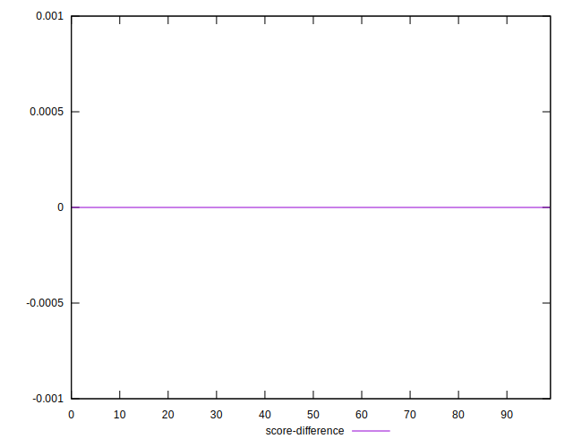
## P Score Difference


```yaml
p90min: -0.0048235294117647265
p90max: 0.0038823529411765034
p90range: 0.00870588235294123
p90mean: -0.0009776109025170414
median: -0.0010849673202614207
p90stdev: 0.002565440210062767
mad: 0.002228758169934647
stdevBySn: 0.0031822153594771112
lfitCenter: -0.001014105668066784
lfitStdev: 0.002231943413798981
mfitCenter: -0.001014105668066784
mfitStdev: 0.002797326237017271
mfitConfidence: 0.0002797326237017271
p90skewness: 0.22697236254768258
p90eccentricity: 0.9999999999999999
p90discretization: 1.5161290322580645
outlandishness: 0.9096817985993814

```

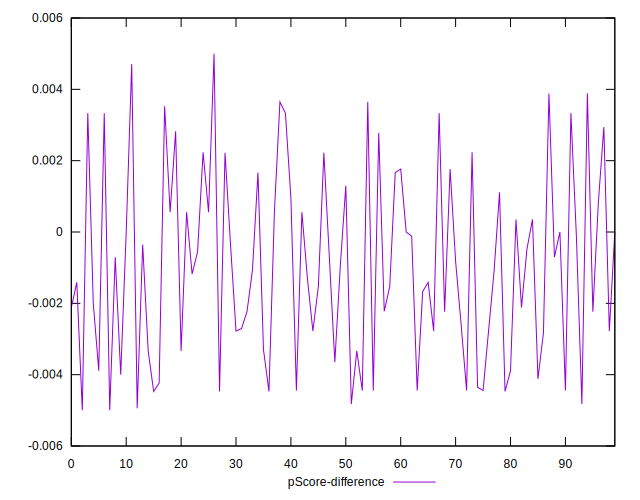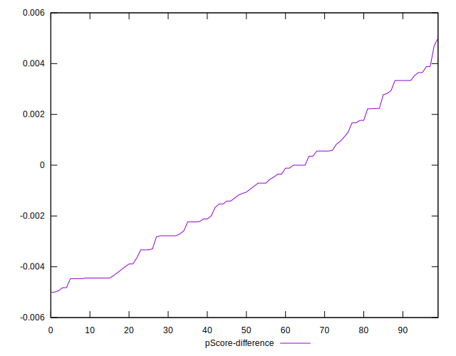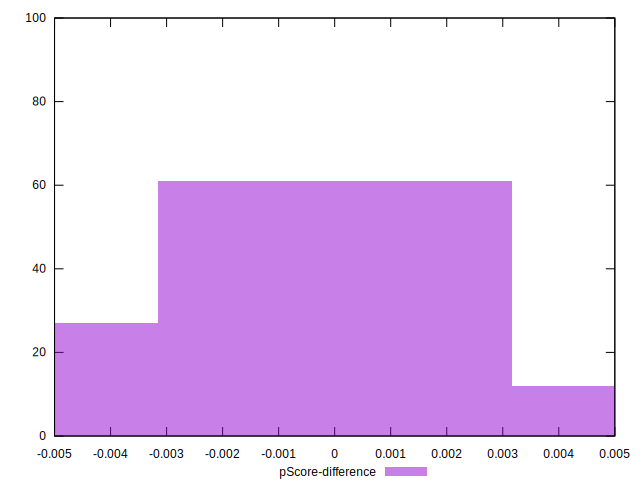