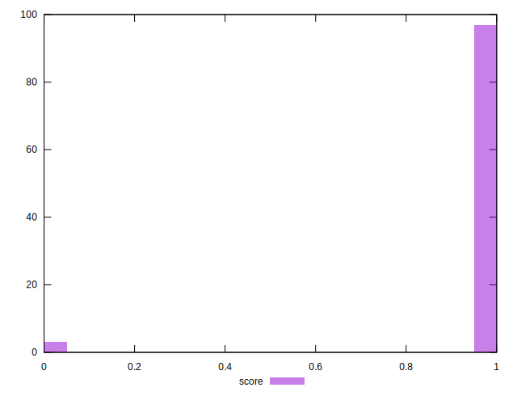

# //server-response-time/samples/agenda

[→ Parent](../..)


## Raw


```yaml
p90min: 2.662
p90max: 104.17699999999999
p90range: 101.51499999999999
p90mean: 6.732680851063829
median: 3.568
p90stdev: 12.779653136181851
mad: 0.7255
stdevBySn: 1.0166914999999996
lfitCenter: 54.75821335305771
lfitStdev: 122.98373455077635
mfitCenter: 54.75821335305771
mfitStdev: 154.1372533274442
mfitConfidence: 15.41372533274442
p90skewness: 5.805071014479213
p90eccentricity: 1
p90discretization: 1
outlandishness: 267.85410027207445

```


## Score


```yaml
p90min: 1
p90max: 1
p90range: 0
p90mean: 1
median: 1
p90stdev: 0
mad: 0
stdevBySn: 0
lfitCenter: 0.9856633205386263
lfitStdev: 0.03542151281482539
mfitCenter: 0.9856633205386263
mfitStdev: 0.04439428282059423
mfitConfidence: 0.004439428282059423
p90skewness: .nan
p90eccentricity: .nan
p90discretization: 94
outlandishness: 0.9409

```


## Raw Estimate


## Score Estimate


## P Score


```yaml
p90min: 1
p90max: 1
p90range: 0
p90mean: 1
median: 1
p90stdev: 0
mad: 0
stdevBySn: 0
lfitCenter: 0.9856633205386263
lfitStdev: 0.03542151281482539
mfitCenter: 0.9856633205386263
mfitStdev: 0.04439428282059423
mfitConfidence: 0.004439428282059423
p90skewness: .nan
p90eccentricity: .nan
p90discretization: 94
outlandishness: 0.9409

```


## Score Difference


```yaml
p90min: 0
p90max: 0
p90range: 0
p90mean: 0
median: 0
p90stdev: 0
mad: 0
stdevBySn: 0
lfitCenter: 0
lfitStdev: 0
mfitCenter: 0
mfitStdev: 0
mfitConfidence: 0
p90skewness: .nan
p90eccentricity: .nan
p90discretization: 94
outlandishness: .nan

```


## P Score Difference


```yaml
p90min: 0
p90max: 0
p90range: 0
p90mean: 0
median: 0
p90stdev: 0
mad: 0
stdevBySn: 0
lfitCenter: 0
lfitStdev: 0
mfitCenter: 0
mfitStdev: 0
mfitConfidence: 0
p90skewness: .nan
p90eccentricity: .nan
p90discretization: 94
outlandishness: .nan

```

