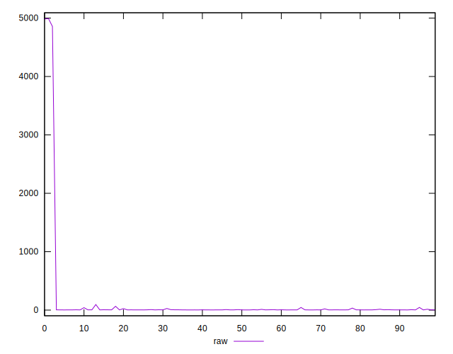
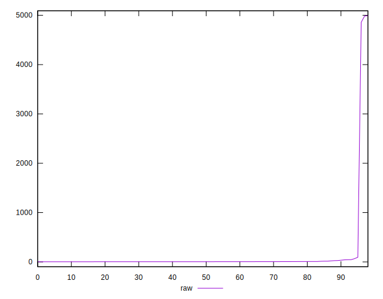
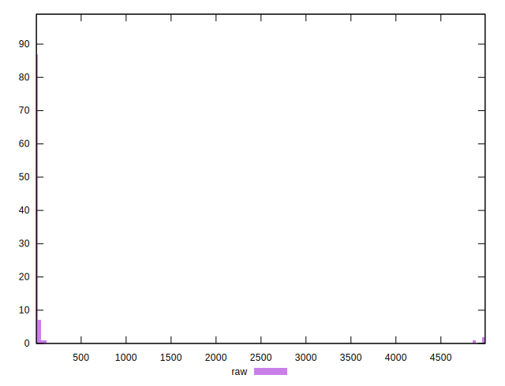
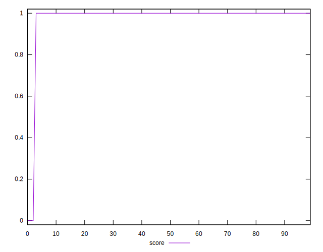
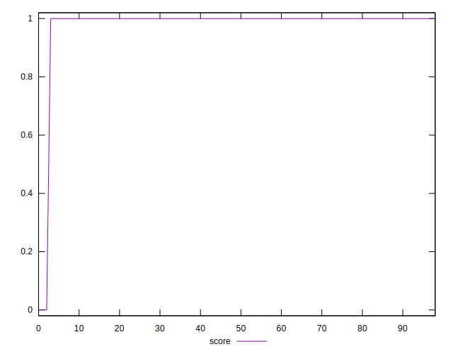
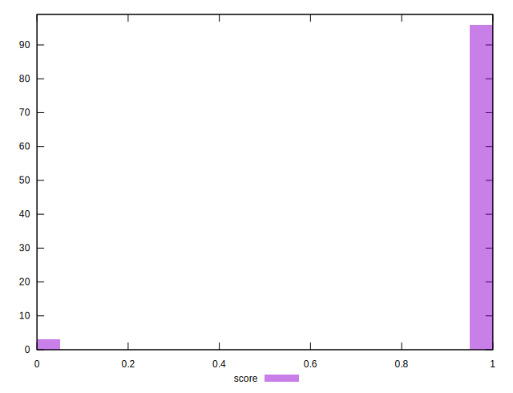
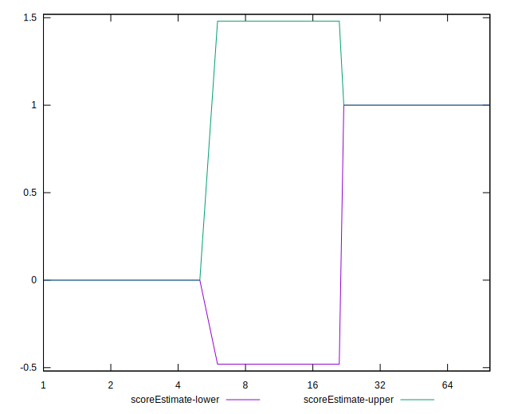
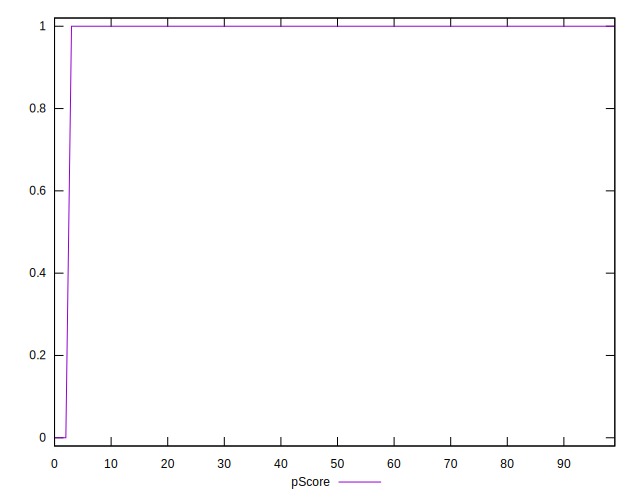
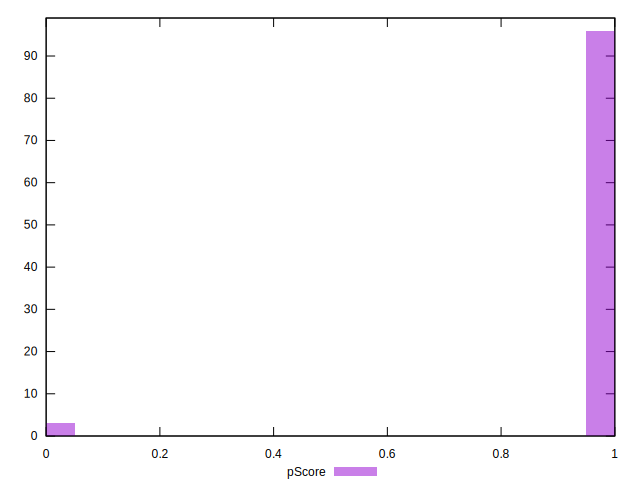
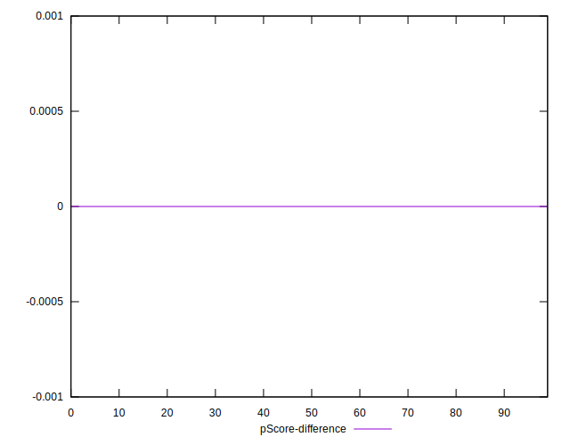

# //server-response-time/samples/card

[→ Parent](../..)


## Raw


```yaml
p90min: 2.6259999999999994
p90max: 95.169
p90range: 92.54299999999999
p90mean: 8.246268817204298
median: 3.6969999999999996
p90stdev: 13.837931487490046
mad: 0.8029999999999995
stdevBySn: 1.2140668000000003
lfitCenter: 77.71730137745027
lfitStdev: 176.88228164634376
mfitCenter: 77.71730137745027
mfitStdev: 221.68906445105762
mfitConfidence: 22.28058930027496
p90skewness: 4.060626935023813
p90eccentricity: 1.0000000000000002
p90discretization: 1
outlandishness: 365.5238923293067

```


## Score


```yaml
p90min: 1
p90max: 1
p90range: 0
p90mean: 1
median: 1
p90stdev: 0
mad: 0
stdevBySn: 0
lfitCenter: 0.9855152179633853
lfitStdev: 0.0357820512931506
mfitCenter: 0.9855152179633853
mfitStdev: 0.044846150792980134
mfitConfidence: 0.004507207741576194
p90skewness: .nan
p90eccentricity: .nan
p90discretization: 93
outlandishness: 0.9403122130394859

```


## Raw Estimate


## Score Estimate


## P Score


```yaml
p90min: 1
p90max: 1
p90range: 0
p90mean: 1
median: 1
p90stdev: 0
mad: 0
stdevBySn: 0
lfitCenter: 0.9855152179633853
lfitStdev: 0.0357820512931506
mfitCenter: 0.9855152179633853
mfitStdev: 0.044846150792980134
mfitConfidence: 0.004507207741576194
p90skewness: .nan
p90eccentricity: .nan
p90discretization: 93
outlandishness: 0.9403122130394859

```


## Score Difference


```yaml
p90min: 0
p90max: 0
p90range: 0
p90mean: 0
median: 0
p90stdev: 0
mad: 0
stdevBySn: 0
lfitCenter: 0
lfitStdev: 0
mfitCenter: 0
mfitStdev: 0
mfitConfidence: 0
p90skewness: .nan
p90eccentricity: .nan
p90discretization: 93
outlandishness: .nan

```


## P Score Difference


```yaml
p90min: 0
p90max: 0
p90range: 0
p90mean: 0
median: 0
p90stdev: 0
mad: 0
stdevBySn: 0
lfitCenter: 0
lfitStdev: 0
mfitCenter: 0
mfitStdev: 0
mfitConfidence: 0
p90skewness: .nan
p90eccentricity: .nan
p90discretization: 93
outlandishness: .nan

```

