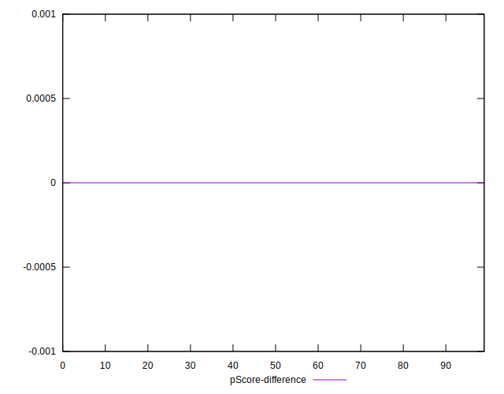

# //server-response-time/samples/music

[→ Parent](../..)


## Raw


```yaml
p90min: 2.685
p90max: 72.019
p90range: 69.334
p90mean: 6.152468085106386
median: 3.5414999999999996
p90stdev: 8.320620011552087
mad: 0.6975
stdevBySn: 0.9970136
lfitCenter: 53.08553746916365
lfitStdev: 118.91207702578646
mfitCenter: 53.08553746916365
mfitStdev: 149.03418738393242
mfitConfidence: 14.903418738393242
p90skewness: 5.790837510314813
p90eccentricity: 0.9999999999999996
p90discretization: 1
outlandishness: 307.1963094231173

```


## Score


```yaml
p90min: 1
p90max: 1
p90range: 0
p90mean: 1
median: 1
p90stdev: 0
mad: 0
stdevBySn: 0
lfitCenter: 0.9905689143351166
lfitStdev: 0.023417273015196766
mfitCenter: 0.9905689143351166
mfitStdev: 0.02934919935685529
mfitConfidence: 0.0029349199356855293
p90skewness: .nan
p90eccentricity: .nan
p90discretization: 94
outlandishness: 0.9603999999999999

```


## Raw Estimate


## Score Estimate


## P Score


```yaml
p90min: 1
p90max: 1
p90range: 0
p90mean: 1
median: 1
p90stdev: 0
mad: 0
stdevBySn: 0
lfitCenter: 0.9905689143351166
lfitStdev: 0.023417273015196766
mfitCenter: 0.9905689143351166
mfitStdev: 0.02934919935685529
mfitConfidence: 0.0029349199356855293
p90skewness: .nan
p90eccentricity: .nan
p90discretization: 94
outlandishness: 0.9603999999999999

```


## Score Difference


```yaml
p90min: 0
p90max: 0
p90range: 0
p90mean: 0
median: 0
p90stdev: 0
mad: 0
stdevBySn: 0
lfitCenter: 0
lfitStdev: 0
mfitCenter: 0
mfitStdev: 0
mfitConfidence: 0
p90skewness: .nan
p90eccentricity: .nan
p90discretization: 94
outlandishness: .nan

```


## P Score Difference


```yaml
p90min: 0
p90max: 0
p90range: 0
p90mean: 0
median: 0
p90stdev: 0
mad: 0
stdevBySn: 0
lfitCenter: 0
lfitStdev: 0
mfitCenter: 0
mfitStdev: 0
mfitConfidence: 0
p90skewness: .nan
p90eccentricity: .nan
p90discretization: 94
outlandishness: .nan

```

