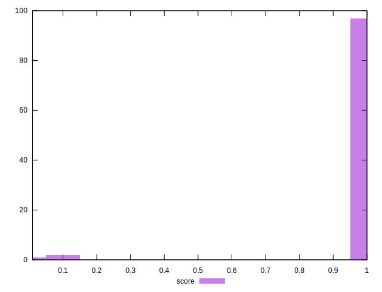

# //speed-index/samples/agenda

[→ Parent](../..)


## Raw


```yaml
p90min: 1212.591
p90max: 1933.2446020199072
p90range: 720.6536020199073
p90mean: 1281.459540447021
median: 1229.9085
p90stdev: 107.00720487616
mad: 11.380049999999983
stdevBySn: 17.90867790000008
lfitCenter: 1413.8192907451016
lfitStdev: 385.50323432381145
mfitCenter: 1413.8192907451016
mfitStdev: 483.15665404505563
mfitConfidence: 48.315665404505566
p90skewness: 3.06872834534763
p90eccentricity: 0.9999999999999994
p90discretization: 1
outlandishness: 1.5493371494922796

```


## Score


```yaml
p90min: 1
p90max: 1
p90range: 0
p90mean: 1
median: 1
p90stdev: 0
mad: 0
stdevBySn: 0
lfitCenter: 0.986581333581946
lfitStdev: 0.033153385744973785
mfitCenter: 0.986581333581946
mfitStdev: 0.04155160709586082
mfitConfidence: 0.0041551607095860815
p90skewness: .nan
p90eccentricity: .nan
p90discretization: 94
outlandishness: 0.94458961

```


## Raw Estimate


## Score Estimate


## P Score


```yaml
p90min: 0.9955711130655096
p90max: 0.9999037625797726
p90range: 0.004332649514263043
p90mean: 0.9997731244635517
median: 0.9998900192291991
p90stdev: 0.00046172542089319076
mad: 0.000009202651629847125
stdevBySn: 0.000014396151218923155
lfitCenter: 0.9864401449379425
lfitStdev: 0.03306386934890075
mfitCenter: 0.9864401449379425
mfitStdev: 0.041439414931028054
mfitConfidence: 0.004143941493102805
p90skewness: -8.088616387835847
p90eccentricity: 1.0000000000000004
p90discretization: 1
outlandishness: 0.944733449959752

```


## Score Difference


```yaml
p90min: 0
p90max: 0
p90range: 0
p90mean: 0
median: 0
p90stdev: 0
mad: 0
stdevBySn: 0
lfitCenter: 0
lfitStdev: 0
mfitCenter: 0
mfitStdev: 0
mfitConfidence: 0
p90skewness: .nan
p90eccentricity: .nan
p90discretization: 94
outlandishness: .nan

```


## P Score Difference


```yaml
p90min: -0.000792420611655853
p90max: -0.00009564036742004678
p90range: 0.0006967802442358062
p90mean: -0.00016459179898497745
median: -0.00010896491141959563
p90stdev: 0.00011623237904271235
mad: 0.00000900885762572523
stdevBySn: 0.000014396151218923155
lfitCenter: -0.0001362953054240079
lfitStdev: 0.00014187403826388948
mfitCenter: -0.0001362953054240079
mfitStdev: 0.00017781273805309565
mfitConfidence: 0.000017781273805309566
p90skewness: -2.6399928252654377
p90eccentricity: 1
p90discretization: 1
outlandishness: 0.7924663960263251

```

