# //speed-index/samples/astro

[→ Parent](../..)


## Raw


```yaml
p90min: 8560.872342670991
p90max: 12155.057527246696
p90range: 3594.1851845757046
p90mean: 9469.204874573874
median: 9026.601519583457
p90stdev: 1234.107037734767
mad: 387.04686050444434
stdevBySn: 674.9984664722341
lfitCenter: 9451.072069626516
lfitStdev: 1087.3199688535028
mfitCenter: 9451.072069626516
mfitStdev: 1362.753490120805
mfitConfidence: 481.806116975028
p90skewness: 1.5838749186451349
p90eccentricity: 1
p90discretization: 1
outlandishness: 1.0529621028596827

```

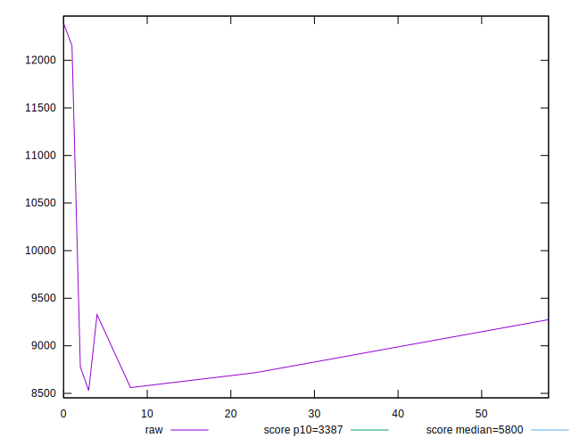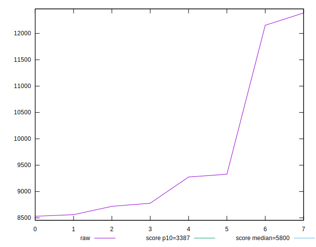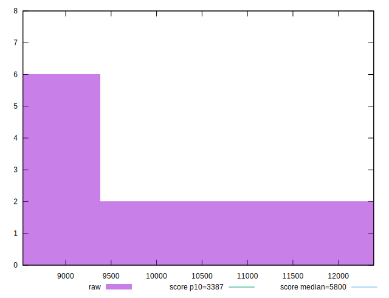
## Score


```yaml
p90min: 0.04
p90max: 0.18
p90range: 0.13999999999999999
p90mean: 0.135
median: 0.14500000000000002
p90stdev: 0.04645786621588784
mad: 0.029999999999999985
stdevBySn: 0.047703999999999996
lfitCenter: 0.13554049488093078
lfitStdev: 0.04191477469789792
mfitCenter: 0.13554049488093078
mfitStdev: 0.052532379744129803
mfitConfidence: 0.018573000974470507
p90skewness: -1.1768042556616152
p90eccentricity: 1
p90discretization: 1.2
outlandishness: 0.9095507544581619

```

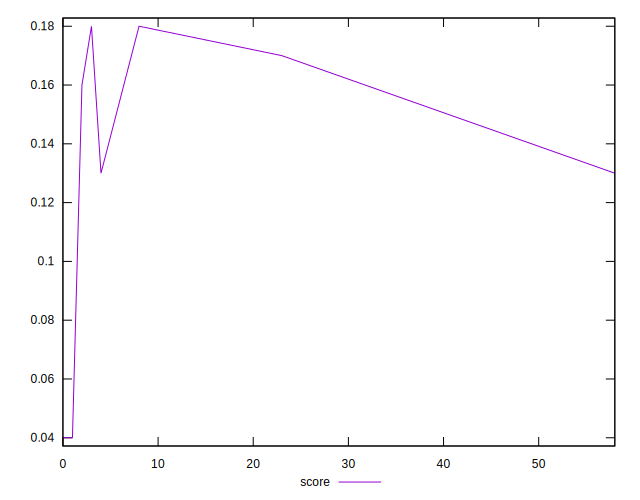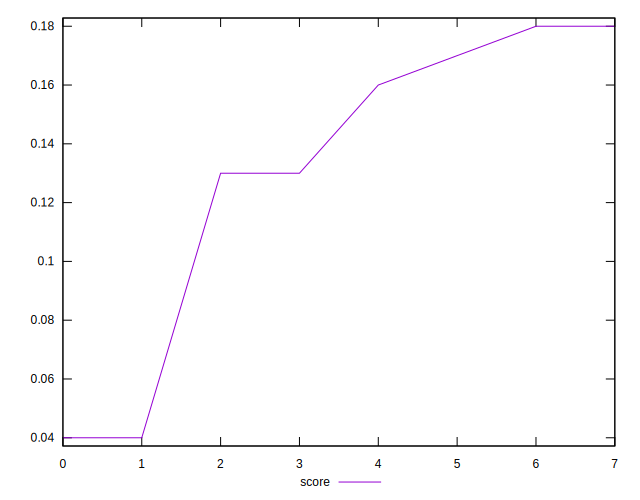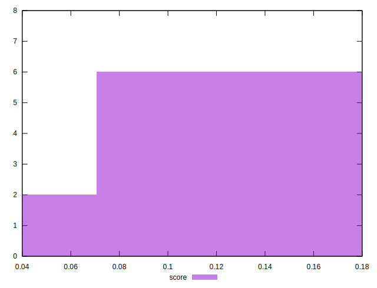
## Raw Estimate

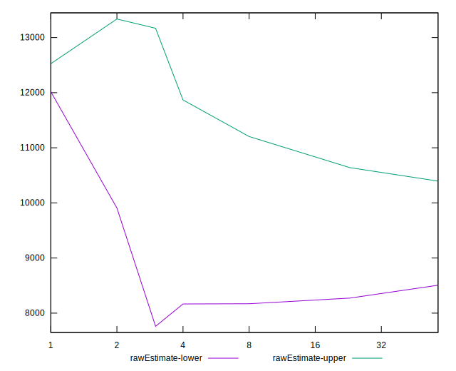
## Score Estimate

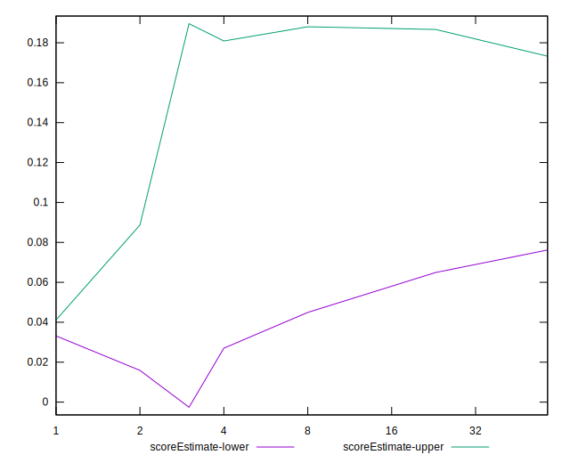
## P Score


```yaml
p90min: 0.03897173589151165
p90max: 0.17680935278028692
p90range: 0.13783761688877527
p90mean: 0.13396635433315948
median: 0.1467130852769157
p90stdev: 0.04596226056053911
mad: 0.024580009472232933
stdevBySn: 0.04289923860229326
lfitCenter: 0.13474857001483323
lfitStdev: 0.04144779880315944
mfitCenter: 0.13474857001483323
mfitStdev: 0.051947112252879596
mfitConfidence: 0.018366077668534975
p90skewness: -1.2446376427383814
p90eccentricity: 1
p90discretization: 1
outlandishness: 0.9024847883516677

```

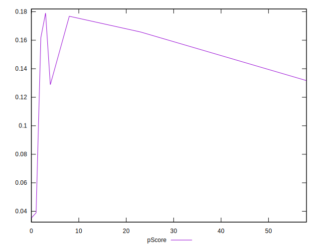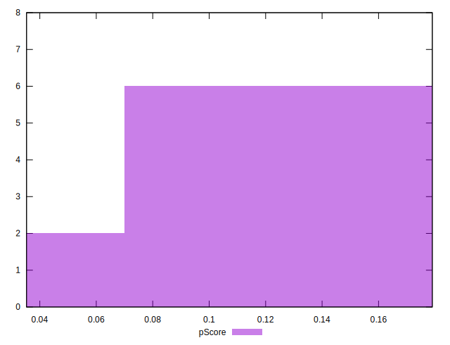
## Score Difference


```yaml
p90min: 0
p90max: 0
p90range: 0
p90mean: 0
median: 0
p90stdev: 0
mad: 0
stdevBySn: 0
lfitCenter: 0
lfitStdev: 0
mfitCenter: 0
mfitStdev: 0
mfitConfidence: 0
p90skewness: .nan
p90eccentricity: .nan
p90discretization: 6
outlandishness: .nan

```

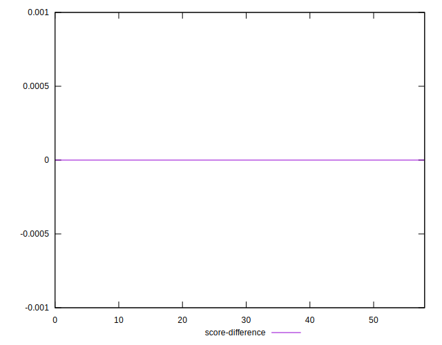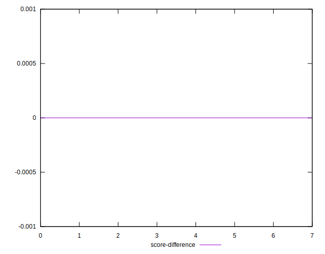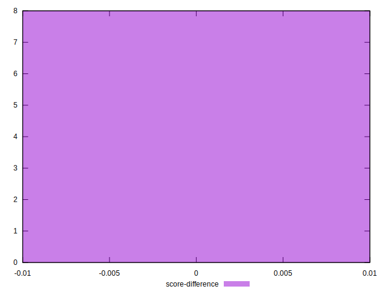
## P Score Difference


```yaml
p90min: -0.004223163281989656
p90max: 0.0016753861233129164
p90range: 0.005898549405302572
p90mean: -0.0014858176877991965
median: -0.0011071170265859291
p90stdev: 0.0018693182203866165
mad: 0.002433016671512994
stdevBySn: 0.0031100144695078804
lfitCenter: -0.0014537564351097042
lfitStdev: 0.0017568505286458896
mfitCenter: -0.0014537564351097042
mfitStdev: 0.0022018856069177346
mfitConfidence: 0.0007784841220242934
p90skewness: 0.1630614838876646
p90eccentricity: 1
p90discretization: 1
outlandishness: 0.9962591054502733

```

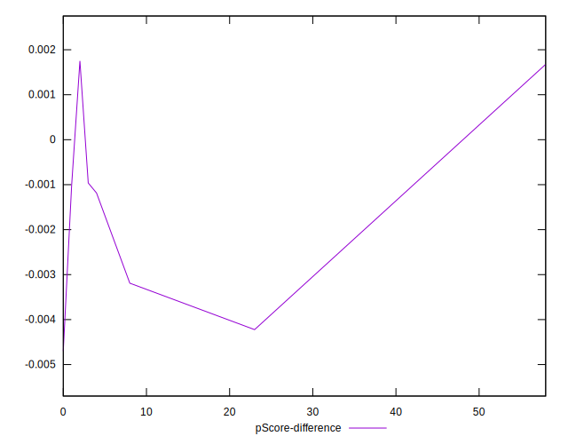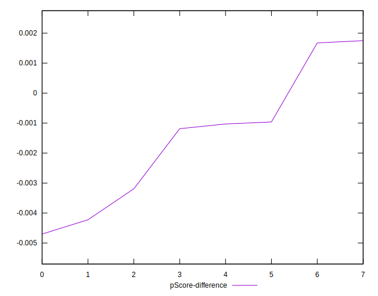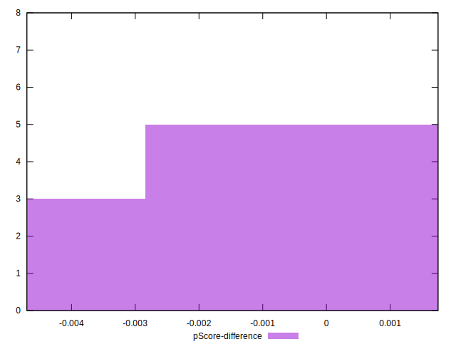