# //speed-index/samples/card

[→ Parent](../..)


## Raw


```yaml
p90min: 1213.4879999999998
p90max: 1598.7179999999998
p90range: 385.23
p90mean: 1277.2749222368484
median: 1232.313
p90stdev: 80.35505531772603
mad: 15.069000000000187
stdevBySn: 21.727979400000063
lfitCenter: 1436.5418093436178
lfitStdev: 431.74748714388704
mfitCenter: 1436.5418093436178
mfitStdev: 541.115229932369
mfitConfidence: 54.38412684947143
p90skewness: 1.5544572377774297
p90eccentricity: 0.9999999999999997
p90discretization: 1
outlandishness: 1.6453616488957314

```

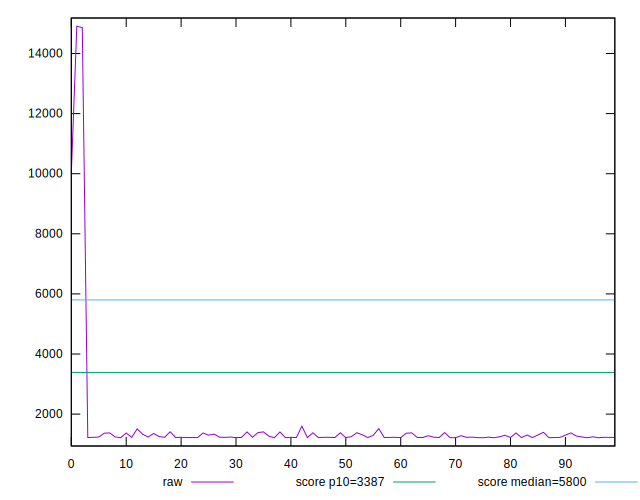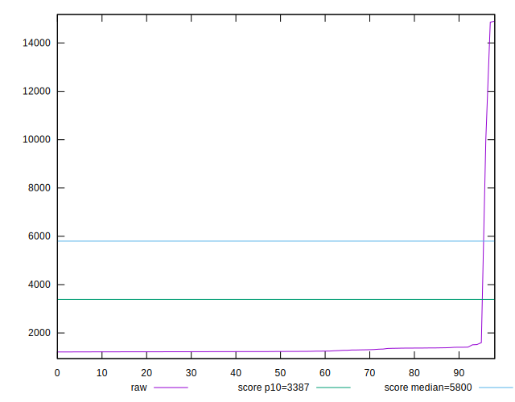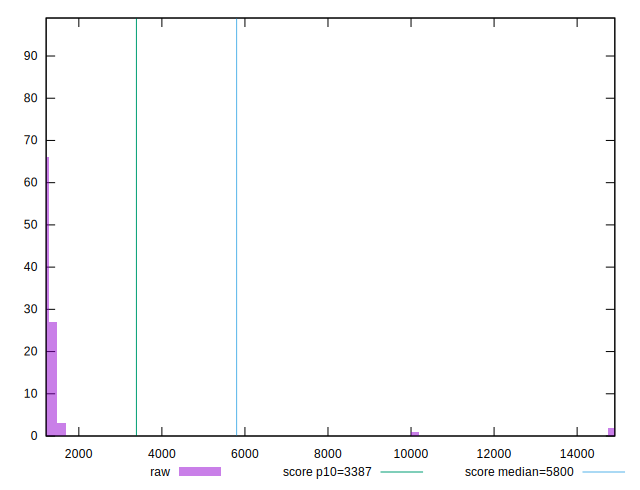
## Score


```yaml
p90min: 1
p90max: 1
p90range: 0
p90mean: 1
median: 1
p90stdev: 0
mad: 0
stdevBySn: 0
lfitCenter: 0.9861062491500636
lfitStdev: 0.034322014947134216
mfitCenter: 0.9861062491500636
mfitStdev: 0.04301626659768202
mfitConfidence: 0.0043232974601942155
p90skewness: .nan
p90eccentricity: .nan
p90discretization: 93
outlandishness: 0.9426644628099174

```

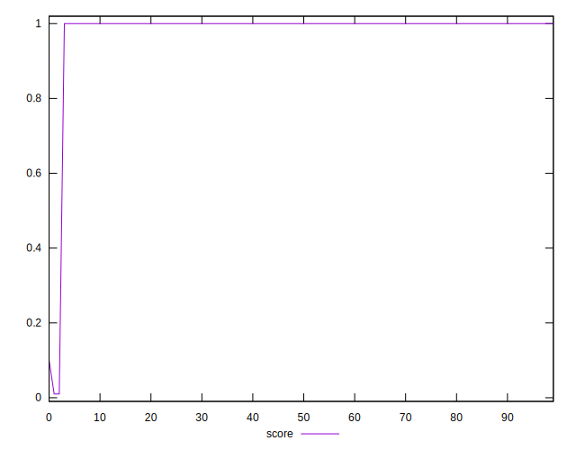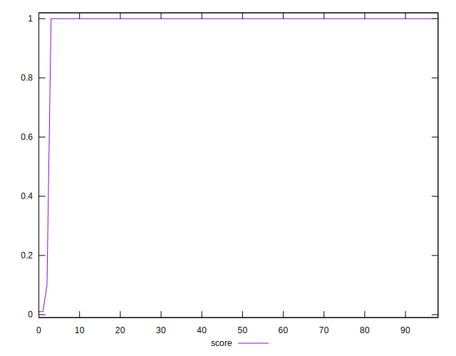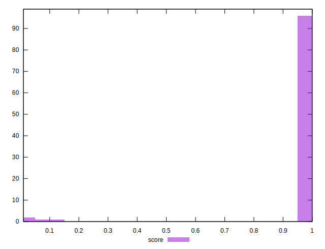
## Raw Estimate

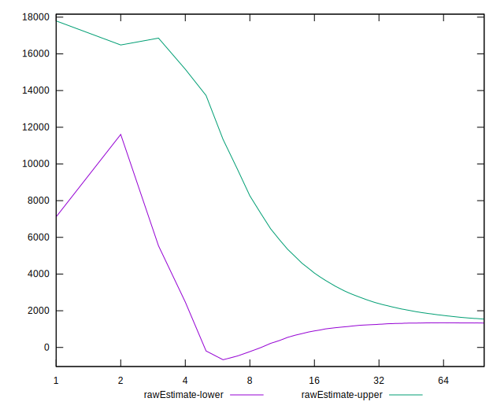
## Score Estimate

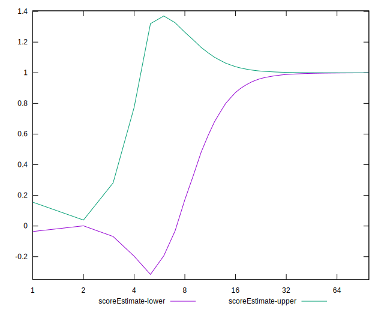
## P Score


```yaml
p90min: 0.9989302033343554
p90max: 0.9999030877488571
p90range: 0.0009728844145016069
p90mean: 0.9998174399359003
median: 0.9998879879594582
p90stdev: 0.00014727251230376906
mad: 0.00001254982721654585
stdevBySn: 0.000017845897801583812
lfitCenter: 0.9859583145984098
lfitStdev: 0.03429699404201264
mfitCenter: 0.9859583145984098
mfitStdev: 0.042984907543533166
mfitConfidence: 0.0043201457566671795
p90skewness: -3.317969286204667
p90eccentricity: 1.0000000000000002
p90discretization: 1
outlandishness: 0.9427045549704159

```

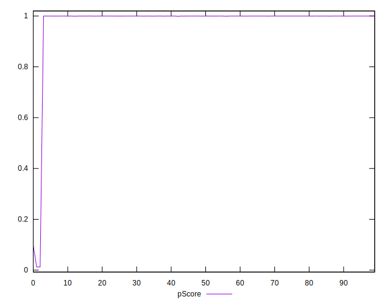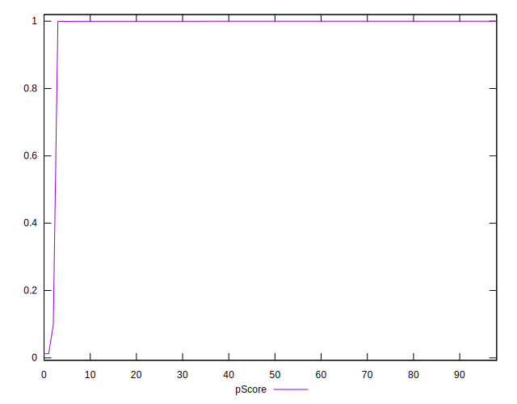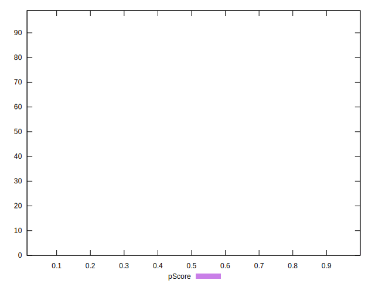
## Score Difference


```yaml
p90min: 0
p90max: 0
p90range: 0
p90mean: 0
median: 0
p90stdev: 0
mad: 0
stdevBySn: 0
lfitCenter: 0
lfitStdev: 0
mfitCenter: 0
mfitStdev: 0
mfitConfidence: 0
p90skewness: .nan
p90eccentricity: .nan
p90discretization: 93
outlandishness: .nan

```

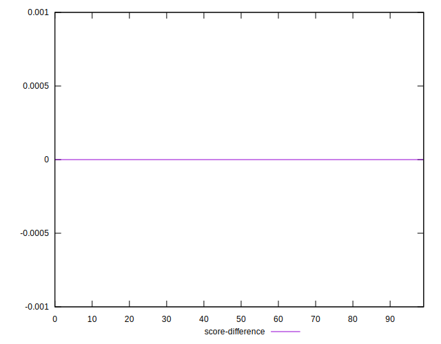
## P Score Difference


```yaml
p90min: -0.0006702391668907959
p90max: -0.00009645816915093697
p90range: 0.0005737809977398589
p90mean: -0.00016557434071197104
median: -0.00010965043360777749
p90stdev: 0.00010089962362489757
mad: 0.00001045710182412396
stdevBySn: 0.000017845897801583812
lfitCenter: -0.0001443193727844924
lfitStdev: 0.00012458356898806562
mfitCenter: -0.0001443193727844924
mfitStdev: 0.00015614234844708063
mfitConfidence: 0.000015692896475269654
p90skewness: -2.026084373012819
p90eccentricity: 1.0000000000000002
p90discretization: 1
outlandishness: 0.8946095163414144

```

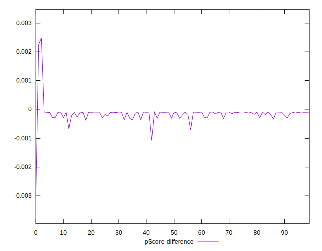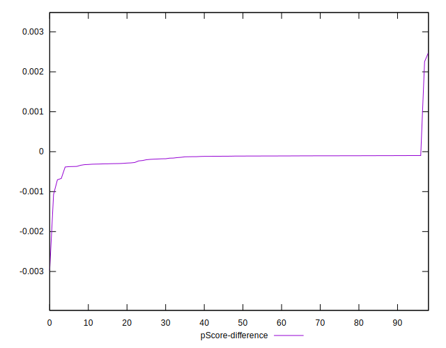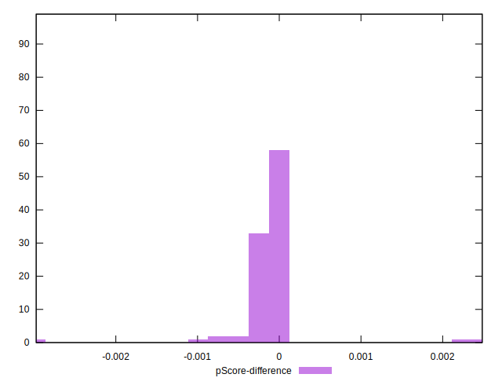