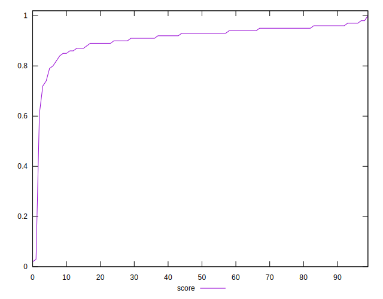
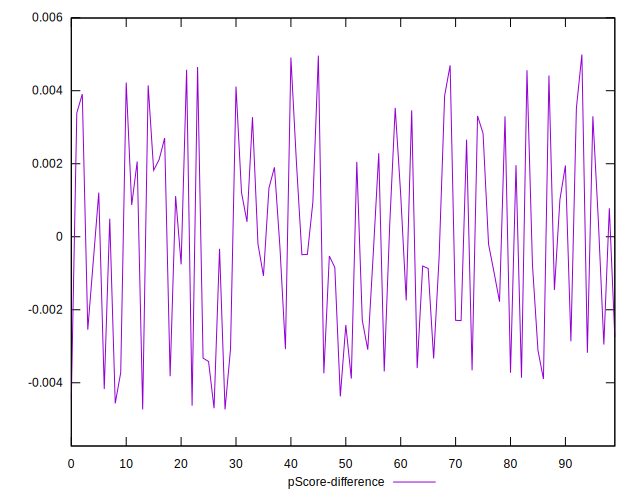
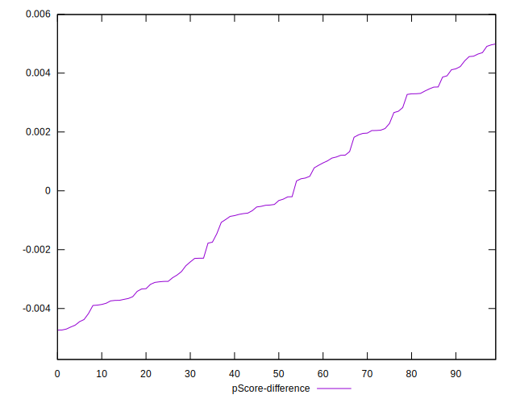

# //speed-index/samples/music

[→ Parent](../..)


## Raw


```yaml
p90min: 2599.7113421869635
p90max: 4529.723958523857
p90range: 1930.0126163368932
p90mean: 3193.831078125845
median: 3122.53403731967
p90stdev: 371.42564186658916
mad: 233.2428899463016
stdevBySn: 372.7269161605542
lfitCenter: 3258.6365052534065
lfitStdev: 439.3906521341912
mfitCenter: 3258.6365052534065
mfitStdev: 550.6945166781911
mfitConfidence: 55.06945166781911
p90skewness: 1.1888397304482756
p90eccentricity: 0.9999999999999996
p90discretization: 1
outlandishness: 1.1218532102977248

```


## Score


```yaml
p90min: 0.72
p90max: 0.97
p90range: 0.25
p90mean: 0.9173404255319152
median: 0.93
p90stdev: 0.046130608565543914
mad: 0.020000000000000018
stdevBySn: 0.0357779999999999
lfitCenter: 0.9129605530499858
lfitStdev: 0.04688247209815249
mfitCenter: 0.9129605530499858
mfitStdev: 0.058758465132039264
mfitConfidence: 0.005875846513203926
p90skewness: -1.9297471082667146
p90eccentricity: 0.9999999999999989
p90discretization: 4.947368421052632
outlandishness: 0.9593456217980362

```


## Raw Estimate


## Score Estimate


## P Score


```yaml
p90min: 0.7220473554583762
p90max: 0.9720500874406213
p90range: 0.2500027319822451
p90mean: 0.917294378076086
median: 0.9299258328318747
p90stdev: 0.045886155708049235
mad: 0.023606964307798572
stdevBySn: 0.035651166291835595
lfitCenter: 0.9128335604349329
lfitStdev: 0.04683132083845662
mfitCenter: 0.9128335604349329
mfitStdev: 0.058694356535056426
mfitConfidence: 0.005869435653505643
p90skewness: -1.9576124865091835
p90eccentricity: 0.9999999999999992
p90discretization: 1
outlandishness: 0.9591758126192027

```


## Score Difference


```yaml
p90min: 0
p90max: 1.1102230246251565e-16
p90range: 1.1102230246251565e-16
p90mean: 2.7165031453594255e-17
median: 0
p90stdev: 4.772824535398222e-17
mad: 0
stdevBySn: 0
lfitCenter: 1.9391877609103694e-17
lfitStdev: 4.011799930328909e-17
mfitCenter: 1.9391877609103694e-17
mfitStdev: 5.0280455738219935e-17
mfitConfidence: 5.028045573821993e-18
p90skewness: 1.187813193945481
p90eccentricity: 1.0000000000000007
p90discretization: 47
outlandishness: 1.1291372400756148

```


## P Score Difference


```yaml
p90min: -0.004628320618226267
p90max: 0.0046956938230583445
p90range: 0.009324014441284612
p90mean: -0.00014002887912634106
median: -0.0003968338575438546
p90stdev: 0.0028022572311402283
mad: 0.002681740232673424
stdevBySn: 0.0033453308285829996
lfitCenter: -0.0001633171642785071
lfitStdev: 0.002493030813778336
mfitCenter: -0.0001633171642785071
mfitStdev: 0.003124550766815611
mfitConfidence: 0.00031245507668156106
p90skewness: 0.09333097869654229
p90eccentricity: 1.0000000000000002
p90discretization: 1
outlandishness: 0.7920383104280916

```

